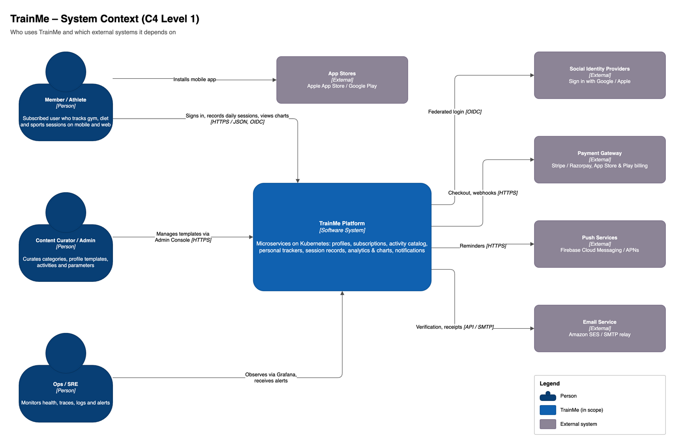
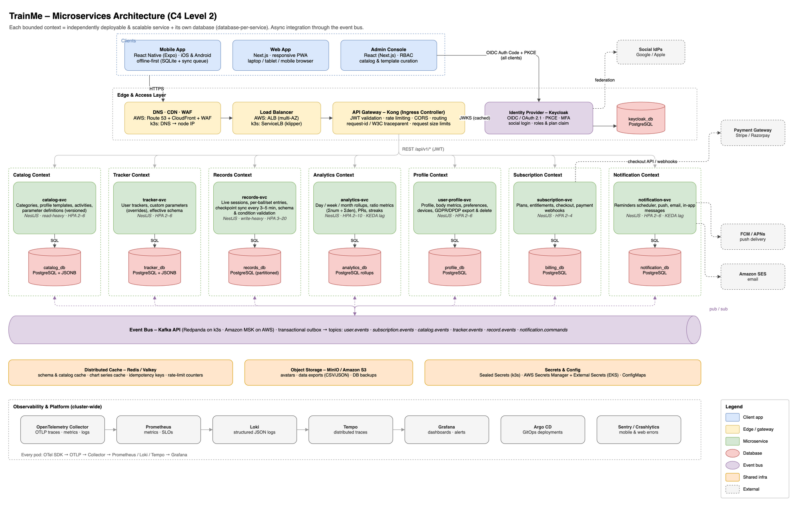
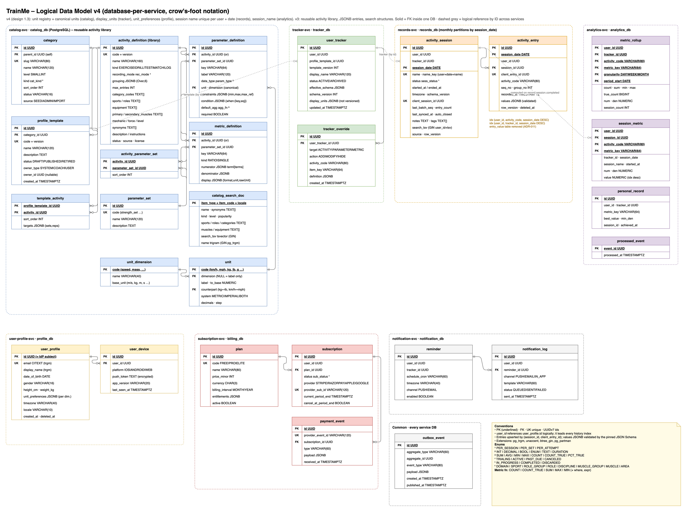
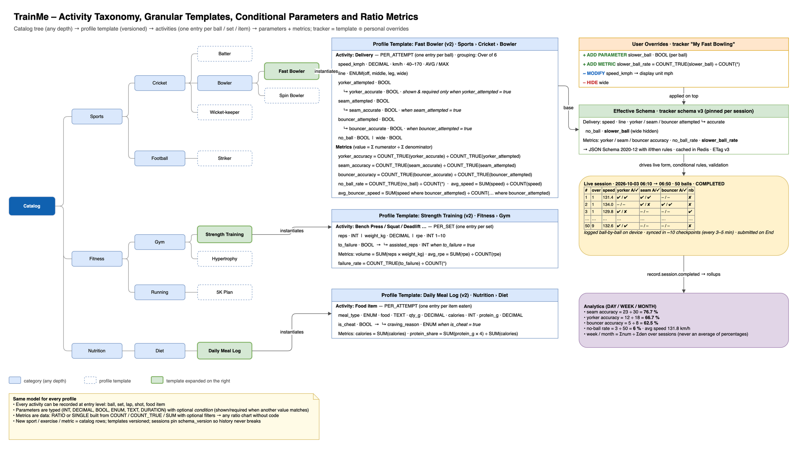
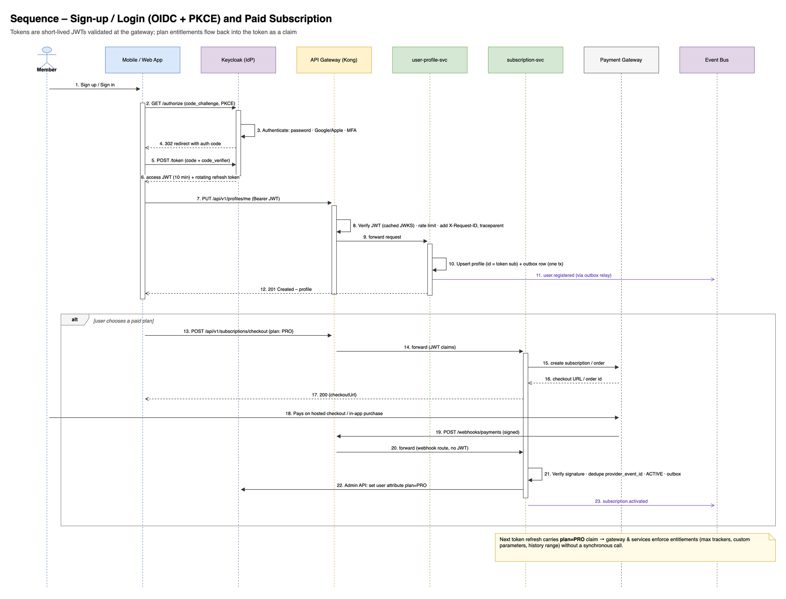
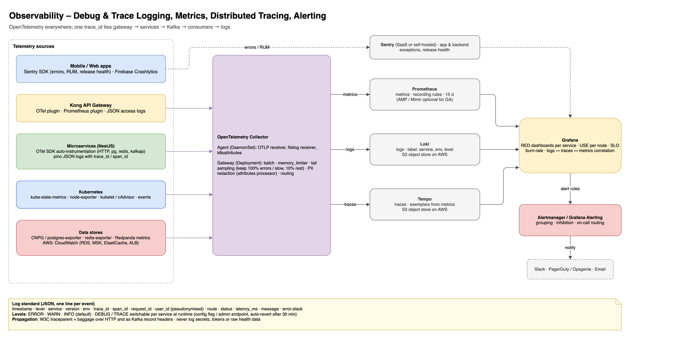

# TrainMe – High-Level Design (HLD)

| Item | Value |
|---|---|
| Version | 1.3 · 2026-10-03 (named sessions with N per day, editable units; 1.2 activity library, JSONB entries, search design; 1.1 live granular sessions, conditional parameters, ratio metrics) |
| Related | `01_Software_Requirements_Specification.md`, `03_Low_Level_Design.md`, `04_Deployment_and_Infrastructure.md` |
| Diagrams | `../diagrams/*.drawio` (editable in draw.io / diagrams.net; PNG previews in `../diagrams/png/`) |

---

## 1. Architecture Goals and Principles

| # | Principle | How it is applied |
|---|---|---|
| P1 | **Independent scalability** (TR-1) | One bounded context = one deployable service = one database. Scale each service on its own metric. |
| P2 | **Data-driven extensibility** (TR-2, TR-8, TR-9) | Activities and parameters are catalog *data* with a closed set of types; no code or DDL change to add a sport. |
| P3 | **API-first, mobile-first** (TR-4) | OpenAPI contracts, the same API for mobile/web/admin, offline-first mobile with idempotent sync. |
| P4 | **Async by default between services** | Domain events over Kafka with the transactional outbox. Synchronous calls only on the user request path. |
| P5 | **Stateless compute, managed state** | Pods are stateless and horizontally scalable; state lives in PostgreSQL / Redis / Kafka / S3. |
| P6 | **Portability** | Kubernetes + open protocols (PostgreSQL, Kafka API, Redis, S3, OIDC). k3s for test and EKS for beta use the same images and charts. |
| P7 | **Secure by design** | Zero-trust between services, short-lived tokens, least privilege, encrypted everywhere, privacy by default. |
| P8 | **Observable by default** (TR-7) | OpenTelemetry in every component; logs, metrics and traces correlated by `trace_id`. |
| P9 | **Evolve, don't overhaul** | Versioned templates, versioned APIs, expand/contract migrations, feature flags. |

---

## 2. System Context

*Source: `diagrams/01_system_context.drawio`*

- **Members** use the mobile app (React Native) or the responsive web app (Next.js).
- **Curators** maintain the catalog through the Admin Console.
- **Ops/SRE** operate the platform through Grafana and Argo CD.
- **External systems**: social IdPs (Google, Apple), payment gateways (Stripe / Razorpay, App Store and Play billing), push services (FCM / APNs), email (SES).

---

## 3. Architecture Style

**Microservices on Kubernetes, organised by bounded context (DDD), with an API gateway at the edge and an event bus inside.**

*Source: `diagrams/02_microservices_architecture.drawio`*

### 3.1 Layers

| Layer | Components | Responsibility |
|---|---|---|
| Clients | Mobile App (React Native/Expo), Web App (Next.js PWA), Admin Console | UX, offline capture, dynamic forms from schema, charts |
| Edge | DNS, CDN, WAF (Route 53 / CloudFront / AWS WAF on AWS), Load Balancer (ALB / k3s ServiceLB) | TLS termination, DDoS/bot protection, static asset caching |
| API Gateway | **Kong** (Kong Ingress Controller) | Routing, JWT validation, rate limiting, CORS, request IDs, request size limits, OTel spans |
| Identity | **Keycloak** (OIDC/OAuth 2.1) | Login, social federation, MFA, roles, `plan` claim, token issuance |
| Domain services | catalog, tracker, records, analytics, user-profile, subscription, notification | Business logic; each owns its own database |
| Integration | **Kafka API** event bus (Redpanda on k3s / Amazon MSK on AWS) | Domain events, decoupling, replay |
| Data | PostgreSQL per service, Redis/Valkey, S3/MinIO | Persistence, cache, objects |
| Platform | Argo CD, External Secrets / Sealed Secrets, cert-manager, OTel Collector, Prometheus, Loki, Tempo, Grafana | Delivery, config, observability |

---

## 4. Service Catalog

| Service | Bounded context and responsibilities | Owns (DB) | Key sync APIs | Publishes | Consumes | Scaling profile |
|---|---|---|---|---|---|---|
| **catalog-svc** | Categories tree, profile templates (versioned), activities, parameter definitions; **unit registry** (dimensions, units, conversion factors); catalog search; admin curation | `catalog_db` (PostgreSQL + JSONB) | `GET /categories`, `GET /templates/{id}`, admin CRUD/publish | `catalog.template.published`, `catalog.template.retired` | – | Read-heavy, heavily cached; HPA 2–6 |
| **tracker-svc** | User trackers, overrides (ADD/MODIFY/HIDE), effective schema compilation (JSON Schema), entitlement checks on tracker limits | `tracker_db` (PostgreSQL + JSONB) | `POST /trackers`, `GET /trackers/{id}/schema`, `POST /trackers/{id}/overrides` | `tracker.created`, `tracker.schema.changed`, `tracker.archived` | `catalog.template.published`, `subscription.*`, `user.deleted` | Moderate; HPA 2–6 |
| **records-svc** | **Named sessions, any number per day, unique (date, name) per user**; live session lifecycle (IN_PROGRESS → COMPLETED), granular entries (ball/set/item), idempotent checkpoint upserts every 3–5 min, schema + condition validation, completeness check on End, auto-close of idle sessions, edits/deletes | `records_db` (PostgreSQL, partitioned) | `POST /sessions`, `POST /sessions/{id}/entries:batch`, `POST /sessions/{id}/complete`, `GET /sessions`, `PATCH/DELETE /sessions/{id}` | `record.session.started/completed/updated/deleted` | `tracker.schema.changed`, `user.deleted` | **Write-heavy, most traffic**; HPA 3–20 |
| **analytics-svc** | Rollups (DAY/WEEK/MONTH) of parameter stats **and ratio metrics (Σnum, Σden)**, chart series, personal records, streaks, derived metrics | `analytics_db` (PostgreSQL rollup tables) | `GET /analytics/series`, `GET /analytics/summary`, `GET /analytics/records` | `analytics.pr.achieved`, `analytics.streak.at_risk` | `record.session.*`, `tracker.schema.changed`, `user.deleted` | CPU-bound consumers; HPA + **KEDA on consumer lag** 2–10 |
| **user-profile-svc** | Profile, preferences, **unit preferences per dimension** (metric / imperial preset + individual overrides), timezone, devices/push tokens, data export and erasure orchestration | `profile_db` | `GET/PUT /profiles/me`, `POST /profiles/me/export`, `DELETE /profiles/me` | `user.registered`, `user.updated`, `user.deleted` | Keycloak events (optional) | Light; HPA 2–6 |
| **subscription-svc** | Plans and entitlements, checkout, provider webhooks, store receipt validation, plan claim sync to Keycloak | `billing_db` | `GET /plans`, `POST /subscriptions/checkout`, `POST /webhooks/payments` | `subscription.activated/changed/canceled` | `user.deleted` | Light, bursty on webhooks; HPA 2–4 |
| **notification-svc** | Reminder scheduling, push (FCM/APNs), email (SES), in-app inbox, preferences enforcement | `notification_db` | `POST /reminders`, `GET /notifications` | `notification.sent` | `notification.commands`, `analytics.*`, `subscription.*`, `user.*` | Bursty on schedules; HPA + KEDA 2–6 |
| **Keycloak** (platform) | Identity provider | `keycloak_db` | OIDC endpoints | Admin events | – | 2+ replicas, clustered cache |
| **Kong** (platform) | API gateway | stateless (DB-less, declarative config via CRDs) | – | – | – | 2+ replicas, HPA |

> **Why 7 services and not more?** Each boundary matches a different scaling profile, data owner and rate of change. Finer splits (e.g. a separate search service or media service) can be added later without touching the others, because integration goes through events.

---

## 5. Key Architectural Decisions (ADRs)

### ADR-001 – Microservices with database-per-service
- **Decision:** 7 domain services, each with its own PostgreSQL database (a separate logical database; on AWS the beta can share one RDS instance and split to dedicated instances when load requires).
- **Why:** Meets TR-1 (independent scaling and deployment) and keeps teams decoupled.
- **Trade-off:** Distributed data needs eventual consistency, events and the outbox. Mitigated with the outbox, idempotent consumers and replayable Kafka topics.

### ADR-002 – PostgreSQL (with JSONB + typed values) over MongoDB for flexible activities
- **Options:** (a) MongoDB documents; (b) PostgreSQL pure EAV; (c) **PostgreSQL relational core + JSONB for definitions/constraints + typed value columns for recorded data**.
- **Decision:** (c).
- **Why:**
  - Catalog and tracker definitions are hierarchical, versioned and relational (FKs, uniqueness). JSONB covers the flexible parts (constraints, enum options, metadata).
  - Recorded values go into `entry_value(entry_id, parameter_key, value_num, value_bool, value_text, value_json)`. Aggregations (`SUM/AVG/COUNT FILTER`) run on typed columns with indexes. That is faster and safer than casting JSON on every query.
  - Strong transactions are needed for the outbox pattern, billing and idempotency.
  - The same engine everywhere: CloudNativePG on k3s, Amazon RDS / Aurora on AWS. One operational skill set.
- **When to revisit:** At very high write volume (> 50 k values/s sustained), move `records` to Citus (sharded PostgreSQL) or Aurora Limitless. Alternatively, add ClickHouse as an analytical read store fed from Kafka.

### ADR-003 – Event bus with the Kafka API
- **Decision:** Kafka protocol. **Redpanda** (single binary, low footprint) on k3s; **Amazon MSK Serverless** (or provisioned MSK) on AWS.
- **Why:** Durable, ordered per key (`user_id`), and **replayable**. Analytics rollups can be rebuilt by replaying `record.events`. Large ecosystem (Debezium, KEDA scaler, schema registry).
- **Alternatives considered:** RabbitMQ / Amazon MQ (simpler, but no replay); NATS JetStream (light, smaller ecosystem on AWS); SNS+SQS (AWS lock-in, harder parity with k3s).

### ADR-004 – Kong as API gateway + ingress, Keycloak as IdP
- **Decision:** Kong Ingress Controller (DB-less) on both k3s and EKS. Keycloak for OIDC.
- **Why:** The same gateway behaviour in test and beta (JWT plugin, rate limiting with Redis, CORS, OpenTelemetry plugin). Keycloak is open source, portable and supports social login, MFA, passkeys and custom claims.
- **Alternatives:** AWS API Gateway + Cognito (managed, but no k3s parity); Traefik (k3s default) + oauth2-proxy; Envoy Gateway; Auth0/Clerk (SaaS, cost grows per MAU).

### ADR-005 – Pre-aggregated rollups for charts
- **Decision:** analytics-svc consumes `record.session.completed/updated/deleted` and upserts `metric_rollup` rows for DAY, WEEK and MONTH. Parameter rows hold count, sum, min, max and true_count. **Metric rows hold `num` and `den`** for catalog-defined ratio metrics, so any period's ratio is Σnum ÷ Σden (additive, exact for weeks and months).
- **Why:** Chart queries become O(number of periods), not O(number of raw records). They respond fast at any data volume (NFR-PERF-01), and Redis caches the hot series.

### ADR-006 – React Native (Expo) + Next.js, TypeScript end-to-end
- **Decision:** React Native with Expo for iOS/Android; Next.js for web and admin; **NestJS (TypeScript)** for backend services.
- **Why:** One language across the stack, shared types generated from OpenAPI, shared validation (JSON Schema / Zod) and a smaller team footprint.
- **Alternatives:** Flutter for mobile; Spring Boot (Java/Kotlin) or Go for services. Both are valid. Go is a good fit for hot paths (records / analytics consumers) if profiling demands it.

### ADR-007 – Offline-first clients with idempotent sync
- **Decision:** The mobile app writes every entry to local SQLite (WatermelonDB / expo-sqlite) and the web app to IndexedDB **before** acknowledging the tap. A sync worker uploads with client-generated IDs (see ADR-009).
- **Why:** Gyms and cricket grounds often have poor connectivity. Data entry must never block or lose data (FR-REC-04, NFR-REL-07).

### ADR-009 – Live sessions with periodic checkpoint sync (not one request per ball, not one upload at the end)
- **Options:** (a) one API call per ball/set; (b) upload the whole session only at End; (c) **local-first entries + checkpoint batches every 3–5 min + explicit complete**.
- **Decision:** (c). A session is created `IN_PROGRESS`. Entries are batched to `POST /sessions/{id}/entries:batch` every 3–5 min (remote-config, ±30 s jitter) and on background / tab-hidden / network regain / ≥ 25 unsynced entries. Entries are upserted by `(session_id, client_entry_id)`. `POST /sessions/{id}/complete` verifies the entry count and marks the session `COMPLETED`. A scheduler auto-completes idle sessions.
- **Why:**
  - (a) is chatty: about 250 req/s for 10 k live bowlers, it drains battery and fails on flaky networks.
  - (b) risks losing a 40-minute session if the phone dies, and gives no server-side progress for resuming on another device or for future coach live-view.
  - (c) costs about 33–55 req/s at the same load, caps server-side loss at one interval (the device still has everything), and is idempotent by design.
- **Analytics boundary:** rollups are computed only from `COMPLETED` sessions (one consistent event per session). Live in-session stats are computed on the device using the same metric definitions (shared TypeScript library).

### ADR-010 – Conditional parameters and catalog-defined metrics
- **Decision:** `parameter_definition.condition` (e.g. `{"when":{"key":"yorker_attempted","eq":true}}`) compiles to JSON Schema `if/then` rules used by both clients and the server. `metric_definition` rows describe RATIO / SINGLE metrics with `{fn, param, where}` numerator and denominator.
- **Why:** Patterns like "attempted → accurate" (yorker, seam, bouncer, shot on target, serve in) and ratio charts are needed by every sport. Making them data keeps TR-8 (extensibility) and TR-9 (user customisation): users can add their own conditional parameters and ratio metrics via overrides.

### ADR-011 – One JSONB document per entry (replaces one row per value)
- **Context:** 10K users × 3 sessions/day × 50 entries × ~11 values means ~6 B value rows/year in the v1.1 `entry_value` design.
- **Decision:** `activity_entry.values JSONB` holds all values of one ball/set/item (validated against the pinned JSON Schema on write). `user_id` is denormalised onto entries. Tables are monthly partitioned; raw entries stay hot for 13 months and are then archived to S3 Parquet.
- **Why:** ~11× fewer rows and ~2.7× less storage (~245 GB/year). Charts use rollups, and history search uses `session_metric` plus user-scoped entry scans, so nothing needs SQL aggregation across raw values.
- **Trade-off:** ad-hoc cross-user SQL over raw values is harder. That belongs in the analytical store (S3 Parquet / Athena / ClickHouse) anyway.

### ADR-012 – PostgreSQL full-text + trigram for search (no separate search engine in Phase 1)
- **Decision:** catalog search uses a denormalised `catalog_search_doc` with weighted `tsvector`, `pg_trgm` (typos), synonyms and GIN facet arrays, with Redis/CDN caching. History search uses user-scoped B-tree / `btree_gin` indexes and precomputed `session_metric`.
- **Why:** the catalog is small (hundreds to thousands of items) and history queries are per user. PostgreSQL meets the < 5 s / < 2 s ceilings with two orders of magnitude of headroom, with no extra cluster to run in k3s and AWS and no sync lag.
- **Revisit when:** cross-user discovery (coach marketplace / public profiles), heavy multi-language relevance tuning, or more than 1 M catalog documents. Then add OpenSearch fed from Kafka, with PostgreSQL remaining the source of truth.

### ADR-013 – Catalog as versioned seed data + reusable activity library
- **Decision:** the Phase 1 knowledge base is code-reviewed data (`catalog/phase1/catalog.json`, generated and validated by a builder). It is applied by an idempotent seed Job on each deployment. Activities and parameter sets are reusable across templates.
- **Why:** reproducible environments (k3s = AWS), reviewable content changes, no duplication (one *Bench Press* for every gym split), and safe versioning of user trackers.

### ADR-014 – Canonical storage units + display conversion (editable units)
- **Context:** users want to see and enter values in their own units: km/h or mph, kg, lb or g, km or miles (FR-PRF-06, FR-TRK-09). Some users mix them (bowling speed in mph, gym in kg).
- **Decision:** every measured parameter has a **dimension** and one **canonical unit**, fixed when the parameter is created (e.g. `speed_kmph` → speed, km/h; `weight_kg` → mass, kg). Values are **always stored and aggregated in the canonical unit**. A **unit registry** (catalog data, exact factors such as 1 lb = 0.45359237 kg and 1 mi = 1609.344 m) and a shared TypeScript package `libs/units` convert at the edges: the app converts input to canonical before saving and converts back for display; analytics converts chart and PR responses. The chosen display unit is resolved as *tracker parameter choice → user preference for that dimension → catalog default*.
- **Why:** rollups, ratio metrics, personal records and search thresholds stay correct when a user switches units, because nothing stored is rewritten. Mixed-unit history (half the sets entered in lb, half in kg) aggregates correctly. Display-unit choices are **not** part of the schema version, so a user can switch to mph in the middle of a live session without the `409 schema mismatch` that a schema change would cause.
- **Trade-off:** small rounding on display (100 lb → 45.359237 kg stored → 100.0 lb shown; values are stored with 6 decimals so round trips are exact at display precision). Temperature (needs an offset, not a factor) is out of scope until a parameter needs it.

### ADR-015 – Sessions are identified by (date, name) per user; N sessions per day
- **Context:** a user may train several times a day: morning and evening nets, batting then bowling, bowling then gym (FR-REC-17..20).
- **Decision:** `activity_session` gets a `name`. A partial unique index on `(user_id, session_date, lower(name))` over live (not deleted) sessions guarantees that date + name identifies one session for that user. The UUID stays the technical key used by APIs and events. There is no per-day limit in the product; a configurable abuse guard (default 50 sessions per user per day) protects the system. Several sessions may be `IN_PROGRESS` at once. Name clashes are rejected with a suggestion when online, and auto-suffixed (`"Morning Nets (2)"`) when an offline-created session syncs, so offline capture never fails.
- **Why:** people remember sessions by when and what ("Saturday's evening gym"), not by IDs. Uniqueness in the database (not only in the app) stays correct with two devices and offline sync. Daily charts still sum all sessions of the day, and the per-session view (FR-ANL-11) splits them.

### ADR-008 – GitOps with Argo CD; Helm charts; Terraform for AWS
- **Decision:** Every environment is declared in a GitOps repo, and Argo CD reconciles it. AWS infrastructure is provisioned with Terraform.
- **Why:** Reproducible environments, auditable changes and easy promotion from k3s test to AWS beta.

---

## 6. Data Architecture

*Source: `diagrams/03_data_model_erd.drawio`. Detailed tables in LLD §2.*

*Source: `diagrams/04_activity_taxonomy_schema.drawio`*

### 6.1 How flexibility works (TR-2, TR-8, TR-9)
1. **Catalog** defines `category → profile_template(version) → activity_definition → parameter_definition`.
2. A **tracker** references a template version. User **overrides** (ADD / MODIFY / HIDE) are stored separately (copy-on-write).
3. tracker-svc compiles the **effective schema** (template ⊕ overrides) into JSON Schema with a `schema_version`. It is cached in Redis and served with an ETag.
4. Clients **render forms dynamically** from the schema. records-svc **validates** submissions against the same schema.
5. Each session stores its `schema_version`, so history always renders correctly, even after parameters change.
6. Values are stored as typed columns keyed by `parameter_key`, so a new parameter needs **no migration**.
7. **Granular by default**: each activity records entries (ball, set, lap, food item); each entry has many values. Optional `grouping` (e.g. *Over* of 6) numbers entries for display.
8. **Conditional parameters** (`yorker_accurate` only when `yorker_attempted = true`) are enforced in the form and on the server.
9. **Metrics** (ratios like yorker accuracy = accurate ÷ attempted) are catalog data, aggregated as Σnum ÷ Σden for any period.
10. **Live sessions**: `IN_PROGRESS` while recording with checkpoint sync every 3–5 min, then `COMPLETED` on End (or auto-closed). See sequence `06`.

### 6.2 Data ownership and consistency
- Each service is the single writer of its data. Other services keep only IDs or local read models built from events.
- Cross-service consistency is **eventual** (seconds). User-facing writes are strongly consistent within the owning service.
- **Transactional outbox**: business row and event row are written in one transaction. A relay (Debezium CDC or a polling publisher) publishes to Kafka. Consumers are idempotent (`processed_event` table).

### 6.3 Data lifecycle
- `records_db` is range-partitioned by month (`pg_partman`). Old partitions can be moved to cheaper storage or archived to S3 as Parquet for long-term analytics.
- Erasure: `user.deleted` event → every service deletes or crypto-shreds that user's rows → each confirms back to user-profile-svc, which closes the request.

---

## 7. Integration Patterns

| Pattern | Where | Notes |
|---|---|---|
| Synchronous REST via gateway | Client → services | JSON over HTTPS, versioned `/api/v1`, OpenAPI 3.1 |
| Service-to-service REST (sparing) | e.g. records-svc fetching a schema on cache miss | Timeouts (≤ 300 ms), retries with jitter, circuit breaker (opossum / resilience lib) |
| Domain events | All state changes | Kafka topics per aggregate, key = `user_id` for ordering, CloudEvents envelope, schema registry (Redpanda / Glue) |
| Transactional outbox | Every producer | Guarantees "save + publish" atomically |
| Idempotent consumer | Every consumer | `processed_event` de-duplication |
| Cache-aside | Catalog, schema, chart series | Redis with TTL + event-driven invalidation |
| Saga (choreography) | Account deletion, subscription changes | Events with compensations; no distributed transactions |
| Dead-letter topics | All consumers | `<topic>.dlq` with alerting and replay tooling |

---

## 8. Security Architecture

| Concern | Design |
|---|---|
| Identity | Keycloak realm `trainme`; clients: `mobile` (public, PKCE), `web` (public, PKCE / BFF cookie), `admin` (confidential + MFA). Social IdPs: Google, Apple. |
| Tokens | Access JWT ≤ 10–15 min, RS256/ES256, claims: `sub`, `roles`, `plan`, `entitlements_ver`; refresh-token rotation with reuse detection. |
| Gateway enforcement | Kong JWT/OIDC plugin validates signature, expiry and audience; rate limiting per consumer/IP (Redis-backed); request size limits; CORS allow-list. |
| Service enforcement | Each service re-validates the JWT (shared library), checks ownership (`resource.user_id == sub`) and roles. Admin endpoints are on a separate route with a role requirement. |
| Entitlements | `plan` claim in the token for fast checks; authoritative limits read from subscription-svc's entitlement cache (Redis) when exact counts matter. |
| Network | Kubernetes NetworkPolicies (default deny; allow gateway → services, services → their DB/Redis/Kafka). On AWS: private subnets, security groups, VPC endpoints. Optional service mesh (Linkerd) for mTLS at GA. |
| Data | TLS in transit; KMS encryption at rest; field-level encryption for push tokens; secrets via External Secrets / Sealed Secrets. |
| Supply chain | Signed images (cosign), SBOMs, Trivy scans, Kyverno policies (signed images only, no `:latest`, non-root, read-only rootfs, resource limits required). |
| Edge | AWS WAF managed rules + rate rules; Shield Standard; CloudFront for static assets. |
| Webhooks | Signature verification (Stripe-Signature / Razorpay HMAC), replay window, idempotency on `provider_event_id`. |

Sequence for login and subscription:

---

## 9. Performance, Scalability and Caching (TR-6)

| Technique | Detail |
|---|---|
| Horizontal scaling | All services stateless; HPA on CPU and requests/s (via Prometheus Adapter); KEDA on Kafka consumer lag for analytics and notification. |
| Node autoscaling | Karpenter on EKS (on-demand for baseline, Spot for burst); k3s: add agent nodes. |
| Load balancing | ALB (L7, multi-AZ) → Kong (round-robin / least-connections, health checks) → Kubernetes Services. |
| Caching | CDN for static web assets; Redis for catalog trees (TTL 1 h + invalidation on `catalog.template.published`), effective schema (key includes version, effectively immutable), chart series (TTL 5 min + invalidation); HTTP ETag / `304` for schema and catalog. |
| Data access | Connection pooling (PgBouncer, or RDS Proxy on AWS); read replicas for analytics and catalog reads at GA; partitioning on records; covering indexes. |
| Async offloading | Analytics, notifications and exports never sit on the write path. |
| Back-pressure and protection | Rate limits at gateway, bulkheads (separate pools), timeouts, circuit breakers, bounded queues, DLQs. |
| Mobile efficiency | Batch sync, compression (gzip/br), delta fetch with `updated_since`, ETags. |

Capacity sketch for beta (10 k concurrent users, ~1.5 k RPS peak; live sessions add only ~33–55 checkpoint writes/s per 10 k concurrent sessions): Kong 2–4 pods; records 4–8 pods; analytics 2–4 consumers (one Kafka partition per consumer, 12 partitions on `record.events`); RDS db.m7g.large Multi-AZ; ElastiCache cache.m7g.large primary + replica. Validate with k6 (see test strategy).

---

## 10. Extensibility Roadmap (TR-8)

| Future feature | How it plugs in without overhaul |
|---|---|
| New sport / exercise / diet plan | Catalog data via Admin Console. No code. |
| Coach and team accounts | New `team-svc`; sharing grants checked by services via a policy library (OPA / Cedar); consumes `record.*` for coach dashboards. |
| Wearables (Apple Health, Google Fit, Garmin) | New `integration-svc` that maps external samples to tracker parameters and calls the records sync API. |
| AI insights / recommendations | New `insights-svc` consuming `record.*` and `analytics.*`; writes suggestions to notification-svc. |
| Social / leaderboards | New `social-svc` reading analytics events; opt-in privacy flags. |
| Media (technique videos) | New `media-svc` with S3 pre-signed uploads + MediaConvert; link to session ID. |
| Analytical data warehouse | Kafka → S3 (Parquet) / ClickHouse for BI without loading OLTP databases. |
| GraphQL / BFF for richer clients | Add Apollo Router or a BFF in front of existing REST services. |

---

## 11. Observability (TR-7)

- **Logs**: pino (NestJS) JSON logs to stdout → OTel Collector (filelog receiver) → Loki. Fields: `timestamp, level, service, version, env, trace_id, span_id, request_id, user_id(pseudonymised), route, status, latency_ms, msg`.
- **Debug and trace logs**: the log level can be changed per service at runtime (config flag via ConfigMap watch or a protected admin endpoint) and auto-reverts after 30 min. DEBUG can also be enabled **per request** with a sampled header (`x-debug: 1` allowed for internal users only).
- **Tracing**: OpenTelemetry SDK auto-instrumentation (HTTP, pg, ioredis, kafkajs). W3C `traceparent` is propagated through Kong and inside Kafka headers. Tail sampling keeps 100 % of errors and slow traces and 10 % of the rest.
- **Metrics**: Prometheus (RED per endpoint, consumer lag, pool usage, business KPIs). Grafana dashboards are provisioned as code.
- **Alerting**: SLO burn-rate alerts (e.g. 2 % error budget in 1 h) → Alertmanager → Slack / PagerDuty.
- **Clients**: Sentry for React Native and Next.js (errors, performance, release health); optionally Firebase Crashlytics.

---

## 12. Deployment View (summary)

| Environment | Platform | Purpose |
|---|---|---|
| Local dev | Docker Compose or k3d + Tilt | Developer inner loop |
| **Test** | **k3s** on one test instance (optional +2 agent nodes) | Integration, E2E, UAT, moderate load tests |
| **Beta** | **AWS**: EKS (2 AZ), RDS PostgreSQL Multi-AZ, ElastiCache, MSK, S3, CloudFront, WAF | Public beta with real users |
| GA (future) | AWS, 3 AZ, optional second region for DR | Production |

Details are in `04_Deployment_and_Infrastructure.md`.

| k3s test | AWS beta |
|---|---|
|  |  |

---

## 13. Risks and Mitigations

| Risk | Impact | Mitigation |
|---|---|---|
| Over-granular microservices for a small team | Slow delivery | Monorepo (Nx / Turborepo), shared libraries, service template generator, 7 services only. |
| Eventual consistency confuses users (chart lag) | UX | Optimistic UI on the client; rollup lag SLO ≤ 60 s; show "updating…" state. |
| Schema flexibility abused (huge custom forms) | Performance, UX | Limits per plan: max parameters per activity (e.g. 30), max ENUM options (50), validation rules. |
| Payment / store policy complexity | Revenue, review rejection | Use store IAP on mobile where required; use RevenueCat (optional) to unify receipts. |
| Kafka operational burden | Ops load | Redpanda in test; MSK Serverless on AWS; outbox relay is the only producer path. |
| Cost overrun on AWS beta | Budget | Graviton + Spot, scale-to-min schedules, AWS Budgets alerts, a shared RDS instance in beta. |
| k3s single node is a SPOF for test | Test downtime | Acceptable for test; nightly backups; IaC to rebuild in < 1 h. |
