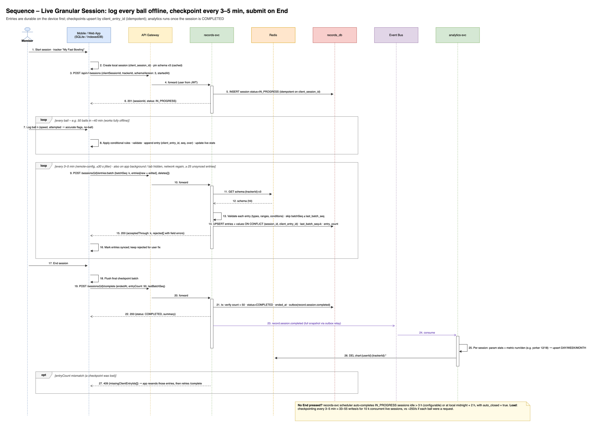
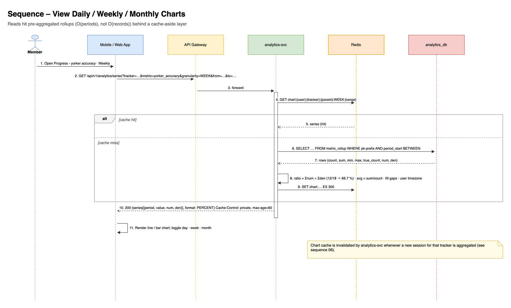
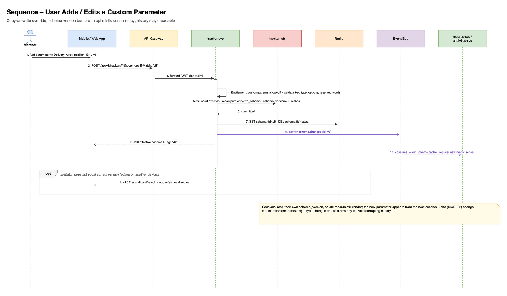

# TrainMe – Low-Level Design (LLD)

| Item | Value |
|---|---|
| Version | 1.3 · 2026-10-03 (named sessions, N per day; unit registry and editable units; 1.2 reusable activity library + parameter sets, JSONB entry values, search structures, catalog seeding; v1.1 live sessions, conditions, ratio metrics) |
| Related | `02_High_Level_Design.md` |
| Diagrams | `03_data_model_erd`, `04_activity_taxonomy_schema`, `05`–`08` sequences |

---

## 1. Service Internal Structure

Each NestJS service follows the same **hexagonal (ports & adapters)** layout, generated from a shared service template:

```
src/services/<name>/
  src/
    api/            # REST controllers, DTOs (generated from OpenAPI), guards (JWT, roles, ownership)
    application/    # use cases / command & query handlers
    domain/         # entities, value objects, domain events, invariants (no framework imports)
    infrastructure/ # Postgres repositories (Prisma/Kysely), Kafka producer/consumer, Redis, HTTP clients
    outbox/         # outbox writer + relay (or Debezium connector config)
    config/         # env schema (zod), feature flags (OpenFeature)
    observability/  # OTel bootstrap, pino logger, metrics
  migrations/       # SQL migrations (Flyway-style, expand/contract)
  test/             # unit, integration (Testcontainers), contract (Pact)
  helm/             # chart values overrides (base chart shared)
  openapi.yaml
```

Shared libraries (monorepo `src/libs/`): `auth` (JWT validation, roles, ownership guard), `observability`, `kafka` (CloudEvents envelope, idempotent consumer), `errors` (RFC 9457), `schema` (JSON Schema compiler for trackers), `testing`.

---

## 2. Data Model (DDL – PostgreSQL 17)

Conventions: `UUIDv7` primary keys; `TIMESTAMPTZ` in UTC; `snake_case`; every DB has an `outbox_event` table; soft delete only where needed.

### 2.1 catalog_db

```sql
CREATE TABLE category (
  id          UUID PRIMARY KEY,
  parent_id   UUID REFERENCES category(id),       -- any depth: Sports › Cricket › Bowler
  slug        VARCHAR(80) NOT NULL UNIQUE,
  name        VARCHAR(120) NOT NULL,
  level       SMALLINT NOT NULL CHECK (level BETWEEN 1 AND 6),
  icon        VARCHAR(80),
  sort_order  INT NOT NULL DEFAULT 0,
  kind        VARCHAR(16) NOT NULL DEFAULT 'AREA'  -- DOMAIN | SPORT | ROLE_GROUP | ROLE | DISCIPLINE | MUSCLE_GROUP | MUSCLE | AREA
              CHECK (kind IN ('DOMAIN','SPORT','ROLE_GROUP','ROLE','DISCIPLINE','MUSCLE_GROUP','MUSCLE','AREA')),
  status      VARCHAR(16) NOT NULL DEFAULT 'ACTIVE',
  source      VARCHAR(16) NOT NULL DEFAULT 'SEED',   -- SEED | ADMIN | IMPORT (seed never overwrites ADMIN rows)
  i18n        JSONB NOT NULL DEFAULT '{}'          -- {"hi": {"name": "..."}}
);

CREATE TABLE profile_template (                    -- attaches to any category node (e.g. Fast Bowler under Bowler)
  id           UUID PRIMARY KEY,
  category_id  UUID NOT NULL REFERENCES category(id),
  code         VARCHAR(80) NOT NULL,              -- e.g. cricket.fast_bowler
  version      INT NOT NULL,
  name         VARCHAR(120) NOT NULL,
  description  TEXT,
  status       VARCHAR(16) NOT NULL CHECK (status IN ('DRAFT','PUBLISHED','RETIRED')),
  owner_type   VARCHAR(16) NOT NULL DEFAULT 'SYSTEM' CHECK (owner_type IN ('SYSTEM','COACH','USER')),
  owner_id     UUID,
  tags         TEXT[] NOT NULL DEFAULT '{}',
  created_at   TIMESTAMPTZ NOT NULL DEFAULT now(),
  published_at TIMESTAMPTZ,
  UNIQUE (code, version)
);

-- v1.2: activities are a REUSABLE LIBRARY (one "Catching Drill" / "Barbell Bench Press" shared by many templates)
CREATE TABLE activity_definition (
  id                UUID PRIMARY KEY,
  code              VARCHAR(80) NOT NULL,       -- e.g. cricket.fast.delivery, gym.barbell_bench_press
  version           INT NOT NULL DEFAULT 1,
  name              VARCHAR(160) NOT NULL,
  kind              VARCHAR(12) NOT NULL CHECK (kind IN ('EXERCISE','DRILL','TEST','MATCH','LOG')),
  recording_mode    VARCHAR(16) NOT NULL CHECK (recording_mode IN ('PER_SESSION','PER_SET','PER_ATTEMPT')),
  grouping          JSONB,                      -- {"label":"Over","size":6} → ball 7 = over 2 ball 1
  max_entries       INT NOT NULL DEFAULT 500,   -- per session guard
  category_codes    TEXT[] NOT NULL DEFAULT '{}',
  sports            TEXT[] NOT NULL DEFAULT '{}',
  roles             TEXT[] NOT NULL DEFAULT '{}',
  equipment         TEXT[] NOT NULL DEFAULT '{}',
  primary_muscles   TEXT[] NOT NULL DEFAULT '{}',
  secondary_muscles TEXT[] NOT NULL DEFAULT '{}',
  mechanic          VARCHAR(12),                -- compound | isolation
  force             VARCHAR(12),                -- push | pull | static
  level             VARCHAR(12),                -- beginner | intermediate | advanced
  synonyms          TEXT[] NOT NULL DEFAULT '{}',
  description       TEXT,
  instructions      TEXT[],
  media             JSONB NOT NULL DEFAULT '{}',
  status            VARCHAR(16) NOT NULL DEFAULT 'PUBLISHED' CHECK (status IN ('DRAFT','PUBLISHED','RETIRED')),
  source            VARCHAR(16) NOT NULL DEFAULT 'SEED',     -- SEED | ADMIN | IMPORT
  license           VARCHAR(40),                              -- e.g. 'Unlicense' for Free Exercise DB imports
  metadata          JSONB NOT NULL DEFAULT '{}',
  UNIQUE (code, version)
);

-- v1.3: unit registry (ADR-014). Seeded from catalog.json "lookups.units"; factors are exact definitions.
CREATE TABLE unit_dimension (
  code       VARCHAR(16) PRIMARY KEY,              -- speed | mass | length | duration | energy | volume | pace
  name       VARCHAR(40) NOT NULL,
  base_unit  VARCHAR(16) NOT NULL                  -- reference unit for factors: m/s, kg, m, s, kcal, l, s/m
);
CREATE TABLE unit (
  code         VARCHAR(16) PRIMARY KEY,            -- 'km/h', 'mph', 'kg', 'lb', 'g', 'mi', 'reps', 'bpm' …
  dimension    VARCHAR(16) REFERENCES unit_dimension(code),   -- NULL = label-only unit (reps, bpm, rpm, %, AU): never converted
  label        VARCHAR(40) NOT NULL,               -- "miles per hour"
  to_base      NUMERIC(30,15),                     -- value_in_base = value × to_base   (lb 0.45359237, mi 1609.344, km/h 1/3.6)
  system       VARCHAR(8) NOT NULL DEFAULT 'BOTH' CHECK (system IN ('METRIC','IMPERIAL','BOTH')),
  counterpart  VARCHAR(16) REFERENCES unit(code),  -- same-magnitude unit in the other system: kg↔lb, g↔oz, km↔mi, cm↔in, km/h↔mph
  decimals     SMALLINT NOT NULL DEFAULT 1,        -- display rounding
  step         NUMERIC,                            -- input stepper step in this unit (lb 0.5, kg 0.25, g 1)
  CHECK ((dimension IS NULL) = (to_base IS NULL))
);

CREATE TABLE parameter_set (                       -- reusable shapes: strength_set, cardio_bout, drill_block …
  id           UUID PRIMARY KEY,
  code         VARCHAR(64) NOT NULL UNIQUE,
  name         VARCHAR(120) NOT NULL,
  description  TEXT
);

CREATE TABLE activity_parameter_set (
  activity_id      UUID NOT NULL REFERENCES activity_definition(id) ON DELETE CASCADE,
  parameter_set_id UUID NOT NULL REFERENCES parameter_set(id),
  sort_order       INT NOT NULL DEFAULT 0,
  PRIMARY KEY (activity_id, parameter_set_id)
);

CREATE TABLE template_activity (                   -- which library activities a profile template offers
  profile_template_id UUID NOT NULL REFERENCES profile_template(id) ON DELETE CASCADE,
  activity_id         UUID NOT NULL REFERENCES activity_definition(id),
  sort_order          INT NOT NULL DEFAULT 0,
  targets             JSONB NOT NULL DEFAULT '{}', -- {"targetSets":5,"targetReps":"5"}
  PRIMARY KEY (profile_template_id, activity_id)
);

CREATE TABLE parameter_definition (                -- owned by an activity OR by a parameter set
  id               UUID PRIMARY KEY,
  activity_id      UUID REFERENCES activity_definition(id) ON DELETE CASCADE,
  parameter_set_id UUID REFERENCES parameter_set(id) ON DELETE CASCADE,
  key          VARCHAR(64) NOT NULL CHECK (key ~ '^[a-z][a-z0-9_]{1,63}$'),
  label        VARCHAR(120) NOT NULL,
  data_type    VARCHAR(16) NOT NULL CHECK (data_type IN ('INT','DECIMAL','BOOL','ENUM','TEXT','DURATION')),
  unit         VARCHAR(16) REFERENCES unit(code), -- CANONICAL (storage) unit, fixed once published: kg, km/h, reps, kcal, s
  dimension    VARCHAR(16) REFERENCES unit_dimension(code),  -- derived from unit; NULL = not convertible
  allowed_units TEXT[],                           -- optional narrowing of the picker (body weight: kg, lb, st); NULL = every unit of the dimension
  constraints  JSONB NOT NULL DEFAULT '{}',       -- {"min":40,"max":170,"step":0.1,"options":["off","leg"],"max_ref":"attempts"}
  condition    JSONB,                             -- {"when":{"key":"yorker_attempted","eq":true}}  (shown/required only then)
  default_agg  VARCHAR(16) NOT NULL DEFAULT 'AVG'
               CHECK (default_agg IN ('SUM','AVG','MIN','MAX','COUNT','COUNT_TRUE','PCT_TRUE','NONE')),
  required     BOOLEAN NOT NULL DEFAULT false,    -- with a condition: required only when the condition holds
  sort_order   INT NOT NULL DEFAULT 0,
  CHECK (num_nonnulls(activity_id, parameter_set_id) = 1),
  UNIQUE NULLS NOT DISTINCT (activity_id, parameter_set_id, key)
);

CREATE TABLE metric_definition (                   -- chartable metrics, incl. ratios; owned by an activity OR a parameter set
  id               UUID PRIMARY KEY,
  activity_id      UUID REFERENCES activity_definition(id) ON DELETE CASCADE,
  parameter_set_id UUID REFERENCES parameter_set(id) ON DELETE CASCADE,
  key          VARCHAR(64) NOT NULL,              -- e.g. yorker_accuracy
  label        VARCHAR(120) NOT NULL,
  kind         VARCHAR(8) NOT NULL CHECK (kind IN ('RATIO','SINGLE')),
  numerator    JSONB NOT NULL,                    -- term or [terms]: {"fn":"COUNT_TRUE","param":"yorker_accurate"}
  denominator  JSONB,                             -- {"fn":"COUNT_TRUE","param":"yorker_attempted"}  (NULL for SINGLE)
  display      JSONB NOT NULL DEFAULT '{}',       -- {"format":"PERCENT","decimals":1} | {"format":"NUMBER","rawUnit":"m","unit":"km","decimals":2}
                                                  -- rawUnit = canonical unit the formula yields; unit = default display unit (converted via the registry)
  sort_order   INT NOT NULL DEFAULT 0,
  CHECK (num_nonnulls(activity_id, parameter_set_id) = 1),
  UNIQUE NULLS NOT DISTINCT (activity_id, parameter_set_id, key)
);
CREATE INDEX ON template_activity (activity_id);
CREATE INDEX ON activity_definition USING GIN (category_codes, sports, roles, equipment, primary_muscles);
-- catalog_search_doc (denormalised search table) → see 08_Search_and_Query_Performance.md §4.1
CREATE INDEX ON profile_template (category_id, status);
CREATE INDEX ON profile_template USING GIN (tags);
```

Published template and activity versions are **immutable**. Editing creates version `n+1` as DRAFT. An activity's effective parameters are its parameter sets' parameters (in order) plus its own, and the same holds for metrics. The Phase 1 content (147 activities, 10 parameter sets, 40 templates) is in `07_Phase1_Activity_Catalog.md` / `catalog/phase1/catalog.json`.

**Metric expression grammar** (deliberately small, so it is safe and identical on the device and the server):

```
term  := {"fn": "COUNT" | "COUNT_TRUE" | "SUM" | "MAX" | "MIN", "param": <key> | "*" | "expr": "<arithmetic over params>",
          "where"?: {<key>: <value> | {"in"|"ne"|"gte"|"lte": …}}}
num   := term | [term, …]                              -- a list is summed
value := Σ num ÷ Σ den                                 -- RATIO (MAX/MIN not allowed)
value := Σ num   |   MAX/MIN(num)                      -- SINGLE (MAX/MIN merged with GREATEST/LEAST across periods)
```

- `COUNT(param)` counts entries where the param is not null.
- `COUNT(*)` counts all entries.
- `COUNT_TRUE` counts entries where the BOOL is true.
- `SUM` adds numeric values.
- `where` filters entries, e.g. `{"bouncer_attempted": true}`.
- `expr` allows safe arithmetic (`+ - * /`, constants, parentheses) over params, e.g. volume = SUM(reps × weight_kg), est. 1RM = MAX(weight_kg × (1 + reps / 30)). It is parsed by a whitelist parser and never evaluated as code.
- `where` supports `=`, `in`, `≠`, `≥`, `≤`, with several keys AND-ed (e.g. second serves that were out).

### 2.2 tracker_db

```sql
CREATE TABLE user_tracker (
  id                   UUID PRIMARY KEY,
  user_id              UUID NOT NULL,
  profile_template_id  UUID,                     -- null = built from scratch
  template_code        VARCHAR(80),
  template_version     INT,
  display_name         VARCHAR(120) NOT NULL,
  status               VARCHAR(16) NOT NULL DEFAULT 'ACTIVE' CHECK (status IN ('ACTIVE','ARCHIVED')),
  base_snapshot        JSONB NOT NULL,           -- copy of template (activities, parameters, metrics) at subscribe time
  effective_schema     JSONB NOT NULL,           -- compiled: template ⊕ overrides
  schema_version       INT NOT NULL DEFAULT 1,
  display_units        JSONB NOT NULL DEFAULT '{}',  -- v1.3: {"delivery.speed_kmph":"mph", "*.mass":"lb"}; NOT part of schema_version (ADR-014)
  created_at           TIMESTAMPTZ NOT NULL DEFAULT now(),
  updated_at           TIMESTAMPTZ NOT NULL DEFAULT now()
);
CREATE INDEX ON user_tracker (user_id, status);

CREATE TABLE tracker_override (
  id               UUID PRIMARY KEY,
  user_tracker_id  UUID NOT NULL REFERENCES user_tracker(id) ON DELETE CASCADE,
  target           VARCHAR(16) NOT NULL CHECK (target IN ('ACTIVITY','PARAMETER','METRIC')),
  action           VARCHAR(16) NOT NULL CHECK (action IN ('ADD','MODIFY','HIDE')),
  activity_code    VARCHAR(80) NOT NULL,
  item_key         VARCHAR(64),                  -- parameter key or metric key
  definition       JSONB NOT NULL DEFAULT '{}',  -- same shape as parameter_definition / metric_definition / activity_definition
  created_at       TIMESTAMPTZ NOT NULL DEFAULT now(),
  UNIQUE (user_tracker_id, target, activity_code, item_key, action)
);
```

Keeping `base_snapshot` makes trackers independent of later catalog changes. Template upgrades are an explicit, user-approved merge.

### 2.3 records_db

```sql
CREATE TABLE activity_session (
  id                 UUID NOT NULL,
  user_id            UUID NOT NULL,
  tracker_id         UUID NOT NULL,
  session_date       DATE NOT NULL,             -- local date (user timezone) of started_at; editable for backfill
  name               VARCHAR(80) NOT NULL CHECK (length(btrim(name)) BETWEEN 1 AND 80),   -- v1.3: "Morning Nets", "Evening Gym"
  name_key           VARCHAR(80) GENERATED ALWAYS AS (lower(regexp_replace(btrim(name), '\s+', ' ', 'g'))) STORED,
  status             VARCHAR(12) NOT NULL DEFAULT 'IN_PROGRESS'
                     CHECK (status IN ('IN_PROGRESS','COMPLETED','DISCARDED')),
  started_at         TIMESTAMPTZ NOT NULL,
  ended_at           TIMESTAMPTZ,
  timezone           VARCHAR(40) NOT NULL,
  schema_version     INT NOT NULL,              -- pinned at start; later tracker edits apply to the next session
  client_session_id  UUID NOT NULL,             -- generated on device; idempotency for "start"
  last_batch_seq     INT NOT NULL DEFAULT 0,    -- highest checkpoint batch applied
  entry_count        INT NOT NULL DEFAULT 0,    -- live (non-deleted) entries on the server
  last_synced_at     TIMESTAMPTZ,
  auto_closed        BOOLEAN NOT NULL DEFAULT false,
  notes              TEXT,
  source             VARCHAR(16) NOT NULL DEFAULT 'MOBILE',
  row_version        INT NOT NULL DEFAULT 1,    -- optimistic locking for edits after completion
  deleted_at         TIMESTAMPTZ,
  created_at         TIMESTAMPTZ NOT NULL DEFAULT now(),
  updated_at         TIMESTAMPTZ NOT NULL DEFAULT now(),
  PRIMARY KEY (id, session_date)
) PARTITION BY RANGE (session_date);
CREATE UNIQUE INDEX ON activity_session (user_id, client_session_id, session_date);
-- v1.3 (ADR-015): (date, name) identifies a session for its user; discarded / deleted sessions free the name
CREATE UNIQUE INDEX uq_session_name ON activity_session (user_id, session_date, name_key)
  WHERE deleted_at IS NULL AND status <> 'DISCARDED';
CREATE INDEX ON activity_session (user_id, tracker_id, session_date DESC);
CREATE INDEX ON activity_session (status, last_synced_at) WHERE status = 'IN_PROGRESS';   -- auto-close scan

CREATE TABLE activity_entry (                      -- v1.2: one row per ball/set/item, values as one JSONB document (ADR-011)
  id               UUID NOT NULL,
  user_id          UUID NOT NULL,               -- denormalised: every search is user-scoped
  session_id       UUID NOT NULL,
  session_date     DATE NOT NULL,               -- partition key
  client_entry_id  UUID NOT NULL,               -- generated on device per ball / set / item
  activity_code    VARCHAR(80) NOT NULL,
  seq_no           INT NOT NULL,                -- ball number / set number / item number
  group_no         INT,                         -- over / round (derived from activity grouping)
  recorded_at      TIMESTAMPTZ NOT NULL,        -- device time of the tap
  values           JSONB NOT NULL CHECK (jsonb_typeof(values) = 'object'),   -- validated against the pinned JSON Schema
  row_version      INT NOT NULL DEFAULT 1,
  deleted_at       TIMESTAMPTZ,                 -- tombstone, so deletes also sync idempotently
  PRIMARY KEY (id, session_date),
  UNIQUE (session_id, client_entry_id, session_date)
) PARTITION BY RANGE (session_date);
CREATE INDEX ON activity_entry (user_id, activity_code, session_date DESC) WHERE deleted_at IS NULL;
CREATE INDEX ON activity_entry (session_id, seq_no);
-- activity_session also gets tags TEXT[] + generated search_tsv with GIN (user_id, search_tsv) → 08 §4.2
-- pg_partman: monthly partitions for activity_session and activity_entry, premake 3 months; raw entries hot for 13 months then archived to S3 Parquet
```

Notes:
- **Sessions per day (v1.3):** no product limit; any number of sessions per user per date, on the same or different trackers, and several may be `IN_PROGRESS` at once. A configurable guard (`records.maxSessionsPerDay`, default 50) returns `429` above it. `uq_session_name` was tested on a partitioned table: "Morning Nets" and "  morning   NETS " clash on the same date, the same name on another date is accepted, and discarding a session frees its name.
- **Values are stored in the parameter's canonical unit** (e.g. `speed_kmph` always km/h even if the user typed mph). See §3.1.
- Parameters whose condition is false are **not stored**: the key is absent from `values`. A missing key means "not applicable", which differs from `false`.
- Volume (10K users × 3 sessions/day × 50 entries): ~1.5 M entry rows/day, ~548 M/year (~245 GB with indexes). The v1.1 row-per-value design would have produced ~6 B rows/year. Sizing, indexes and query shapes are in `08_Search_and_Query_Performance.md`.

### 2.4 analytics_db

```sql
CREATE TABLE metric_rollup (
  user_id        UUID NOT NULL,
  tracker_id     UUID NOT NULL,
  activity_code  VARCHAR(80) NOT NULL,
  metric_key     VARCHAR(64) NOT NULL,          -- a parameter key (stats) or a metric_definition key (ratio)
  granularity    CHAR(5) NOT NULL CHECK (granularity IN ('DAY','WEEK','MONTH')),
  period_start   DATE NOT NULL,
  count          BIGINT NOT NULL DEFAULT 0,     -- parameter rows: non-null values
  sum            NUMERIC NOT NULL DEFAULT 0,
  min            NUMERIC,
  max            NUMERIC,
  true_count     BIGINT NOT NULL DEFAULT 0,
  num            NUMERIC,                       -- metric rows: Σ numerator
  den            NUMERIC,                       -- metric rows: Σ denominator (NULL for SINGLE)
  session_count  INT NOT NULL DEFAULT 0,
  updated_at     TIMESTAMPTZ NOT NULL DEFAULT now(),
  PRIMARY KEY (user_id, tracker_id, activity_code, metric_key, granularity, period_start)
);
CREATE TABLE personal_record (
  id UUID PRIMARY KEY, user_id UUID NOT NULL, tracker_id UUID NOT NULL,
  activity_code VARCHAR(80) NOT NULL, metric_key VARCHAR(64) NOT NULL,
  best_value NUMERIC NOT NULL, direction CHAR(3) NOT NULL DEFAULT 'MAX',   -- MAX (fastest ball) or MIN (fastest 5K time)
  min_den NUMERIC,                                                        -- ratio PRs need a minimum sample, e.g. ≥ 10 yorkers
  session_id UUID NOT NULL, achieved_at TIMESTAMPTZ NOT NULL,
  UNIQUE (user_id, tracker_id, activity_code, metric_key)
);
CREATE TABLE session_metric (                      -- per-session metric values for history search (08 §4.3)
  user_id UUID NOT NULL, tracker_id UUID NOT NULL, session_id UUID NOT NULL, session_date DATE NOT NULL,
  session_name VARCHAR(80) NOT NULL, started_at TIMESTAMPTZ NOT NULL,     -- v1.3: per-session view inside a day (FR-ANL-11)
  activity_code VARCHAR(80) NOT NULL, metric_key VARCHAR(64) NOT NULL, num NUMERIC, den NUMERIC, value NUMERIC,
  PRIMARY KEY (user_id, session_id, activity_code, metric_key)
);
CREATE INDEX ON session_metric (user_id, tracker_id, metric_key, value DESC, session_date DESC);
CREATE TABLE streak (user_id UUID, tracker_id UUID, current_days INT, longest_days INT, last_active DATE, PRIMARY KEY (user_id, tracker_id));
CREATE TABLE processed_event (event_id UUID PRIMARY KEY, processed_at TIMESTAMPTZ NOT NULL DEFAULT now());
```

**Aggregation trigger:** only `record.session.completed`, `.updated` (edit after completion) and `.deleted` are aggregated. In-progress checkpoints are not, so charts never show half sessions twice.

**Update and delete correctness:** on `record.session.updated/deleted`, analytics recomputes the affected **DAY** rows for that (user, tracker, date) from the event snapshot. It then recomputes the parent WEEK and MONTH rows from their DAY rows. Because `num`/`den`/`sum`/`count` are additive, the result is exact, and reprocessing is safe.

### 2.4.1 Worked example – Fast Bowler, 50 balls, 40 minutes

Template `cricket.fast_bowler` v2 · activity `delivery` (PER_ATTEMPT, grouping Over/6).

**parameter_definition** (condition column shown):

| key | data_type | condition |
|---|---|---|
| speed_kmph | DECIMAL (km/h, 40–170) | – |
| line | ENUM(off, middle, leg, wide) | – |
| yorker_attempted | BOOL | – |
| yorker_accurate | BOOL | `{"when":{"key":"yorker_attempted","eq":true}}` |
| seam_attempted | BOOL | – |
| seam_accurate | BOOL | `{"when":{"key":"seam_attempted","eq":true}}` |
| bouncer_attempted | BOOL | – |
| bouncer_accurate | BOOL | `{"when":{"key":"bouncer_attempted","eq":true}}` |
| no_ball | BOOL | – |

**metric_definition**:

| key | kind | numerator | denominator | display |
|---|---|---|---|---|
| yorker_accuracy | RATIO | `{"fn":"COUNT_TRUE","param":"yorker_accurate"}` | `{"fn":"COUNT_TRUE","param":"yorker_attempted"}` | PERCENT |
| seam_accuracy | RATIO | COUNT_TRUE(seam_accurate) | COUNT_TRUE(seam_attempted) | PERCENT |
| bouncer_accuracy | RATIO | COUNT_TRUE(bouncer_accurate) | COUNT_TRUE(bouncer_attempted) | PERCENT |
| no_ball_rate | RATIO | COUNT_TRUE(no_ball) | COUNT(*) | PERCENT |
| avg_speed | RATIO | SUM(speed_kmph) | COUNT(speed_kmph) | NUMBER km/h |
| balls_bowled | SINGLE | COUNT(*) | – | NUMBER |

**activity_session** (after End):

| id | tracker_id | session_date | status | started_at | ended_at | schema_version | entry_count | last_batch_seq |
|---|---|---|---|---|---|---|---|---|
| ses-1 | trk-1 | 2026-10-03 | COMPLETED | 06:10 | 06:50 | 3 | 50 | 10 |

**activity_entry** (3 of 50):

| id | client_entry_id | activity_code | seq_no | group_no | recorded_at |
|---|---|---|---|---|---|
| ent-1 | c-0001 | delivery | 1 | 1 | 06:10:42 |
| ent-2 | c-0002 | delivery | 2 | 1 | 06:11:31 |
| ent-3 | c-0003 | delivery | 3 | 1 | 06:12:20 |

**activity_entry.values** (JSONB; conditional children are present only when the parent is true):

| entry | values |
|---|---|
| ent-1 | `{"speed_kmph":131.4,"line":"off_stump","yorker_attempted":true,"yorker_accurate":true,"seam_attempted":true,"seam_accurate":true,"bouncer_attempted":false,"no_ball":false}` |
| ent-2 | `{"speed_kmph":134.0,"yorker_attempted":false,"seam_attempted":true,"seam_accurate":false,"bouncer_attempted":true,"bouncer_accurate":true,"no_ball":false}` |
| ent-3 | `{"speed_kmph":129.8,"yorker_attempted":true,"yorker_accurate":false,"seam_attempted":false,"bouncer_attempted":false,"no_ball":true}` |
| … | … |

Assume the 50 balls total: seam attempted 30 / accurate 23 · yorker attempted 18 / accurate 12 · bouncer attempted 8 / accurate 5 · no-balls 3 · speeds sum 6,590 km/h.

**metric_rollup** after `record.session.completed` (DAY row; WEEK 2026-09-28 and MONTH 2026-10-01 rows are upserted identically):

| metric_key | granularity | period_start | num | den | → chart value |
|---|---|---|---|---|---|
| seam_accuracy | DAY | 2026-10-03 | 23 | 30 | 76.7 % |
| yorker_accuracy | DAY | 2026-10-03 | 12 | 18 | 66.7 % |
| bouncer_accuracy | DAY | 2026-10-03 | 5 | 8 | 62.5 % |
| no_ball_rate | DAY | 2026-10-03 | 3 | 50 | 6.0 % |
| avg_speed | DAY | 2026-10-03 | 6590 | 50 | 131.8 km/h |
| balls_bowled | DAY | 2026-10-03 | 50 | – | 50 |

`session_metric` gets the same per-session values (e.g. `yorker_accuracy` value 0.667, num 12, den 18) for history search. Parameter-stat rows also exist (e.g. `speed_kmph`: count 50, sum 6590, min 124.9, max 138.2) for MIN/MAX charts and personal records.

If a second session on 5 Oct has seam 20/24, the WEEK row becomes `num 43, den 54` → **79.6 %**. That is the true weekly accuracy; averaging the daily percentages would give 80.0 %.

### 2.5 profile_db, billing_db, notification_db
These follow the ERD diagram (`user_profile`, `user_device`, `plan`, `subscription`, `payment_event`, `reminder`, `notification_log`).
- `payment_event.provider_event_id` is **UNIQUE** (webhook idempotency).
- `user_profile.unit_preferences JSONB` (v1.3, FR-PRF-06): `{"preset":"METRIC","speed":"IMPERIAL","mass":"METRIC","length":"METRIC","volume":"METRIC","pace":"METRIC"}`. The preset fills every dimension; each can then be switched. Published in `user.updated` so analytics and notification-svc can format values ("New PR: 88.2 mph").
- `plan.entitlements` example: `{"max_trackers": 3, "custom_params": true, "history_days": 365, "export": true, "reminders": 10}`.

### 2.6 outbox_event (every DB)

```sql
CREATE TABLE outbox_event (
  id              UUID PRIMARY KEY,
  aggregate_type  VARCHAR(60) NOT NULL,
  aggregate_id    UUID NOT NULL,
  event_type      VARCHAR(80) NOT NULL,
  payload         JSONB NOT NULL,
  headers         JSONB NOT NULL DEFAULT '{}',  -- traceparent, user_id
  created_at      TIMESTAMPTZ NOT NULL DEFAULT now(),
  published_at    TIMESTAMPTZ
);
CREATE INDEX ON outbox_event (published_at) WHERE published_at IS NULL;
```

The relay is either **Debezium** (Kafka Connect, outbox event router SMT) or an in-service poller using `SELECT … FOR UPDATE SKIP LOCKED`, batch 500, every 200 ms. Start with the poller, which is simpler. Move to Debezium when throughput requires it.

---

## 3. Effective Schema Compilation

Input: `base_snapshot` (template version) + ordered `tracker_override` rows. Output: a JSON document plus a **JSON Schema (draft 2020-12)** per activity entry, used by clients (form rendering, live validation) and by records-svc (checkpoint validation).

```jsonc
// GET /api/v1/trackers/{id}/schema   ETag: "v3"
{
  "trackerId": "trk-1",
  "schemaVersion": 3,
  "activities": [{
    "code": "delivery", "name": "Delivery", "recordingMode": "PER_ATTEMPT",
    "grouping": {"label": "Over", "size": 6}, "maxEntries": 500,
    "parameters": [
      {"key": "speed_kmph", "type": "DECIMAL", "dimension": "speed", "unit": "km/h", "min": 40, "max": 170, "step": 0.1},
      {"key": "line", "type": "ENUM", "options": ["off", "middle", "leg", "wide"]},
      {"key": "yorker_attempted", "type": "BOOL", "required": true},
      {"key": "yorker_accurate", "type": "BOOL", "required": true, "when": {"key": "yorker_attempted", "eq": true}},
      {"key": "seam_attempted", "type": "BOOL", "required": true},
      {"key": "seam_accurate", "type": "BOOL", "required": true, "when": {"key": "seam_attempted", "eq": true}},
      {"key": "bouncer_attempted", "type": "BOOL", "required": true},
      {"key": "bouncer_accurate", "type": "BOOL", "required": true, "when": {"key": "bouncer_attempted", "eq": true}},
      {"key": "no_ball", "type": "BOOL", "required": true},
      {"key": "slower_ball", "type": "BOOL", "custom": true},
      {"key": "wide", "type": "BOOL", "hidden": true}
    ],
    "metrics": [
      {"key": "yorker_accuracy", "kind": "RATIO", "num": {"fn": "COUNT_TRUE", "param": "yorker_accurate"},
       "den": {"fn": "COUNT_TRUE", "param": "yorker_attempted"}, "display": {"format": "PERCENT", "decimals": 1}},
      {"key": "slower_ball_rate", "kind": "RATIO", "num": {"fn": "COUNT_TRUE", "param": "slower_ball"},
       "den": {"fn": "COUNT", "param": "*"}, "display": {"format": "PERCENT"}, "custom": true}
    ],
    "entryJsonSchema": {
      "$schema": "https://json-schema.org/draft/2020-12/schema",
      "type": "object", "additionalProperties": false,
      "properties": {"speed_kmph": {"type": "number", "minimum": 40, "maximum": 170}, "yorker_attempted": {"type": "boolean"},
                     "yorker_accurate": {"type": "boolean"}, "...": {}},
      "required": ["yorker_attempted", "seam_attempted", "bouncer_attempted", "no_ball"],
      "allOf": [
        {"if": {"properties": {"yorker_attempted": {"const": true}}},
         "then": {"required": ["yorker_accurate"]},
         "else": {"not": {"required": ["yorker_accurate"]}}}
      ]
    }
  }]
}
```

Rules:
1. Apply overrides in `created_at` order: **ADD** appends a parameter, metric or activity; **MODIFY** may change `label, min/max, options (add only), agg, required, condition, sort_order` or a metric's display format (the **display unit is not an override**: it lives in `display_units`, §3.1); **HIDE** sets `hidden=true` (kept for history rendering, excluded from forms and new metrics).
2. A **type change is not allowed** through MODIFY. The client must ADD a new key, and the old key can be HIDDEN.
3. Conditions: they may reference only a BOOL or ENUM parameter of the **same activity**, with no cycles and a nesting depth ≤ 2. The compiler emits `if/then/else`, so the child is required when the parent matches and **forbidden** otherwise.
4. Metrics: every `param` referenced must exist in the effective schema (a hidden param keeps old metrics valid for history). `fn` must fit the type (`COUNT_TRUE` → BOOL; `SUM` → INT/DECIMAL/DURATION).
5. Validate: unique keys per activity; reserved keys (`id`, `seq_no`, `recorded_at`, `group_no`…) rejected; plan limits (max params per activity 30, max custom metrics 10, custom params allowed).
6. Units: a parameter's canonical `unit` and `dimension` can never be changed by MODIFY (that would reinterpret history). Stored values are always canonical; the display unit is resolved separately (§3.1).
7. The compiled result is stored in `user_tracker.effective_schema` and cached in Redis as `schema:{trackerId}:v{n}` (no TTL; immutable per version), with `schema:{trackerId}:latest` → n (TTL 1 h). **A session pins `schema_version` at Start**, so edits made mid-session apply to the next session.
8. The same compiler and metric evaluator ship as a shared TypeScript package (`libs/schema`). Mobile, web and the server therefore produce identical validation results and live stats.

### 3.1 Units of measure (v1.3, ADR-014)

**Registry** (`unit_dimension`, `unit`; seeded from `catalog.json → lookups.units`, listed in `07_Phase1_Activity_Catalog.md` §1.2):

| Dimension | Base | Units (metric ↔ imperial counterpart) |
|---|---|---|
| speed | m/s | km/h ↔ mph, m/s ↔ ft/s |
| mass | kg | kg ↔ lb, g ↔ oz, st (imperial) |
| length | m | km ↔ mi, m ↔ yd, cm ↔ in, mm, ft |
| duration | s | ms, s, min, h (same in both systems) |
| energy | kcal | kcal, kJ |
| volume | l | ml ↔ fl oz, l ↔ qt |
| pace | s/m | min/km ↔ min/mi |
| *(none)* | – | reps, bpm, rpm, spm, %, AU, and free-text custom units: labels only |

**Which unit is shown** for a parameter or metric (first match wins):
1. Tracker, this parameter: `display_units["delivery.speed_kmph"] = "mph"` (FR-TRK-09).
2. Tracker, this dimension: `display_units["*.mass"] = "lb"` ("everything in this tracker in pounds").
3. Profile preference for the dimension (FR-PRF-06): `IMPERIAL` → the canonical unit's `counterpart` (kg → lb, g → oz, km/h → mph, cm → in); `METRIC` → the canonical unit itself.
4. The catalog's canonical unit.

**Conversion** (`libs/units`, used by mobile, web, analytics and export):
- `display = canonical × to_base(canonical) ÷ to_base(display)`, and the reverse on input. Only linear factors (no offsets), so sums, averages, maxima and ratios convert exactly the same way before or after aggregation.
- Input is converted to canonical **on the device before the entry is saved**, rounded to 6 decimal places. The server only ever receives canonical values, so validation, checkpoints, rollups, PRs and search work as before. Example: the user types 100 lb → stored `45.359237` kg → shown again as `100.0 lb`.
- Ranges are converted for display and rounded **inwards** (min up, max down), so a value inside the displayed range is always valid: 40–170 km/h → 24.9–105.6 mph. The stepper uses the display unit's `step`.
- Metrics: a metric's `display.rawUnit` (what the formula yields, e.g. `SUM(distance_m)` → m) converts to the resolved unit (km or mi). Ratios and percentages have no unit. Pace converts min/km ↔ min/mi.
- Changing a display unit is `PUT /trackers/{id}/display-units` or `PUT /profiles/me` and does **not** bump `schema_version`, so it is allowed in the middle of a live session.
- CSV import (FR-REC-08) may name the unit in the header (`speed_kmph[mph]`); the importer converts to canonical.
- History search thresholds (≥ 87 mph) are converted to canonical by the client before calling the API.

---

## 4. REST API Specification (v1 summary)

Base URL: `https://api.<env>.trainme.app/api/v1`. Auth: `Authorization: Bearer <JWT>` unless noted. All list endpoints use cursor pagination (`?limit=50&cursor=…`). Errors use `application/problem+json`.

### 4.1 Profile – user-profile-svc
| Method | Path | Description |
|---|---|---|
| GET | `/profiles/me` | Get own profile |
| PUT | `/profiles/me` | Create/update profile (upsert, id = token `sub`), including `unitPreferences` (§3.1) |
| POST | `/profiles/me/devices` | Register device + push token |
| DELETE | `/profiles/me/devices/{deviceId}` | Unregister device |
| POST | `/profiles/me/export` | Request data export (202 + job id) |
| DELETE | `/profiles/me` | Request account erasure (202) |

### 4.2 Subscription – subscription-svc
| Method | Path | Description |
|---|---|---|
| GET | `/plans` | Public plan list (no auth) |
| GET | `/subscriptions/me` | Current subscription + entitlements |
| POST | `/subscriptions/checkout` | Start checkout `{planCode, provider}` → `{checkoutUrl}` |
| POST | `/subscriptions/receipts` | Validate App Store / Play receipt |
| POST | `/subscriptions/me/cancel` | Cancel at period end |
| POST | `/webhooks/payments/{provider}` | Provider webhooks (no JWT; signature) |

### 4.3 Catalog – catalog-svc
| Method | Path | Description |
|---|---|---|
| GET | `/categories?parent={id}` | Browse tree |
| GET | `/units` | Unit registry (dimensions, units, factors, counterparts); cached by clients, changes only with a catalog release |
| GET | `/templates?category={id}&q=bowler` | Search templates |
| GET | `/templates/{code}` | Latest published version (with activities and parameters) |
| GET | `/templates/{code}/versions/{v}` | Specific version |
| POST/PUT/DELETE | `/admin/templates…`, `/admin/categories…` | Curator CRUD (role `curator`) |
| POST | `/admin/templates/{id}/publish` | Publish DRAFT → PUBLISHED (emits event) |

### 4.4 Trackers – tracker-svc
| Method | Path | Description |
|---|---|---|
| GET | `/trackers` | List own trackers |
| POST | `/trackers` | Create `{templateCode, displayName}` or blank `{displayName, activities[]}` |
| GET | `/trackers/{id}` | Tracker details |
| GET | `/trackers/{id}/schema` | Effective schema (ETag / If-None-Match) |
| POST | `/trackers/{id}/overrides` | Add/modify/hide (`If-Match: "v{n}"`) |
| DELETE | `/trackers/{id}/overrides/{overrideId}` | Remove an override (`If-Match`) |
| POST | `/trackers/{id}/upgrade` | Upgrade to newer template version (preview with `?dryRun=true`) |
| PATCH | `/trackers/{id}` | Rename / archive / restore |
| GET/PUT | `/trackers/{id}/display-units` | v1.3: per-parameter / per-dimension display units `{"delivery.speed_kmph":"mph","*.mass":"lb"}`. No `If-Match` on schema version; unit must belong to the parameter's dimension (`422` otherwise) |
| DELETE | `/trackers/{id}` | Delete tracker (async purge of its records) |

### 4.5 Records – records-svc (live sessions)

| Method | Path | Description |
|---|---|---|
| POST | `/sessions` | **Start** a session `{clientSessionId, trackerId, name, sessionDate?, schemaVersion, startedAt, timezone, onNameConflict: REJECT\|SUFFIX}` → `201 {sessionId, name, sessionDate, status: IN_PROGRESS}`. Idempotent on `clientSessionId`. Name clash: `REJECT` → `409 session-name-taken {suggestedName}`; `SUFFIX` (used by queued offline starts) → saved as `"Morning Nets (2)"` and returned. |
| POST | `/sessions/{id}/entries:batch` | **Checkpoint**: upsert new/edited entries and tombstone deletes. Idempotent on `client_entry_id`. |
| POST | `/sessions/{id}/complete` | **End / submit** `{endedAt, entryCount, lastBatchSeq}` → `200 COMPLETED`, or `409 {missingClientEntryIds}` |
| POST | `/sessions/{id}/discard` | Discard an in-progress session |
| GET | `/sessions?date=&trackerId=&from=&to=&status=` | List sessions (summary + live metrics). `?date=2026-10-03` returns **all of that day's sessions across trackers**, ordered by `started_at` |
| GET | `/sessions/lookup?date=2026-10-03&name=Evening%20Gym` | Find one session by its user-facing identity (date + name, case-insensitive) |
| GET | `/sessions/{id}?include=entries` | Full session with entries and values (used to **resume on another device**) |
| PATCH | `/sessions/{id}` | Rename (`name`), move (`sessionDate`), edit notes / times (`If-Match: row_version`). Allowed while `IN_PROGRESS` too. Name/date clash → `409 session-name-taken {suggestedName}`. Entry edits after completion go through `entries:batch` with `If-Match` |
| DELETE | `/sessions/{id}` | Soft delete |
| POST | `/sessions:import` | Backfill / bulk import of completed sessions (CSV-converted), ≤ 50 per call |

**Checkpoint request** (sent every 3–5 min while the session is open):

```http
POST /api/v1/sessions/ses-1/entries:batch
Content-Type: application/json

{
  "batchSeq": 4,
  "schemaVersion": 3,
  "entries": [
    {"clientEntryId": "c-0019", "activity": "delivery", "seq": 19, "group": 4, "recordedAt": "2026-10-03T06:24:05+05:30",
     "values": {"speed_kmph": 133.1, "line": "off", "yorker_attempted": true, "yorker_accurate": true,
                "seam_attempted": false, "bouncer_attempted": false, "no_ball": false}},
    {"clientEntryId": "c-0020", "activity": "delivery", "seq": 20, "group": 4, "recordedAt": "2026-10-03T06:24:51+05:30",
     "values": {"speed_kmph": 135.6, "yorker_attempted": false, "seam_attempted": true, "seam_accurate": true,
                "bouncer_attempted": false, "no_ball": false}},
    {"clientEntryId": "c-0012", "rowVersion": 1, "activity": "delivery", "seq": 12, "group": 2,
     "values": {"speed_kmph": 128.0, "no_ball": true, "yorker_attempted": false, "seam_attempted": false, "bouncer_attempted": false}}
  ],
  "deletes": ["c-0016"]
}
```

Response:

```json
{"acceptedThrough": 4, "entryCount": 21, "rejected": [
  {"clientEntryId": "c-0020", "errors": [{"pointer": "/values/speed_kmph", "code": "max", "message": "must be ≤ 170"}]}]}
```

Server rules for `entries:batch`:
1. The session must be `IN_PROGRESS`, or `COMPLETED` with `If-Match` for late edits. `schemaVersion` must equal the session's pinned version, otherwise `409`.
2. Each entry is validated on its own with Ajv against the compiled JSON Schema: types, ranges, enum options and **conditions**. A child value without its parent condition fails (`422` for that entry). Valid entries in the same batch are still applied (partial success).
3. Upsert `ON CONFLICT (session_id, client_entry_id)`: a newer `rowVersion` replaces the entry's values; an equal one is a no-op. Deletes set `deleted_at`.
4. `batchSeq ≤ last_batch_seq` is still processed (upserts are idempotent) but flagged as a replay in metrics. Then `last_batch_seq`, `entry_count` and `last_synced_at` are updated.
5. Limits: ≤ 100 entries per batch, ≤ `max_entries` (default 500) per session, body ≤ 256 KB, rate 2 req/s per user.

`complete` verifies `entryCount` against the server's live entry count. On a mismatch it returns `409` with the missing `clientEntryId`s, the app resends them, then retries. On success it sets `COMPLETED` and `ended_at`, and writes the `record.session.completed` outbox event in the same transaction.

**Session naming rules (v1.3, FR-REC-17..20):**
- The **client proposes the name**. If the user leaves it empty, the app uses `<tracker name> – <part of day>` from the local start time (Morning 05–12, Afternoon 12–17, Evening 17–21, Night 21–05) and adds ` 2`, ` 3` … if that day already has it. The server falls back to `Session – <part of day>` when a name is missing (imports).
- The server is the **referee**: inside the start/rename transaction it inserts and, on a `uq_session_name` violation, either returns `409` (`REJECT`) or retries with the next free ` (n)` suffix (`SUFFIX`). The suggestion in the `409` is computed the same way.
- `session_date` is the local date at Start and does not change at midnight. A backfilled session can set it explicitly.
- Every `record.session.*` event carries `name` and `sessionDate`; a rename emits `record.session.updated` so analytics updates `session_metric.session_name`.

**Auto-close job** (records-svc, every 10 min, leader-elected or a Kubernetes CronJob): `IN_PROGRESS` sessions with `last_synced_at` older than 3 h (configurable), or older than local midnight + 2 h, become `COMPLETED` with `auto_closed = true`, and the completed event is emitted. Empty sessions become `DISCARDED`.

### 4.6 Analytics – analytics-svc
| Method | Path | Description |
|---|---|---|
| GET | `/analytics/series?trackerId=&activity=&metric=&granularity=DAY\|WEEK\|MONTH&from=&to=` | Chart series for a parameter stat (`metric=speed_kmph&agg=MAX`) or a defined metric (`metric=yorker_accuracy`) |
| GET | `/analytics/summary?trackerId=&period=WEEK` | Dashboard KPIs vs previous period |
| GET | `/analytics/sessions/{id}/breakdown?by=group` | Per-over / per-round summary of one session (computed from the session snapshot) |
| GET | `/analytics/day?date=&trackerId=` | v1.3: per-session values inside one day (FR-ANL-11): `[{sessionId, name, startedAt, metrics{…}}]` from `session_metric` |
| GET | `/analytics/records?trackerId=` | Personal records |
| GET | `/analytics/streaks` | Streaks per tracker |

```json
{"metric": "yorker_accuracy", "kind": "RATIO", "format": "PERCENT", "granularity": "WEEK",
 "points": [{"period": "2026-09-14", "value": 58.3, "num": 7,  "den": 12},
            {"period": "2026-09-21", "value": 61.9, "num": 13, "den": 21},
            {"period": "2026-09-28", "value": 66.7, "num": 12, "den": 18}]}
```

Values are returned in the **canonical unit** with `"unit": "km/h"`; the client converts with `libs/units`. Server-rendered outputs (exports, share images, notifications) pass `?displayUnit=mph` or use the profile preference.

`num` and `den` are always returned, so the UI can show "12 of 18" and fade out points with a tiny denominator (e.g. `den < 5`).

### 4.7 Notifications – notification-svc
| Method | Path | Description |
|---|---|---|
| GET/POST/PUT/DELETE | `/reminders` | Manage reminders `{trackerId, cron, timezone, channel}` |
| GET | `/notifications` | In-app inbox |
| PUT | `/notifications/preferences` | Channels and quiet hours |

### 4.8 Error model (RFC 9457)

```json
{
  "type": "https://docs.trainme.app/errors/validation",
  "title": "Validation failed",
  "status": 422,
  "detail": "2 fields are invalid",
  "instance": "/api/v1/sessions",
  "traceId": "4bf92f3577b34da6a3ce929d0e0e4736",
  "errors": [
    {"pointer": "/entries/0/values/speed_kmph", "code": "max", "message": "must be ≤ 170"},
    {"pointer": "/entries/1/values/line", "code": "enum", "message": "must be one of off, middle, leg, wide"}
  ]
}
```

Standard codes: `400` malformed, `401` no/invalid token, `403` forbidden or entitlement exceeded (`type: …/plan-limit`), `404`, `409` conflict / stale schema version, `412` precondition failed (If-Match), `422` validation, `429` rate limited (`Retry-After`), `5xx` with `traceId`.

---

## 5. Event Catalog (Kafka)

Envelope: **CloudEvents 1.0** (JSON). Key = `user_id` (per-user ordering). Schemas live in the schema registry (Redpanda Schema Registry / AWS Glue). Compatibility mode is `BACKWARD`.

| Topic | Event types | Producer | Consumers | Partitions (beta) | Retention |
|---|---|---|---|---|---|
| `user.events` | `user.registered`, `user.updated`, `user.deleted` | user-profile-svc | all services | 6 | 7 d |
| `subscription.events` | `subscription.activated`, `.changed`, `.canceled`, `.past_due` | subscription-svc | tracker, records, notification | 6 | 7 d |
| `catalog.events` | `catalog.template.published`, `.retired` | catalog-svc | tracker (upgrade hints), notification | 3 | 30 d |
| `tracker.events` | `tracker.created`, `tracker.schema.changed`, `tracker.archived`, `tracker.deleted` | tracker-svc | records, analytics | 6 | 30 d |
| `record.events` | `record.session.started`, `.completed` (full snapshot), `.updated`, `.deleted`, `.discarded` | records-svc | analytics (completed/updated/deleted), notification (started → suppress reminder) | 12 | **30 d** (replay for rollup rebuild) |
| `analytics.events` | `analytics.pr.achieved`, `analytics.streak.at_risk` | analytics-svc | notification | 6 | 7 d |
| `notification.commands` | `notification.send` | any | notification-svc | 6 | 3 d |
| `<topic>.dlq` | failed messages | consumers | ops tooling | 1–3 | 14 d |

Example:

```json
{
  "specversion": "1.0",
  "id": "0192f4a1-7c1e-7b6a-9c3e-5d2a1f0e4b77",
  "source": "trainme/records-svc",
  "type": "record.session.completed",
  "time": "2026-10-03T01:20:14Z",
  "subject": "session/0192f4a1-…",
  "datacontenttype": "application/json",
  "traceparent": "00-4bf92f3577b34da6a3ce929d0e0e4736-00f067aa0ba902b7-01",
  "data": {
    "sessionId": "ses-1", "userId": "usr-42", "trackerId": "trk-1", "sessionDate": "2026-10-03", "name": "Morning Nets",
    "timezone": "Asia/Kolkata", "schemaVersion": 3, "status": "COMPLETED", "autoClosed": false,
    "startedAt": "2026-10-03T00:40:00Z", "endedAt": "2026-10-03T01:20:00Z", "entryCount": 50,
    "entries": [
      {"id": "ent-1", "activity": "delivery", "seq": 1, "group": 1,
       "values": {"speed_kmph": 131.4, "line": "off", "yorker_attempted": true, "yorker_accurate": true,
                  "seam_attempted": true, "seam_accurate": true, "bouncer_attempted": false, "no_ball": false}},
      "… 49 more"
    ]
  }
}
```

Consumer rules: at-least-once delivery. Every consumer checks `processed_event`, retries 3× with exponential back-off, then sends to the DLQ and raises an alert. A 50-ball snapshot is ~15 KB. If a snapshot exceeds 512 KB (very long sessions), the event carries only IDs, and analytics fetches the entries from records-svc (`GET /sessions/{id}?include=entries`).

---

## 6. Key Flows

### 6.1 Sign-up, login and subscription


### 6.2 Record a live session (granular, checkpointed, submit on End)


Client algorithm (mobile and web share it via `libs/sync`):
1. **Start**: ask for (or default) the session name, create the local session (`client_session_id`, UUIDv7), pin the cached schema version, start the timer, and call `POST /sessions` with `onNameConflict=REJECT` when online, or queue it with `SUFFIX` when offline (the server is idempotent on `clientSessionId`). Other sessions may already be in progress; the app shows them in an "active sessions" bar to switch between.
2. **Log**: each ball/set/item becomes a local entry (`client_entry_id`, `seq_no`, `group_no`, `recorded_at`, values converted to canonical units) **written to SQLite / IndexedDB before the UI confirms** (≤ 100 ms). Conditional fields are shown only when their parent matches. Live stats are recomputed from local entries with the shared metric evaluator.
3. **Checkpoint**: a timer fires every `sync.intervalSec` (remote config, default 240 s, allowed 180–300 s, ±30 s jitter). Early flushes happen on: app background / `visibilitychange=hidden` (web), network regain, ≥ 25 unsynced entries. Each flush sends all unsynced new/edited/deleted entries in batches of ≤ 100 with an incrementing `batchSeq`.
   - Mobile: foreground timer while the session screen is open, plus a flush on background (iOS `beginBackgroundTask`, Android WorkManager expedited work).
   - Web: `setInterval` + IndexedDB, flush on `visibilitychange` and `pagehide` (using `fetch(…, {keepalive: true})`), and Service Worker Background Sync where supported.
4. **Errors**: rejected entries stay local with field errors for the user to fix. Network errors retry with exponential back-off (max 5 min) and never block logging.
5. **End**: flush the final batch, then `POST /sessions/{id}/complete {entryCount, lastBatchSeq}`. On `409 missingClientEntryIds`, resend those entries and retry. The local session becomes read-only once completed.
6. **Resume / multi-device**: another device can `GET /sessions/{id}?include=entries` and continue. Concurrent edits to the same entry resolve by `rowVersion`: the server keeps the higher version and returns `412` for stale edits.
7. **Forgotten sessions**: if End never arrives, the server auto-closes the session (§4.5), and the app reconciles on next launch.

Load math for capacity planning: 10 k concurrent live sessions ÷ 240 s ≈ **42 checkpoint requests/s** (each ~5–15 entries), versus ~250 req/s if every ball were its own request.

### 6.3 View charts


Aggregation formulas (per period, from `metric_rollup`):

| agg / kind | Formula |
|---|---|
| SUM | `sum` |
| AVG | `sum / count` |
| MIN / MAX | `min` / `max` |
| COUNT | `count` |
| COUNT_TRUE | `true_count` |
| PCT_TRUE | `100 * true_count / count` |
| Per-session average | `sum / session_count` |
| **RATIO metric** | `num / den` (× 100 if `PERCENT`); `null` when `den = 0` |
| **SINGLE metric** | `num` |

How analytics builds metric rows for one completed session (pseudo-code):

```ts
for (const m of schema.metrics) {
  const num = evalTerm(m.num, entries);          // e.g. COUNT_TRUE(yorker_accurate) = 12
  const den = m.den ? evalTerm(m.den, entries) : null;   // e.g. COUNT_TRUE(yorker_attempted) = 18
  for (const g of ['DAY', 'WEEK', 'MONTH'])
    upsertAdd(rollupKey(m.key, g, periodStart(session.date, g, user.weekStart)), { num, den, session_count: 1 });
}
// evalTerm: filter entries by term.where, then COUNT | COUNT_TRUE | SUM(param or expr)
```

On edit or delete, the DAY rows of that date are recomputed from all that day's completed sessions, and WEEK/MONTH rows are rebuilt from DAY rows (see §2.4).

`WEEK` periods start on the user's chosen week start (default ISO Monday). `period_start` is computed in the user's timezone from `session_date`, which is already a local date.

### 6.4 Add or edit a custom parameter


---

## 7. Caching Design

| Key | Value | TTL | Invalidation |
|---|---|---|---|
| `cat:tree:{locale}` | Category tree | 1 h | `catalog.template.published/retired` |
| `cat:tpl:{code}:v{n}` | Template version | none (immutable) | – |
| `schema:{trackerId}:v{n}` | Effective schema | none (immutable) | – |
| `schema:{trackerId}:latest` | current version number | 1 h | on override change |
| `chart:{userId}:{trackerId}:{param}:{gran}:{from}:{to}:{agg}` | Series JSON | 5 min | `DEL chart:{userId}:{trackerId}:*` (via a set index, not KEYS) after rollup update |
| `idem:{userId}:{key}` | Request hash + response | 24 h | – |
| `ent:{userId}` | Entitlements snapshot | 10 min | `subscription.*` events |
| `rl:{consumer}:{route}` | Rate-limit counters (Kong) | window | – |

Redis runs with `maxmemory-policy allkeys-lru`. The cache is never the source of truth: on a miss, read from the DB and populate.

---

## 8. Validation and Security Details

- **Input validation**: DTOs are validated with class-validator / zod. Session values are validated with **Ajv** against the compiled JSON Schema, plus server-side numeric bounds and string length caps (TEXT ≤ 500 chars).
- **Ownership guard**: every repository query includes `user_id = :sub`. Postgres **Row-Level Security** is enabled as a second line of defence on records, tracker and analytics tables (`SET app.user_id` per transaction).
- **Rate limits (Kong)**: 20 req/s per user burst 40; `/sessions/{id}/entries:batch` 2 req/s; login endpoints are protected at Keycloak (brute-force detection) and by WAF rate rules.
- **Webhook security**: verify the signature against the raw body, check a 5-minute timestamp tolerance, and keep an idempotency record.
- **PII handling**: user email exists only in Keycloak and profile_db. Events carry `userId`, not email. Logs pseudonymise `userId` (HMAC).

---

## 9. Configuration and Feature Flags

- 12-factor env vars validated at boot (zod schema). Kubernetes ConfigMaps hold non-secret config. Secrets are injected by External Secrets (EKS) or Sealed Secrets (k3s).
- Feature flags via **OpenFeature** SDK with **Unleash** (self-hosted) or **Flagsmith**. Examples: `derived-params`, `csv-import`, `new-chart-ui`.
- Runtime log level: `LOG_LEVEL` ConfigMap watched by the service, or `PUT /internal/log-level` (cluster-internal, admin token). Auto-revert timer is 30 min.

---

## 10. Non-functional Implementation Notes

| Concern | Implementation |
|---|---|
| Health probes | `/health/live` (process), `/health/ready` (DB + Kafka + Redis reachable), `/health/startup` |
| Graceful shutdown | SIGTERM → stop accepting → drain in-flight (≤ 25 s) → commit Kafka offsets → exit; `terminationGracePeriodSeconds: 30` |
| Resource limits | requests/limits per service in Helm values; VPA in recommend mode to tune |
| DB migrations | Run as an Argo CD **PreSync Job**; expand/contract; never drop a column in the same release that stops writing it |
| Connection pooling | PgBouncer (transaction mode) on k3s; RDS Proxy on AWS |
| Time | All server timestamps in UTC; `session_date` is the local date; IANA timezone names stored |
| IDs | UUIDv7 generated in application code (time-ordered → far better B-tree locality and less index bloat than random UUIDv4; still unguessable enough for public IDs) |

---

## 11. Catalog Seeding and Lifecycle

The Phase 1 catalog (`catalog/phase1/catalog.json`, generated and validated by `catalog/tools/build_phase1_catalog.py`) reaches the database through a **catalog-seed Job**:

| Step | Detail |
|---|---|
| Trigger | Argo CD **PostSync hook** Job of catalog-svc in every environment (k3s test, AWS beta); also `npm run seed:catalog` locally |
| Input | `catalog.json` baked into the catalog-svc image (same digest in every environment) plus its SHA-256 |
| Idempotency | `catalog_seed_run(hash, version, applied_at)`. If the hash is already applied, the Job exits immediately |
| Upsert rules | Match by `code`. New rows are inserted as PUBLISHED. A changed activity or template becomes **version n+1** (published versions are immutable, so trackers stay on their version). Rows missing from the file become **RETIRED**, never deleted. Rows with `source = ADMIN` are never touched |
| Validation | The same rules as the builder (conditions, metric references, types) are re-checked in the importer. Any error rolls back the whole transaction, and the deployment fails visibly |
| Side effects | Rebuild `catalog_search_doc`, bump `catalogVersion` (cache keys), emit `catalog.template.published` for changed templates (tracker-svc shows "upgrade available") |
| Admin edits | Curators create and edit items in the Admin Console (`source = ADMIN`, DRAFT → PUBLISHED with audit) |
| Bulk imports | Free Exercise DB (public domain) and similar sources are mapped by an `import` command into **DRAFT** items with `source = IMPORT` and `license` set. A curator reviews and publishes them |
| Promotion | Content changes ship like code: PR to the builder, CI regenerates and validates, the image carries the new JSON, and it promotes k3s test → AWS beta |

