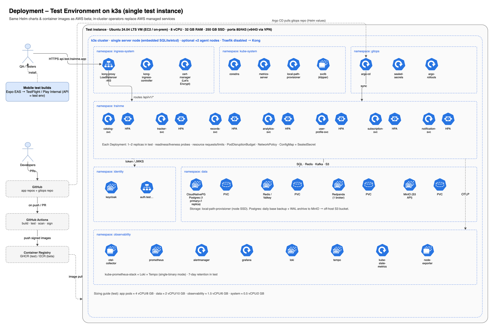
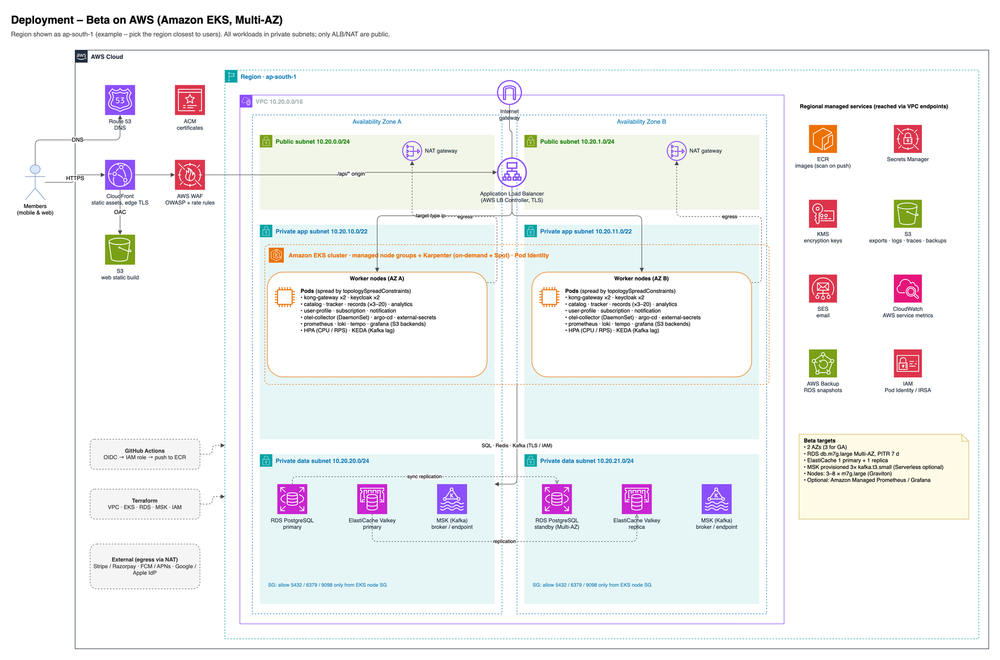
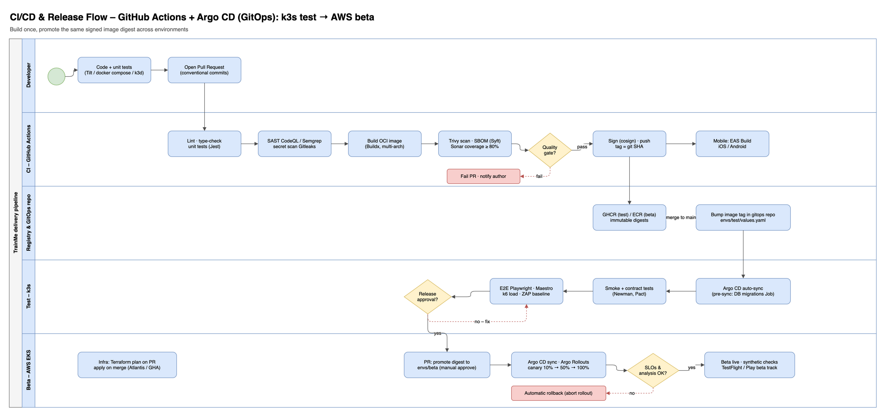

# TrainMe – Deployment & Infrastructure Design

| Item | Value |
|---|---|
| Version | 1.0 · 2026-10-03 |
| Environments | Local → **Test (k3s on one test instance)** → **Beta (AWS)** → GA (future) |
| Diagrams | `09_deploy_k3s_test`, `10_deploy_aws_beta`, `11_cicd_pipeline` |

---

## 1. Environment Strategy

| | Local dev | **Test (k3s)** | **Beta (AWS)** | GA (future) |
|---|---|---|---|---|
| Purpose | Inner loop | Integration, E2E, UAT, load-test rehearsal, demo | Public beta, real users and payments (live mode) | Production |
| Kubernetes | k3d / Docker Compose + Tilt | k3s, 1 server node (+0–2 agents) | Amazon EKS, 2 AZ | EKS, 3 AZ (+ DR region optional) |
| PostgreSQL | container | **CloudNativePG** operator (1 primary + 1 replica) | **Amazon RDS for PostgreSQL** Multi-AZ (or Aurora PostgreSQL) | Aurora / RDS with read replicas |
| Kafka | Redpanda container | **Redpanda** (1 broker) | **Amazon MSK** (provisioned 3 × kafka.t3.small, or Serverless) | MSK provisioned m7g |
| Redis | container | Valkey/Redis (Bitnami chart) | **ElastiCache (Valkey)** primary + replica | cluster mode |
| Object storage | MinIO | **MinIO** | **Amazon S3** | S3 + replication |
| Identity | Keycloak dev | Keycloak (2 replicas optional) | Keycloak on EKS (RDS DB) – or Amazon Cognito | Same |
| Ingress / gateway | – | **Kong Ingress Controller** (Traefik disabled) + ServiceLB | ALB (AWS Load Balancer Controller) → **Kong** | Same |
| TLS | mkcert | cert-manager + Let's Encrypt | ACM (ALB/CloudFront) + cert-manager internal | Same |
| Secrets | `.env` | **Sealed Secrets** (or SOPS + age) | **AWS Secrets Manager** + External Secrets Operator | Same |
| Observability | console | kube-prometheus-stack, Loki, Tempo, Grafana (in-cluster) | Same stack on EKS with S3 backends (option: AMP / AMG) | Same / managed |
| Payments | provider test mode | provider **test mode** | provider **live mode** (beta pricing / coupons) | live |
| Mobile builds | Expo Go / dev client | EAS internal distribution → test API | TestFlight / Play **open beta** → beta API | Store production |

**Golden rule:** the same container image digest and the same Helm chart go to every environment. Only `values-<env>.yaml` and secrets change.

---

## 2. Test Environment on k3s



### 2.1 Test instance sizing

| Option | Spec | Notes |
|---|---|---|
| **Recommended** | 1 VM: **8 vCPU, 32 GB RAM, 250 GB NVMe SSD**, Ubuntu 24.04 LTS | e.g. EC2 m7i.2xlarge / m6a.2xlarge, Hetzner CCX33, or on-prem VM |
| Minimum | 4 vCPU, 16 GB, 120 GB SSD | Disable Tempo, reduce replicas to 1, Redpanda `--smp 1 --memory 1G` |
| HA-ish test | 1 server + 2 agents (4 vCPU / 16 GB each) | Lets you test pod spreading, node drain and PDBs |

Approximate resource budget: app services ≈ 4 vCPU / 8 GB · data (Postgres, Redis, Redpanda, MinIO) ≈ 2 vCPU / 10 GB · observability ≈ 1.5 vCPU / 6 GB · system ≈ 0.5 vCPU / 2 GB.

### 2.2 Network and DNS
- DNS records: `api.test.trainme.app`, `auth.test.trainme.app`, `app.test.trainme.app`, `admin.test.trainme.app`, `grafana.test.trainme.app`, `argocd.test.trainme.app` → VM public IP (or internal IP behind VPN).
- Firewall: inbound 80/443 only. Kubernetes API (6443) and SSH reachable **only via VPN** (WireGuard / Tailscale) or a bastion.
- Grafana and Argo CD are protected by Keycloak SSO (OIDC) plus an IP allow-list.

### 2.3 Installation steps (summary)

```bash
# 1. OS hardening: unattended-upgrades, ufw (22 from VPN only, 80, 443), fail2ban, swap off, time sync
# 2. Install k3s without Traefik (Kong will be the ingress); keep ServiceLB + local-path
curl -sfL https://get.k3s.io | INSTALL_K3S_EXEC="server \
  --disable traefik \
  --write-kubeconfig-mode 600 \
  --secrets-encryption \
  --kube-apiserver-arg=audit-log-path=/var/log/k3s-audit.log \
  --tls-san <vpn-ip-or-dns>" sh -
# optional agents:  curl -sfL https://get.k3s.io | K3S_URL=https://<server>:6443 K3S_TOKEN=<token> sh -

# 3. Bootstrap GitOps (everything else is installed by Argo CD from the gitops repo)
helm repo add argo https://argoproj.github.io/argo-helm
helm install argocd argo/argo-cd -n gitops --create-namespace -f bootstrap/argocd-values.yaml
kubectl apply -f bootstrap/root-app-test.yaml      # "app of apps" for env=test
```

Argo CD then installs these, in sync waves:

| Wave | Components |
|---|---|
| 0 | Namespaces, NetworkPolicies, Sealed Secrets controller, cert-manager, ClusterIssuers |
| 1 | Kong Ingress Controller, metrics-server (already in k3s), Kyverno policies |
| 2 | CloudNativePG operator + `Cluster` (databases per service), Redis/Valkey, Redpanda, MinIO |
| 3 | Keycloak (realm import via keycloak-config-cli), kube-prometheus-stack, Loki, Tempo, OTel Collector, Grafana dashboards |
| 4 | TrainMe services (Helm umbrella chart), DB migration PreSync jobs, Kong routes and plugins (KongPlugin CRDs) |
| 5 | **catalog-seed PostSync Job** (idempotent import of `catalog/phase1/catalog.json`, LLD §11); `seed-load` synthetic 10K-user dataset Job (**test only**, on demand) |

### 2.4 Data protection in test
- CloudNativePG: scheduled base backup daily plus continuous WAL archiving to MinIO, replicated to an **off-host S3 bucket** (e.g. AWS S3 or Backblaze B2).
- Nightly Velero backup of cluster resources and PVCs (optional).
- Seed data: a `seed` Job loads the catalog (Cricket, Gym, Diet templates) and synthetic users/sessions for testing.
- **Never** copy production or beta personal data to test. Use synthetic data generators instead.

### 2.5 Rebuild time
The whole test environment is reproducible from Git: provision the VM (Terraform / Ansible) → install k3s → bootstrap Argo CD → restore DB from backup. Target: **< 1 hour**.

---

## 3. Beta on AWS



### 3.1 AWS account and organisation
- AWS Organizations with separate accounts: `shared-services` (ECR, CI roles), `beta`, later `prod`. Use IAM Identity Center (SSO) for humans and MFA everywhere.
- Guardrails: CloudTrail (org trail), AWS Config, GuardDuty, Security Hub, IAM Access Analyzer, AWS Budgets alerts.

### 3.2 Network
| Component | Design |
|---|---|
| VPC | `10.20.0.0/16`, 2 AZs for beta (3 for GA) |
| Public subnets | ALB, NAT Gateway (one per AZ; one shared NAT is acceptable in beta to save cost) |
| Private app subnets | EKS worker nodes (/22 each, enough IPs for VPC CNI with prefix delegation) |
| Private data subnets | RDS, ElastiCache, MSK; no route to the internet |
| VPC endpoints | Gateway: S3. Interface: ECR (api, dkr), Secrets Manager, KMS, STS, CloudWatch Logs |
| Security groups | ALB → nodes (Kong) only; nodes → RDS 5432, Redis 6379, MSK 9098 (IAM auth); no public DB endpoints |
| DNS / edge | Route 53 hosted zone; CloudFront for web static assets (S3 origin with OAC) and as the front for the API with AWS WAF; ACM certificates |

### 3.3 Compute – Amazon EKS
- EKS (latest supported version), managed add-ons: VPC CNI, CoreDNS, kube-proxy, EBS CSI, Pod Identity Agent.
- **Node strategy:** a managed node group with 2 × m7g.large (Graviton, on-demand) for system/critical pods, plus **Karpenter** NodePools for app pods (m7g/c7g, on-demand + Spot, consolidation enabled).
- Cluster add-ons via Argo CD: AWS Load Balancer Controller, External Secrets Operator, cert-manager, Kong, Karpenter, KEDA, metrics-server, Kyverno, OTel Collector, kube-prometheus-stack, Loki, Tempo (S3 backends), Argo Rollouts.
- Workload identity: **EKS Pod Identity** (or IRSA) with one IAM role per service (least privilege: e.g. notification-svc → `ses:SendEmail`; user-profile-svc → `s3:PutObject` on the exports bucket).

### 3.4 Managed data services

| Service | Beta configuration | Notes |
|---|---|---|
| RDS for PostgreSQL 17 | `db.m7g.large` → **`db.m7g.xlarge` once > 5K daily active users**, Multi-AZ, gp3 **500 GB** (autoscaling; ~245 GB/year of entries at 10K users), PITR 7 days, Performance Insights, KMS; extensions `pg_trgm`, `unaccent`, `btree_gin`, `pg_partman`, `pg_stat_statements`, `auto_explain`; read replica for search when needed (`08` §8) | One instance, **separate database and user per service**. Split hot services (records, analytics) to their own instance when needed. RDS Proxy for pooling. |
| ElastiCache (Valkey 8) | `cache.t4g.medium` → `cache.m7g.large`, 1 primary + 1 replica, Multi-AZ, TLS + AUTH | Cache only; safe to flush |
| Amazon MSK | Provisioned 3 × `kafka.t3.small` (cheapest HA) or MSK Serverless; TLS + IAM auth | Topics created by Terraform / Strimzi topic CRDs; replication factor 3 |
| S3 | Buckets: `web-static`, `exports` (lifecycle 7 d), `observability` (Loki/Tempo), `backups` | Block public access, SSE-KMS, versioning on backups |
| SES | Verified domain, DKIM, SPF, DMARC; production access request | Bounce/complaint handling via SNS → notification-svc |
| Secrets Manager + KMS | One secret per service; automatic rotation for RDS credentials | Synced to Kubernetes by External Secrets |
| AWS Backup | Daily RDS snapshot copy to a backup vault (optional cross-region) | Restore drill quarterly |

### 3.5 Infrastructure as Code (Terraform)

```
infra/terraform/
  modules/ (vpc, eks, rds, elasticache, msk, s3, iam-service-roles, waf, cloudfront, route53, ses)
  envs/beta/ (main.tf, variables.tfvars, backend.tf → S3 state + DynamoDB lock)
```
Use community modules where mature (`terraform-aws-modules/vpc`, `eks`, `rds`). Run `terraform plan` on PR and `apply` on merge, via GitHub Actions with OIDC (no static keys) or Atlantis. Run `tflint`, `checkov` / `tfsec` in CI.

### 3.6 Scaling configuration (beta starting points)

| Workload | Min / max replicas | Scaling signal |
|---|---|---|
| kong-gateway | 2 / 6 | CPU 60 % |
| catalog-svc | 2 / 6 | CPU 60 % |
| tracker-svc | 2 / 6 | CPU 60 % |
| records-svc | 3 / 20 | CPU 60 % or RPS per pod > 150 (checkpoint batches ~42 req/s per 10 k live sessions) |
| records-auto-close | CronJob every 10 min | Completes idle IN_PROGRESS sessions (idempotent; `concurrencyPolicy: Forbid`) |
| analytics-svc | 2 / 12 | KEDA: Kafka lag on `record.events` > 500 |
| user-profile-svc | 2 / 6 | CPU 60 % |
| subscription-svc | 2 / 4 | CPU 60 % |
| notification-svc | 2 / 6 | KEDA: lag on `notification.commands` |
| keycloak | 2 / 4 | CPU 70 % |
| Nodes (Karpenter) | 3 / 12 | pending pods; consolidation when under-utilised |

Every Deployment also gets a PodDisruptionBudget (`minAvailable: 1`), `topologySpreadConstraints` across zones and nodes, resource requests/limits, and liveness/readiness/startup probes.

---

## 4. CI/CD and Release Flow



| Stage | Tooling | Gate |
|---|---|---|
| Source | GitHub monorepo (Nx / Turborepo) + separate `gitops` repo | Branch protection, CODEOWNERS, signed commits |
| CI (per PR) | GitHub Actions: lint, type-check, unit tests (Jest), integration tests (Testcontainers), contract tests (Pact) | All green; coverage ≥ 80 % on domain code (SonarQube / SonarCloud) |
| Security | CodeQL / Semgrep (SAST), Gitleaks (secrets), Trivy (deps + image), Syft (SBOM), Checkov (IaC) | No critical/high unfixed vulnerabilities |
| Build | Docker Buildx multi-arch (amd64 + arm64), distroless / alpine base, non-root | Image signed with **cosign** (keyless, GitHub OIDC) |
| Publish | GHCR (test) and ECR (beta) – the same digest is copied | Immutable tags (git SHA) |
| Deploy test | CI commits the new tag to `gitops/envs/test` (or Argo CD Image Updater) → Argo CD auto-sync | PreSync migrations succeed |
| Verify test | Smoke tests (Newman), E2E web (Playwright), E2E mobile (Maestro), k6 load profile, OWASP ZAP baseline | Test report + manual QA sign-off |
| Promote to beta | PR that copies the digest to `gitops/envs/beta`; requires approval (release manager) | Change record |
| Deploy beta | Argo CD sync + **Argo Rollouts canary** (10 % → 50 % → 100 %) with Prometheus analysis (error rate, p95) | Automatic rollback on failed analysis |
| Mobile | EAS Build → EAS Submit → TestFlight / Play beta track; EAS Update for OTA JS fixes (non-native) | Store review |

**Database migrations**: they run as Argo CD PreSync hook Jobs with expand/contract discipline, so the previous app version stays compatible during canary.

**Rollback**: app → Argo Rollouts abort / Git revert of the digest; DB → forward-fix only (never down-migrate in beta/prod), with PITR as the last resort.

---

## 5. Disaster Recovery and Backup

| Asset | Test (k3s) | Beta (AWS) |
|---|---|---|
| PostgreSQL | CNPG daily base backup + WAL to MinIO → off-host S3 | RDS automated backups + PITR (7 d), daily AWS Backup copy |
| Kafka | Not backed up (rebuildable from outbox/DB) | MSK RF=3 across AZs; topics recreated by IaC; analytics rebuildable by replay or recompute |
| Redis | Not backed up (cache) | Not backed up (cache) |
| S3 / MinIO | Off-host replication of backups bucket | Versioning + lifecycle; optional CRR for backups |
| Cluster config | Git (Argo CD) + optional Velero | Git (Argo CD); EKS rebuilt by Terraform |
| Keycloak | Realm export in Git (without secrets) + DB backup | Same + RDS |
| **Targets** | Best effort, rebuild < 1 h | **RPO ≤ 15 min, RTO ≤ 4 h** |

Runbooks to prepare: RDS failover test, restore-to-point-in-time, region-level outage (GA), Kafka consumer reset, DLQ replay, key/secret rotation.

---

## 6. Indicative Monthly Cost (Beta)

Rough on-demand estimates at low beta traffic, for budgeting only. Verify with the AWS Pricing Calculator for the chosen region.

| Item | Configuration | Est. USD / month |
|---|---|---|
| EKS control plane | 1 cluster | ~75 |
| EC2 worker nodes | 3–5 × m7g.large (part Spot) | ~180–300 |
| RDS PostgreSQL | db.m7g.large Multi-AZ + 100 GB gp3 + backups | ~280–330 |
| ElastiCache | 2 × cache.t4g.medium (→ m7g.large later) | ~100 (→ ~230) |
| Amazon MSK | 3 × kafka.t3.small + storage | ~130–160 |
| NAT Gateway | 1–2 + data processing | ~45–100 |
| ALB + WAF + CloudFront | Low traffic | ~80–120 |
| S3, ECR, Secrets Manager, KMS, CloudWatch, SES, Route 53 | — | ~60–120 |
| **Total** | | **≈ USD 1,000 – 1,500** (≈ 1,800 with headroom) |
| Test instance (k3s) | e.g. EC2 m6a.2xlarge on-demand (or a cheaper VPS) | ~70 (VPS) – 280 (EC2) |

Cost levers: Graviton everywhere, Spot for stateless pods, Savings Plans after usage stabilises, a single NAT in beta, scale-down schedules for non-critical consumers at night, and log/trace retention limits.

---

## 7. Go-Live Checklist for AWS Beta (infrastructure)

- [ ] Terraform applied from CI; state in S3 with lock; drift detection scheduled.
- [ ] WAF managed rule groups + rate rules enabled; Shield Standard active.
- [ ] TLS everywhere; HSTS; security headers (CSP for web).
- [ ] RDS Multi-AZ, PITR, deletion protection; restore drill done.
- [ ] Secrets in Secrets Manager; rotation enabled; no secrets in Git or images (Gitleaks clean).
- [ ] Kyverno policies enforce signed images, non-root, resource limits.
- [ ] Grafana dashboards and SLO alerts routed to on-call; synthetic checks (Grafana Synthetic Monitoring / CloudWatch Synthetics) on login, record session, view chart.
- [ ] k6 load test at 1.5× expected peak passed (see `06_Test_Strategy_and_Release_Plan.md`).
- [ ] SES out of sandbox; DKIM/SPF/DMARC verified; FCM/APNs keys configured.
- [ ] Payment provider live keys, webhooks verified; App Store / Play products configured.
- [ ] Privacy policy, terms, data-safety forms; DPDP/GDPR consent flows tested.
- [ ] Budgets and cost anomaly detection on.
