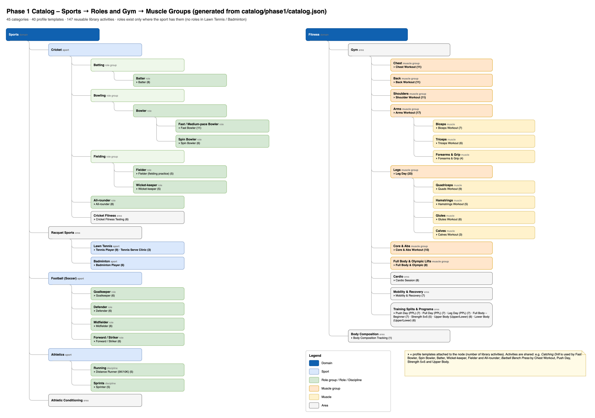

# TrainMe – Phase 1 Activity Catalog (Knowledge Base)

| Item | Value |
|---|---|
| Version | `phase1-2026.10` · generated by `catalog/tools/build_phase1_catalog.py` (do not edit by hand) |
| Seed file | `catalog/phase1/catalog.json` – loaded by the catalog-svc seed Job |
| Size | 45 categories · 40 profile templates · 147 library activities (104 gym / 43 sport & conditioning) · 10 reusable parameter sets · 897 effective parameters · 760 metrics |
| Related | LLD §2.1 (catalog DDL), `08_Search_and_Query_Performance.md`, diagram `13_phase1_catalog_taxonomy` |

---

## 1. How the knowledge is organised

- **Taxonomy (categories, any depth)**. Roles are modelled as category nodes where a sport has them: *Cricket › Bowling › Bowler › Fast Bowler*; *Football › Goalkeeper*. Sports without roles (Lawn Tennis, Badminton) have one player profile organised by stroke area. Gym is organised by **muscle group** (Chest, Back, Shoulders, Arms › Biceps/Triceps/Forearms, Legs › Quads/Hamstrings/Glutes/Calves, Core), plus Cardio, Mobility and Training Splits.
- **Activity library (reusable)**. Every exercise or drill is defined **once** (e.g. *Catching Drill*, *Barbell Back Squat*) and referenced by many profile templates (Batter, Fielder, Wicket-keeper all reuse *Catching Drill*; Push Day, Chest Workout and Strength 5×5 reuse *Barbell Bench Press*).
- **Reusable parameter sets**. Common shapes such as a weighted set (`reps`, `weight_kg`, `rpe`, `to_failure` → `assisted_reps`) are defined once and attached to 70+ gym exercises, so they share parameters and metrics (volume, top set, estimated 1RM).
- **Granular recording everywhere**. Ball-by-ball, serve-by-serve, shot-by-shot, set-by-set and lap-by-lap entries (`PER_ATTEMPT` / `PER_SET`). Match stats and check-ins are `PER_SESSION`.
- **Attempted → accurate pattern**. Applied consistently: bowling skills (yorker, seam, bouncer, swing, slower ball, turn, drift, variation), keeping (stumping / catch chances), tennis and badminton (`in` → `target_hit` / `winner`; out → error type), football (`on_target` → `goal`; `saved` → `held`).
- **Metrics are data**. Ratios are Σ numerator ÷ Σ denominator, which stays correct for any week or month. `where` filters (e.g. first serves only) and `MAX`/`MIN` (top speed, best time) are supported.
- **Search facets** come from the same data: sport, role, category, kind (EXERCISE / DRILL / TEST / MATCH / LOG), equipment, primary/secondary muscles, mechanic, force, level and synonyms.

### 1.1 Metric grammar (extension of LLD §2.1)

```
term      := {fn: COUNT | COUNT_TRUE | SUM | MAX | MIN, param: <key> | "*" | expr: "<arithmetic over params>", where?: {<key>: <value> | {in|ne|gte|lte: …}}}
numerator := term | [term, term, …]          -- a list is summed (e.g. full_toss + long_hop)
RATIO     := Σ numerator ÷ Σ denominator      -- additive → exact for day / week / month
SINGLE    := Σ numerator  (or MAX/MIN, merged with GREATEST/LEAST across periods)
display   := {format: NUMBER | PERCENT | DURATION | PACE, unit?, rawUnit?, dimension?, decimals, scale?}
```

### 1.2 Units of measure (ADR-014)

Every measured parameter stores its values in one **canonical unit** (the *Type* column below, e.g. `speed_kmph` in km/h, `weight_kg` in kg). Users see and type values in the unit they choose: per dimension in their profile (Metric ↔ Imperial uses the *counterpart*), or per parameter in a tracker (any unit of the same dimension). Metrics carry `rawUnit` (what the formula yields) and a default display `unit`; ratios and percentages have none. Parameter keys keep their canonical-unit suffix because it names the stored unit, not the shown one.

Conversion: `display = value × toBase(canonical) ÷ toBase(display)` – linear only, so sums, averages, maxima and ratios convert identically before or after aggregation.

| Unit | Name | Dimension | toBase | System | Counterpart | Decimals | Step |
|---|---|---|---|---|---|---|---|
| `km/h` | kilometres per hour | speed | 0.277777777778 | METRIC | mph | 1 | 0.1 |
| `mph` | miles per hour | speed | 0.44704 | IMPERIAL | km/h | 1 | 0.1 |
| `m/s` | metres per second | speed | 1 | METRIC | ft/s | 2 | 0.1 |
| `ft/s` | feet per second | speed | 0.3048 | IMPERIAL | m/s | 1 | 0.1 |
| `kg` | kilograms | mass | 1 | METRIC | lb | 2 | 0.25 |
| `g` | grams | mass | 0.001 | METRIC | oz | 0 | 1 |
| `lb` | pounds | mass | 0.45359237 | IMPERIAL | kg | 1 | 0.5 |
| `oz` | ounces | mass | 0.028349523125 | IMPERIAL | g | 1 | 0.5 |
| `st` | stone | mass | 6.35029318 | IMPERIAL | kg | 2 | 0.1 |
| `km` | kilometres | length | 1000 | METRIC | mi | 2 | 0.01 |
| `m` | metres | length | 1 | METRIC | yd | 1 | 0.1 |
| `cm` | centimetres | length | 0.01 | METRIC | in | 1 | 0.5 |
| `mm` | millimetres | length | 0.001 | METRIC | in | 0 | 1 |
| `mi` | miles | length | 1609.344 | IMPERIAL | km | 2 | 0.01 |
| `yd` | yards | length | 0.9144 | IMPERIAL | m | 1 | 0.1 |
| `ft` | feet | length | 0.3048 | IMPERIAL | m | 1 | 0.1 |
| `in` | inches | length | 0.0254 | IMPERIAL | cm | 1 | 0.25 |
| `ms` | milliseconds | duration | 0.001 | BOTH |  | 0 | 1 |
| `s` | seconds | duration | 1 | BOTH |  | 2 | 0.01 |
| `min` | minutes | duration | 60 | BOTH |  | 1 | 1 |
| `h` | hours | duration | 3600 | BOTH |  | 2 | 0.25 |
| `kcal` | kilocalories | energy | 1 | BOTH |  | 0 | 1 |
| `kJ` | kilojoules | energy | 0.239005736138 | METRIC |  | 0 | 1 |
| `ml` | millilitres | volume | 0.001 | METRIC | fl oz | 0 | 1 |
| `l` | litres | volume | 1 | METRIC | qt | 2 | 0.05 |
| `fl oz` | US fluid ounces | volume | 0.0295735295625 | IMPERIAL | ml | 1 | 0.5 |
| `qt` | US quarts | volume | 0.946352946 | IMPERIAL | l | 2 | 0.05 |
| `s/m` | seconds per metre (raw pace) | pace | 1 | BOTH |  | 3 |  |
| `min/km` | minutes per kilometre | pace | 0.06 | METRIC | min/mi | 2 |  |
| `min/mi` | minutes per mile | pace | 0.0372822715342 | IMPERIAL | min/km | 2 |  |
| `reps` | repetitions | – (label only) |  |  |  |  |  |
| `bpm` | beats per minute | – (label only) |  |  |  |  |  |
| `rpm` | revolutions per minute | – (label only) |  |  |  |  |  |
| `spm` | steps per minute | – (label only) |  |  |  |  |  |
| `%` | percent | – (label only) |  |  |  |  |  |
| `AU` | arbitrary units | – (label only) |  |  |  |  |  |

Base units: speed = `m/s`, mass = `kg`, length = `m`, duration = `s`, energy = `kcal`, volume = `l`, pace = `s/m`.

---

## 2. Taxonomy and profile templates



- **Sports** `sports` · _domain_
  - **Cricket** `cricket` · _sport_
    - **Batting** `cricket.batting` · _role group_
      - **Batter** `cricket.batter` · _role_ → templates: Batter
    - **Bowling** `cricket.bowling` · _role group_
      - **Bowler** `cricket.bowler` · _role_
        - **Fast / Medium-pace Bowler** `cricket.fast_bowler` · _role_ → templates: Fast Bowler
        - **Spin Bowler** `cricket.spin_bowler` · _role_ → templates: Spin Bowler
    - **Fielding** `cricket.fielding` · _role group_
      - **Fielder** `cricket.fielder` · _role_ → templates: Fielder (fielding practice)
      - **Wicket-keeper** `cricket.wicket_keeper` · _role_ → templates: Wicket-keeper
    - **All-rounder** `cricket.all_rounder` · _role_ → templates: All-rounder
    - **Cricket Fitness** `cricket.fitness` · _area_ → templates: Cricket Fitness Testing
  - **Racquet Sports** `racquet` · _area_
    - **Lawn Tennis** `tennis` · _sport_ → templates: Tennis Player, Tennis Serve Clinic
    - **Badminton** `badminton` · _sport_ → templates: Badminton Player
  - **Football (Soccer)** `football` · _sport_
    - **Goalkeeper** `football.goalkeeper` · _role_ → templates: Goalkeeper
    - **Defender** `football.defender` · _role_ → templates: Defender
    - **Midfielder** `football.midfielder` · _role_ → templates: Midfielder
    - **Forward / Striker** `football.forward` · _role_ → templates: Forward / Striker
  - **Athletics** `athletics` · _sport_
    - **Running** `athletics.running` · _discipline_ → templates: Distance Runner (5K/10K)
    - **Sprints** `athletics.sprints` · _discipline_ → templates: Sprinter
  - **Athletic Conditioning** `conditioning` · _area_
- **Fitness** `fitness` · _domain_
  - **Gym** `gym` · _area_
    - **Chest** `gym.chest` · _muscle group_ → templates: Chest Workout
    - **Back** `gym.back` · _muscle group_ → templates: Back Workout
    - **Shoulders** `gym.shoulders` · _muscle group_ → templates: Shoulder Workout
    - **Arms** `gym.arms` · _muscle group_ → templates: Arms Workout
      - **Biceps** `gym.arms.biceps` · _muscle_ → templates: Biceps Workout
      - **Triceps** `gym.arms.triceps` · _muscle_ → templates: Triceps Workout
      - **Forearms & Grip** `gym.arms.forearms` · _muscle_ → templates: Forearms & Grip
    - **Legs** `gym.legs` · _muscle group_ → templates: Leg Day
      - **Quadriceps** `gym.legs.quads` · _muscle_ → templates: Quads Workout
      - **Hamstrings** `gym.legs.hamstrings` · _muscle_ → templates: Hamstrings Workout
      - **Glutes** `gym.legs.glutes` · _muscle_ → templates: Glutes Workout
      - **Calves** `gym.legs.calves` · _muscle_ → templates: Calves Workout
    - **Core & Abs** `gym.core` · _muscle group_ → templates: Core & Abs Workout
    - **Full Body & Olympic Lifts** `gym.full_body` · _muscle group_ → templates: Full Body & Olympic
    - **Cardio** `gym.cardio` · _area_ → templates: Cardio Session
    - **Mobility & Recovery** `gym.mobility` · _area_ → templates: Mobility & Recovery
    - **Training Splits & Programs** `gym.splits` · _area_ → templates: Push Day (PPL), Pull Day (PPL), Leg Day (PPL), Full Body – Beginner, Strength 5×5, Upper Body (Upper/Lower), Lower Body (Upper/Lower)
  - **Body Composition** `body` · _area_ → templates: Body Composition Tracking

### 2.1 Template contents

| Template | Category | Activities |
|---|---|---|
| **Fast Bowler** `cricket.fast_bowler` | `cricket.fast_bowler` | Fast Bowling – Delivery (ball by ball), Target / Cone Bowling Drill, Run-up & Alignment Drill, Bowling Spell / Match Figures, Bowling Workload Check-in, Catching Drill, Linear Sprint (10/20/30/40 m), Yo-Yo Intermittent Recovery Test Level 1, Nordic Hamstring Curl, Barbell Back Squat, Copenhagen Plank |
| **Spin Bowler** `cricket.spin_bowler` | `cricket.spin_bowler` | Spin Bowling – Delivery (ball by ball), Target / Cone Bowling Drill, Bowling Spell / Match Figures, Bowling Workload Check-in, Catching Drill, Agility Test / Drill (5-10-5, T-test, Illinois) |
| **Batter** `cricket.batter` | `cricket.batter` | Batting – Ball Faced (nets / throw-downs), Batting Shot Drill (block), Running Between Wickets, Batting Innings (match), Catching Drill, Ground Fielding Drill, Linear Sprint (10/20/30/40 m), Yo-Yo Intermittent Recovery Test Level 1 |
| **Wicket-keeper** `cricket.wicket_keeper` | `cricket.wicket_keeper` | Wicket-keeping – Take, Catching Drill, Throwing Accuracy Drill, Batting – Ball Faced (nets / throw-downs), Agility Test / Drill (5-10-5, T-test, Illinois) |
| **Fielder (fielding practice)** `cricket.fielder` | `cricket.fielder` | Catching Drill, Ground Fielding Drill, Throwing Accuracy Drill, Linear Sprint (10/20/30/40 m), Agility Test / Drill (5-10-5, T-test, Illinois) |
| **All-rounder** `cricket.all_rounder` | `cricket.all_rounder` | Batting – Ball Faced (nets / throw-downs), Batting Innings (match), Fast Bowling – Delivery (ball by ball), Spin Bowling – Delivery (ball by ball), Bowling Spell / Match Figures, Bowling Workload Check-in, Catching Drill, Throwing Accuracy Drill |
| **Cricket Fitness Testing** `cricket.fitness` | `cricket.fitness` | Yo-Yo Intermittent Recovery Test Level 1, Bronco Test (1.2 km shuttle), Time Trial (1.6 km / 2 km / 5 km), Linear Sprint (10/20/30/40 m), Running Between Wickets, Training Session Load (sRPE) |
| **Tennis Player** `tennis.player` | `tennis` | Tennis Serve (serve by serve), Tennis Return of Serve, Tennis Groundstroke (shot by shot), Tennis Volley / Overhead, Tennis Rally Consistency Drill, Tennis Match Stats, Agility Test / Drill (5-10-5, T-test, Illinois), Linear Sprint (10/20/30/40 m), Medicine-ball Throws |
| **Tennis Serve Clinic** `tennis.serve_clinic` | `tennis` | Tennis Serve (serve by serve), Tennis Return of Serve, Cable / Band External Rotation |
| **Badminton Player** `badminton.player` | `badminton` | Badminton Serve, Badminton Stroke (shot by shot), Badminton Footwork / Shadow Drill, Badminton Match Stats, Agility Test / Drill (5-10-5, T-test, Illinois), Plyometrics (box / broad / bounding) |
| **Goalkeeper** `football.goalkeeper` | `football.goalkeeper` | Goalkeeping – Shot Stopping, Goalkeeping – Distribution, Football Passing & Receiving, Football Match Stats, Agility Test / Drill (5-10-5, T-test, Illinois), Plyometrics (box / broad / bounding) |
| **Defender** `football.defender` | `football.defender` | Football Defending Duel, Football Passing & Receiving, Football Match Stats, Linear Sprint (10/20/30/40 m), Yo-Yo Intermittent Recovery Test Level 1, Injury-prevention Routine (e.g. FIFA 11+) |
| **Midfielder** `football.midfielder` | `football.midfielder` | Football Passing & Receiving, Football Dribbling / 1v1, Football Shooting (shot by shot), Football Defending Duel, Football Match Stats, Yo-Yo Intermittent Recovery Test Level 1 |
| **Forward / Striker** `football.forward` | `football.forward` | Football Shooting (shot by shot), Football Dribbling / 1v1, Football Passing & Receiving, Football Match Stats, Linear Sprint (10/20/30/40 m), Agility Test / Drill (5-10-5, T-test, Illinois) |
| **Distance Runner (5K/10K)** `athletics.distance_runner` | `athletics.running` | Run (easy / long / tempo), Run Lap / Split, Time Trial (1.6 km / 2 km / 5 km), Training Session Load (sRPE), Single-leg Calf Raise |
| **Sprinter** `athletics.sprinter` | `athletics.sprints` | Linear Sprint (10/20/30/40 m), Run Lap / Split, Plyometrics (box / broad / bounding), Power Clean, Barbell Back Squat |
| **Chest Workout** `gym.chest` | `gym.chest` | Barbell Bench Press, Incline Barbell Bench Press, Decline Bench Press, Dumbbell Bench Press, Incline Dumbbell Press, Dumbbell Fly, Cable Crossover / Cable Fly, Machine Chest Press, Pec Deck, Push-up, Chest Dip |
| **Back Workout** `gym.back` | `gym.back` | Conventional Deadlift, Pull-up, Chin-up, Lat Pulldown, Barbell Bent-over Row, One-arm Dumbbell Row, Seated Cable Row, T-bar Row, Straight-arm Pulldown, Back Extension (45°), Rack Pull |
| **Shoulder Workout** `gym.shoulders` | `gym.shoulders` | Barbell Overhead Press, Seated Dumbbell Shoulder Press, Arnold Press, Dumbbell Lateral Raise, Cable Lateral Raise, Front Raise, Rear-delt Fly, Face Pull, Upright Row, Barbell Shrug, Cable / Band External Rotation |
| **Biceps Workout** `gym.arms.biceps` | `gym.arms.biceps` | Barbell Curl, Dumbbell Curl, Hammer Curl, Preacher Curl, Incline Dumbbell Curl, Cable Curl, Concentration Curl |
| **Triceps Workout** `gym.arms.triceps` | `gym.arms.triceps` | Close-grip Bench Press, Triceps Pushdown, Overhead Triceps Extension, Lying Triceps Extension (Skull Crusher), Bench Dip, Triceps Kickback |
| **Forearms & Grip** `gym.arms.forearms` | `gym.arms.forearms` | Wrist Curl, Reverse Wrist Curl, Farmer's Walk, Dead Hang |
| **Quads Workout** `gym.legs.quads` | `gym.legs.quads` | Barbell Back Squat, Front Squat, Goblet Squat, Leg Press, Hack Squat, Bulgarian Split Squat, Walking Lunge, Leg Extension, Step-up |
| **Hamstrings Workout** `gym.legs.hamstrings` | `gym.legs.hamstrings` | Romanian Deadlift, Lying Leg Curl, Seated Leg Curl, Good Morning, Nordic Hamstring Curl |
| **Glutes Workout** `gym.legs.glutes` | `gym.legs.glutes` | Barbell Hip Thrust, Glute Bridge, Cable Glute Kickback, Sumo Deadlift, Hip Abduction (machine / band), Copenhagen Plank |
| **Calves Workout** `gym.legs.calves` | `gym.legs.calves` | Standing Calf Raise, Seated Calf Raise, Single-leg Calf Raise |
| **Core & Abs Workout** `gym.core` | `gym.core` | Medicine-ball Throws, Plank, Side Plank, Hanging Leg Raise, Cable Crunch, Ab-wheel Rollout, Russian Twist, Dead Bug, Pallof Press, Crunch |
| **Full Body & Olympic** `gym.full_body` | `gym.full_body` | Power Clean, Clean and Jerk, Snatch, Kettlebell Swing, Thruster, Burpee, Turkish Get-up, Sled Push / Pull |
| **Cardio Session** `gym.cardio` | `gym.cardio` | Run (easy / long / tempo), Treadmill Run / Walk, Stationary Bike, Rowing Machine, Elliptical Trainer, Stair Climber, Jump Rope, HIIT Interval (any modality) |
| **Mobility & Recovery** `gym.mobility` | `gym.mobility` | Hip-flexor Stretch, Hamstring Stretch, Thoracic Rotation, World's Greatest Stretch, Band Shoulder Pass-through, Foam Rolling, Ankle Dorsiflexion Mobility |
| **Leg Day** `gym.legs` | `gym.legs` | Barbell Back Squat, Front Squat, Goblet Squat, Leg Press, Hack Squat, Bulgarian Split Squat, Walking Lunge, Leg Extension, Step-up, Romanian Deadlift, Lying Leg Curl, Seated Leg Curl, Good Morning, Nordic Hamstring Curl, Barbell Hip Thrust, Glute Bridge, Cable Glute Kickback, Sumo Deadlift, Hip Abduction (machine / band), Copenhagen Plank, Standing Calf Raise, Seated Calf Raise, Single-leg Calf Raise |
| **Arms Workout** `gym.arms` | `gym.arms` | Barbell Curl, Dumbbell Curl, Hammer Curl, Preacher Curl, Incline Dumbbell Curl, Cable Curl, Concentration Curl, Close-grip Bench Press, Triceps Pushdown, Overhead Triceps Extension, Lying Triceps Extension (Skull Crusher), Bench Dip, Triceps Kickback, Wrist Curl, Reverse Wrist Curl, Farmer's Walk, Dead Hang |
| **Push Day (PPL)** `gym.push_day` | `gym.splits` | Barbell Bench Press (4×5-8), Incline Dumbbell Press, Barbell Overhead Press, Dumbbell Lateral Raise, Cable Crossover / Cable Fly, Triceps Pushdown, Overhead Triceps Extension |
| **Pull Day (PPL)** `gym.pull_day` | `gym.splits` | Conventional Deadlift, Pull-up, Barbell Bent-over Row, Lat Pulldown, Face Pull, Barbell Curl, Hammer Curl |
| **Leg Day (PPL)** `gym.leg_day_ppl` | `gym.splits` | Barbell Back Squat, Romanian Deadlift, Leg Press, Walking Lunge, Lying Leg Curl, Standing Calf Raise, Hanging Leg Raise |
| **Full Body – Beginner** `gym.full_body_beginner` | `gym.splits` | Goblet Squat, Dumbbell Bench Press, Lat Pulldown, Romanian Deadlift, Seated Dumbbell Shoulder Press, Plank, Stationary Bike |
| **Strength 5×5** `gym.strength_5x5` | `gym.splits` | Barbell Back Squat (5×5), Barbell Bench Press (5×5), Barbell Bent-over Row (5×5), Barbell Overhead Press (5×5), Conventional Deadlift |
| **Upper Body (Upper/Lower)** `gym.upper_lower_upper` | `gym.splits` | Barbell Bench Press, Barbell Bent-over Row, Barbell Overhead Press, Pull-up, Dumbbell Curl, Lying Triceps Extension (Skull Crusher) |
| **Lower Body (Upper/Lower)** `gym.upper_lower_lower` | `gym.splits` | Barbell Back Squat, Romanian Deadlift, Bulgarian Split Squat, Lying Leg Curl, Standing Calf Raise, Ab-wheel Rollout |
| **Body Composition Tracking** `body.checkin` | `body` | Body Measurements Check-in |

---

## 3. Reusable parameter sets

### `strength_set` – Weighted set
One row per working set with external load.

| Key | Label | Type | Req. | Condition |
|---|---|---|---|---|
| `reps` | Reps | INT 0–100 reps | ✔ |  |
| `weight_kg` | Weight | DECIMAL 0–600 kg | ✔ |  |
| `rpe` | RPE (1–10) | INT 1–10 |  |  |
| `to_failure` | Taken to failure | BOOL |  |  |
| `assisted_reps` | Assisted / forced reps | INT 0–20 reps |  | when `to_failure` = true |
| `rest_s` | Rest before set | DURATION 0–900 s |  |  |

| Metric | Label | Kind | Formula | Display |
|---|---|---|---|---|
| `sets` | Sets | SINGLE | COUNT(*) | number |
| `total_reps` | Total reps | SINGLE | SUM(reps) | number |
| `volume_kg` | Volume load | SINGLE | SUM(reps * weight_kg) | number kg |
| `top_set_kg` | Top set weight | SINGLE | MAX(weight_kg) | number kg |
| `est_1rm_kg` | Estimated 1RM (Epley) | SINGLE | MAX(weight_kg * (1 + reps / 30)) | number kg |
| `avg_rpe` | Average RPE | RATIO | SUM(rpe) ÷ COUNT(rpe) | number |
| `failure_rate` | Sets to failure | RATIO | COUNT_TRUE(to_failure) ÷ COUNT(*) | percent |

### `bodyweight_set` – Body-weight set
Reps with optional added load (vest/belt) or assistance (band/machine).

| Key | Label | Type | Req. | Condition |
|---|---|---|---|---|
| `reps` | Reps | INT 0–200 reps | ✔ |  |
| `added_weight_kg` | Added weight | DECIMAL 0–150 kg |  |  |
| `assistance_kg` | Assistance (band/machine) | DECIMAL 0–150 kg |  |  |
| `rpe` | RPE (1–10) | INT 1–10 |  |  |
| `to_failure` | Taken to failure | BOOL |  |  |
| `assisted_reps` | Assisted reps | INT 0–20 reps |  | when `to_failure` = true |

| Metric | Label | Kind | Formula | Display |
|---|---|---|---|---|
| `sets` | Sets | SINGLE | COUNT(*) | number |
| `total_reps` | Total reps | SINGLE | SUM(reps) | number |
| `max_reps` | Best set (reps) | SINGLE | MAX(reps) | number |
| `avg_rpe` | Average RPE | RATIO | SUM(rpe) ÷ COUNT(rpe) | number |

### `timed_hold` – Timed hold
Isometric holds and carries measured by time.

| Key | Label | Type | Req. | Condition |
|---|---|---|---|---|
| `duration_s` | Hold time | DURATION 0–1800 s | ✔ |  |
| `added_weight_kg` | Added weight | DECIMAL 0–200 kg |  |  |
| `side` | Side | ENUM(both, left, right) |  |  |
| `rpe` | RPE (1–10) | INT 1–10 |  |  |

| Metric | Label | Kind | Formula | Display |
|---|---|---|---|---|
| `sets` | Sets | SINGLE | COUNT(*) | number |
| `total_time_s` | Total time | SINGLE | SUM(duration_s) | duration |
| `best_hold_s` | Longest hold | SINGLE | MAX(duration_s) | duration |

### `carry` – Loaded carry
Farmer's walk, suitcase carry, sled push/pull.

| Key | Label | Type | Req. | Condition |
|---|---|---|---|---|
| `distance_m` | Distance | DECIMAL 0–1000 m | ✔ |  |
| `weight_kg` | Load (total) | DECIMAL 0–500 kg | ✔ |  |
| `duration_s` | Time | DURATION 0–900 s |  |  |

| Metric | Label | Kind | Formula | Display |
|---|---|---|---|---|
| `total_distance_m` | Total distance | SINGLE | SUM(distance_m) | number m |
| `top_load_kg` | Heaviest carry | SINGLE | MAX(weight_kg) | number kg |

### `cardio_bout` – Cardio bout / interval
Steady-state piece or one interval on a machine or outdoors.

| Key | Label | Type | Req. | Condition |
|---|---|---|---|---|
| `duration_s` | Duration | DURATION 0–21600 s | ✔ |  |
| `distance_m` | Distance | DECIMAL 0–100000 m |  |  |
| `avg_hr` | Average heart rate | INT 40–220 bpm |  |  |
| `max_hr` | Max heart rate | INT 40–230 bpm |  |  |
| `calories` | Calories | INT 0–5000 kcal |  |  |
| `resistance_level` | Resistance / incline level | INT 0–40 |  |  |
| `is_work_interval` | Work interval (vs recovery) | BOOL |  |  |
| `rpe` | RPE (1–10) | INT 1–10 |  |  |

| Metric | Label | Kind | Formula | Display |
|---|---|---|---|---|
| `total_duration_s` | Total time | SINGLE | SUM(duration_s) | duration |
| `total_distance_km` | Total distance | SINGLE | SUM(distance_m) | number m → km |
| `avg_pace_s_per_km` | Average pace | RATIO | SUM(duration_s) ÷ SUM(distance_m) | pace s/m → min/km |
| `time_weighted_hr` | Average HR (time-weighted) | RATIO | SUM(avg_hr * duration_s) ÷ SUM(duration_s where avg_hr ≥ 1) | number bpm |
| `calories` | Calories | SINGLE | SUM(calories) | number kcal |

### `sprint_rep` – Sprint / timed run rep
Short timed effort over a fixed distance or course.

| Key | Label | Type | Req. | Condition |
|---|---|---|---|---|
| `distance_m` | Distance | DECIMAL 1–2000 m | ✔ |  |
| `time_s` | Time | DECIMAL 0.5–900 s | ✔ |  |
| `start` | Start | ENUM(standing, crouch, flying, reactive) |  |  |
| `timing` | Timing method | ENUM(hand, gates, app) |  |  |
| `rest_s` | Rest after rep | DURATION 0–900 s |  |  |

| Metric | Label | Kind | Formula | Display |
|---|---|---|---|---|
| `reps` | Reps | SINGLE | COUNT(*) | number |
| `best_time_s` | Best time | SINGLE | MIN(time_s) | number s |
| `avg_time_s` | Average time | RATIO | SUM(time_s) ÷ COUNT(time_s) | number s |

### `jump_throw` – Jump / throw effort
Plyometric or ballistic effort measured by height or distance.

| Key | Label | Type | Req. | Condition |
|---|---|---|---|---|
| `reps` | Reps | INT 1–50 reps | ✔ |  |
| `height_cm` | Height | DECIMAL 0–200 cm |  |  |
| `distance_cm` | Distance | DECIMAL 0–3000 cm |  |  |
| `load_kg` | Load (box height / ball) | DECIMAL 0–50 kg |  |  |
| `side` | Side | ENUM(both, left, right) |  |  |

| Metric | Label | Kind | Formula | Display |
|---|---|---|---|---|
| `contacts` | Ground contacts / throws | SINGLE | SUM(reps) | number |
| `best_height_cm` | Best height | SINGLE | MAX(height_cm) | number cm |
| `best_distance_cm` | Best distance | SINGLE | MAX(distance_cm) | number cm |

### `mobility_set` – Mobility / stretch
Stretch, mobility drill or soft-tissue work.

| Key | Label | Type | Req. | Condition |
|---|---|---|---|---|
| `duration_s` | Duration | DURATION 0–1800 s | ✔ |  |
| `reps` | Reps | INT 0–100 reps |  |  |
| `side` | Side | ENUM(both, left, right) |  |  |
| `discomfort` | Discomfort (0–10) | INT 0–10 |  |  |

| Metric | Label | Kind | Formula | Display |
|---|---|---|---|---|
| `total_time_s` | Total time | SINGLE | SUM(duration_s) | duration |
| `avg_discomfort` | Average discomfort | RATIO | SUM(discomfort) ÷ COUNT(discomfort) | number |

### `drill_block` – Drill block (attempts vs successes)
Generic block: N attempts, M successful – for target and execution drills.

| Key | Label | Type | Req. | Condition |
|---|---|---|---|---|
| `attempts` | Attempts | INT 1–500 | ✔ |  |
| `successes` | Successful | INT 0–500 (≤ `attempts`) | ✔ |  |
| `duration_s` | Block time | DURATION 0–7200 s |  |  |
| `rpe` | RPE (1–10) | INT 1–10 |  |  |

| Metric | Label | Kind | Formula | Display |
|---|---|---|---|---|
| `success_rate` | Success rate | RATIO | SUM(successes) ÷ SUM(attempts) | percent |
| `attempts` | Attempts | SINGLE | SUM(attempts) | number |

### `session_load` – Session load (sRPE)
Foster session-RPE training load: RPE × minutes.

| Key | Label | Type | Req. | Condition |
|---|---|---|---|---|
| `duration_min` | Session minutes | INT 1–600 min | ✔ |  |
| `session_rpe` | Session RPE (CR-10) | INT 0–10 | ✔ |  |
| `sleep_quality` | Sleep quality (1–5) | INT 1–5 |  |  |
| `soreness` | Soreness (1–5) | INT 1–5 |  |  |

| Metric | Label | Kind | Formula | Display |
|---|---|---|---|---|
| `srpe_load` | Training load (sRPE·min) | SINGLE | SUM(session_rpe * duration_min) | number AU |
| `minutes` | Minutes | SINGLE | SUM(duration_min) | number |

---

## 4. Cricket

### Fast Bowling – Delivery (ball by ball)  
`cricket.fast.delivery` · DRILL · **PER_ATTEMPT** · grouped by Over of 6 · roles: fast_bowler

Log every ball in nets or a spell: pace, line/length, and attempted → accurate for each skill (yorker, seam, bouncer, swing, slower ball).

_Search synonyms_: pace bowling, seam bowling, net bowling, ball by ball

| Key | Label | Type | Req. | Condition |
|---|---|---|---|---|
| `speed_kmph` | Speed | DECIMAL 40–170 km/h |  |  |
| `line` | Line | ENUM(outside_off, off_stump, middle, leg_stump, down_leg, wide) |  |  |
| `length_landed` | Length landed | ENUM(yorker, full, good, back_of_length, short, bouncer, full_toss) |  |  |
| `yorker_attempted` | Yorker attempted | BOOL | ✔ |  |
| `yorker_accurate` | Yorker accurate | BOOL | ✔ | when `yorker_attempted` = true |
| `seam_attempted` | Seam-up / hit the seam attempted | BOOL | ✔ |  |
| `seam_accurate` | Seam-up / hit the seam accurate | BOOL | ✔ | when `seam_attempted` = true |
| `bouncer_attempted` | Bouncer attempted | BOOL | ✔ |  |
| `bouncer_accurate` | Bouncer accurate | BOOL | ✔ | when `bouncer_attempted` = true |
| `swing_attempted` | Swing attempted | BOOL | ✔ |  |
| `swing_accurate` | Swing accurate | BOOL | ✔ | when `swing_attempted` = true |
| `slower_ball_attempted` | Slower ball attempted | BOOL | ✔ |  |
| `slower_ball_accurate` | Slower ball accurate | BOOL | ✔ | when `slower_ball_attempted` = true |
| `target_hit` | Hit target zone / cone | BOOL |  |  |
| `no_ball` | No-ball | BOOL | ✔ |  |
| `wide` | Wide | BOOL |  |  |
| `ball_age` | Ball | ENUM(new, old) |  |  |

| Metric | Label | Kind | Formula | Display |
|---|---|---|---|---|
| `yorker_accuracy` | Yorker accuracy | RATIO | COUNT_TRUE(yorker_accurate) ÷ COUNT_TRUE(yorker_attempted) | percent |
| `seam_accuracy` | Seam accuracy | RATIO | COUNT_TRUE(seam_accurate) ÷ COUNT_TRUE(seam_attempted) | percent |
| `bouncer_accuracy` | Bouncer accuracy | RATIO | COUNT_TRUE(bouncer_accurate) ÷ COUNT_TRUE(bouncer_attempted) | percent |
| `swing_accuracy` | Swing accuracy | RATIO | COUNT_TRUE(swing_accurate) ÷ COUNT_TRUE(swing_attempted) | percent |
| `slower_ball_accuracy` | Slower ball accuracy | RATIO | COUNT_TRUE(slower_ball_accurate) ÷ COUNT_TRUE(slower_ball_attempted) | percent |
| `target_hit_rate` | Target hit rate | RATIO | COUNT_TRUE(target_hit) ÷ COUNT(target_hit) | percent |
| `good_length_pct` | Good-length % | RATIO | COUNT(length_landed where length_landed ∈ ['good', 'back_of_length']) ÷ COUNT(length_landed) | percent |
| `no_ball_rate` | No-ball rate | RATIO | COUNT_TRUE(no_ball) ÷ COUNT(*) | percent |
| `wide_rate` | Wide rate | RATIO | COUNT_TRUE(wide) ÷ COUNT(*) | percent |
| `balls` | Balls bowled | SINGLE | COUNT(*) | number |
| `avg_speed` | Average speed | RATIO | SUM(speed_kmph) ÷ COUNT(speed_kmph) | number km/h |
| `top_speed` | Top speed | SINGLE | MAX(speed_kmph) | number km/h |
| `avg_bouncer_speed` | Average bouncer speed | RATIO | SUM(speed_kmph where bouncer_attempted=true) ÷ COUNT(speed_kmph where bouncer_attempted=true) | number km/h |

### Target / Cone Bowling Drill  
`cricket.fast.target_drill` · DRILL · **PER_SET** · roles: fast_bowler, spin_bowler · uses sets: drill_block

Blocks of N balls at a marked target; success = landed in the zone.

_Search synonyms_: accuracy drill, cone drill, corridor of uncertainty

| Key | Label | Type | Req. | Condition |
|---|---|---|---|---|
| `attempts` | Attempts | INT 1–500 | ✔ |  |
| `successes` | Successful | INT 0–500 (≤ `attempts`) | ✔ |  |
| `duration_s` | Block time | DURATION 0–7200 s |  |  |
| `rpe` | RPE (1–10) | INT 1–10 |  |  |
| `target_zone` | Target zone | ENUM(off_stump_good_length, yorker_zone, wide_yorker, bouncer_zone, fourth_stump, leg_stump_yorker) | ✔ |  |

| Metric | Label | Kind | Formula | Display |
|---|---|---|---|---|
| `success_rate` | Success rate | RATIO | SUM(successes) ÷ SUM(attempts) | percent |
| `attempts` | Attempts | SINGLE | SUM(attempts) | number |

### Run-up & Alignment Drill  
`cricket.fast.run_up` · DRILL · **PER_ATTEMPT** · roles: fast_bowler

_Search synonyms_: approach, rhythm, cone alignment

| Key | Label | Type | Req. | Condition |
|---|---|---|---|---|
| `run_up_time_s` | Run-up time | DECIMAL 1–15 s |  |  |
| `on_mark` | Front foot landed on mark | BOOL | ✔ |  |
| `aligned` | Aligned through crease (cone gate) | BOOL | ✔ |  |
| `no_ball` | No-ball | BOOL |  |  |

| Metric | Label | Kind | Formula | Display |
|---|---|---|---|---|
| `on_mark_rate` | On-mark rate | RATIO | COUNT_TRUE(on_mark) ÷ COUNT(*) | percent |
| `alignment_rate` | Alignment rate | RATIO | COUNT_TRUE(aligned) ÷ COUNT(*) | percent |

### Bowling Spell / Match Figures  
`cricket.bowling.spell_figures` · MATCH · **PER_SESSION** · roles: fast_bowler, spin_bowler

_Search synonyms_: bowling figures, economy, spell

| Key | Label | Type | Req. | Condition |
|---|---|---|---|---|
| `format` | Format | ENUM(T20, ODI, multi_day, club, practice_match) |  |  |
| `balls_bowled` | Balls bowled | INT 0–600 | ✔ |  |
| `maidens` | Maidens | INT 0–100 |  |  |
| `runs_conceded` | Runs conceded | INT 0–400 | ✔ |  |
| `wickets` | Wickets | INT 0–10 | ✔ |  |
| `dot_balls` | Dot balls | INT 0–600 |  |  |
| `wides` | Wides | INT 0–100 |  |  |
| `no_balls` | No-balls | INT 0–100 |  |  |

| Metric | Label | Kind | Formula | Display |
|---|---|---|---|---|
| `economy` | Economy (runs/over) | RATIO | SUM(runs_conceded) ÷ SUM(balls_bowled) | number ×6 |
| `bowling_average` | Bowling average | RATIO | SUM(runs_conceded) ÷ SUM(wickets) | number |
| `bowling_strike_rate` | Strike rate (balls/wicket) | RATIO | SUM(balls_bowled) ÷ SUM(wickets) | number |
| `dot_ball_pct` | Dot-ball % | RATIO | SUM(dot_balls) ÷ SUM(balls_bowled) | percent |
| `wickets` | Wickets | SINGLE | SUM(wickets) | number |

### Bowling Workload Check-in  
`cricket.bowling.workload` · LOG · **PER_SESSION** · roles: fast_bowler, spin_bowler · uses sets: session_load

Daily ball count + session RPE for workload monitoring (Foster sRPE).

_Search synonyms_: workload, srpe, injury prevention

| Key | Label | Type | Req. | Condition |
|---|---|---|---|---|
| `duration_min` | Session minutes | INT 1–600 min | ✔ |  |
| `session_rpe` | Session RPE (CR-10) | INT 0–10 | ✔ |  |
| `sleep_quality` | Sleep quality (1–5) | INT 1–5 |  |  |
| `soreness` | Soreness (1–5) | INT 1–5 |  |  |
| `balls_bowled` | Total balls (all activities) | INT 0–600 | ✔ |  |
| `pain_flag` | Any pain (back, side, ankle)? | BOOL |  |  |
| `pain_site` | Pain site | ENUM(lower_back, side, shoulder, knee, ankle, other) |  | when `pain_flag` = true |

| Metric | Label | Kind | Formula | Display |
|---|---|---|---|---|
| `srpe_load` | Training load (sRPE·min) | SINGLE | SUM(session_rpe * duration_min) | number AU |
| `minutes` | Minutes | SINGLE | SUM(duration_min) | number |
| `weekly_balls` | Balls bowled | SINGLE | SUM(balls_bowled) | number |

### Spin Bowling – Delivery (ball by ball)  
`cricket.spin.delivery` · DRILL · **PER_ATTEMPT** · grouped by Over of 6 · roles: spin_bowler

_Search synonyms_: off spin, leg spin, wrist spin, finger spin, googly, doosra, carrom ball

| Key | Label | Type | Req. | Condition |
|---|---|---|---|---|
| `spin_type` | Spin type | ENUM(off_spin, leg_spin, left_arm_orthodox, left_arm_wrist) |  |  |
| `delivery` | Delivery | ENUM(stock, arm_ball, top_spinner, slider, googly_doosra, carrom, flipper) | ✔ |  |
| `speed_kmph` | Speed | DECIMAL 40–120 km/h |  |  |
| `revs_rpm` | Revolutions | INT 0–3500 rpm |  |  |
| `flight` | Flight | ENUM(flat, normal, flighted) |  |  |
| `line` | Line | ENUM(outside_off, off_stump, middle, leg_stump, down_leg, wide) |  |  |
| `length_landed` | Length landed | ENUM(yorker, full, good, back_of_length, short, bouncer, full_toss) |  |  |
| `turn_attempted` | Turn attempted | BOOL | ✔ |  |
| `turn_accurate` | Turn accurate | BOOL | ✔ | when `turn_attempted` = true |
| `drift_attempted` | Drift attempted | BOOL | ✔ |  |
| `drift_accurate` | Drift accurate | BOOL | ✔ | when `drift_attempted` = true |
| `variation_attempted` | Variation (disguised) attempted | BOOL | ✔ |  |
| `variation_accurate` | Variation (disguised) accurate | BOOL | ✔ | when `variation_attempted` = true |
| `target_hit` | Hit target zone | BOOL |  |  |
| `full_toss` | Full toss | BOOL |  |  |
| `long_hop` | Long hop | BOOL |  |  |
| `no_ball` | No-ball | BOOL | ✔ |  |
| `wide` | Wide | BOOL |  |  |

| Metric | Label | Kind | Formula | Display |
|---|---|---|---|---|
| `turn_accuracy` | Turn accuracy | RATIO | COUNT_TRUE(turn_accurate) ÷ COUNT_TRUE(turn_attempted) | percent |
| `drift_accuracy` | Drift accuracy | RATIO | COUNT_TRUE(drift_accurate) ÷ COUNT_TRUE(drift_attempted) | percent |
| `variation_accuracy` | Variation accuracy | RATIO | COUNT_TRUE(variation_accurate) ÷ COUNT_TRUE(variation_attempted) | percent |
| `target_hit_rate` | Target hit rate | RATIO | COUNT_TRUE(target_hit) ÷ COUNT(target_hit) | percent |
| `bad_ball_rate` | Bad-ball rate (full toss + long hop) | RATIO | COUNT_TRUE(full_toss) + COUNT_TRUE(long_hop) ÷ COUNT(*) | percent |
| `avg_revs` | Average revs | RATIO | SUM(revs_rpm) ÷ COUNT(revs_rpm) | number rpm |
| `balls` | Balls bowled | SINGLE | COUNT(*) | number |

### Batting – Ball Faced (nets / throw-downs)  
`cricket.bat.ball_faced` · DRILL · **PER_ATTEMPT** · grouped by Over of 6 · roles: batter

One row per ball faced: what came (feed, line, length), what was played, and quality of contact.

_Search synonyms_: net session, throwdowns, sidearm, bowling machine

| Key | Label | Type | Req. | Condition |
|---|---|---|---|---|
| `feed` | Feed | ENUM(pace, spin, throwdown, sidearm, bowling_machine) | ✔ |  |
| `ball_speed_kmph` | Ball speed | DECIMAL 30–160 km/h |  |  |
| `line` | Line | ENUM(outside_off, off_stump, middle, leg_stump, down_leg, wide) |  |  |
| `length` | Length | ENUM(yorker, full, good, back_of_length, short, bouncer, full_toss) |  |  |
| `shot` | Shot played | ENUM(leave, forward_defence, back_defence, straight_drive, cover_drive, off_drive, on_drive, square_drive, cut, late_cut, pull, hook, flick, glance, sweep, paddle_sweep, slog_sweep, reverse_sweep, loft, ramp_scoop, switch_hit, other) | ✔ |  |
| `foot` | Foot | ENUM(front, back, none) |  |  |
| `intent` | Intent | ENUM(defend, rotate_strike, attack) |  |  |
| `middled` | Middled | BOOL | ✔ |  |
| `edged` | Edged | BOOL |  |  |
| `beaten` | Beaten / played & missed | BOOL |  |  |
| `dismissed` | Would be out | BOOL | ✔ |  |
| `dismissal` | How out | ENUM(bowled, caught, lbw, stumped, run_out) |  | when `dismissed` = true |
| `runs_est` | Runs (estimated) | INT 0–6 |  |  |

| Metric | Label | Kind | Formula | Display |
|---|---|---|---|---|
| `middle_rate` | Middled % (shots, excl. leaves) | RATIO | COUNT_TRUE(middled) ÷ COUNT(* where shot ≠ leave) | percent |
| `false_shot_rate` | False-shot % (edged or beaten) | RATIO | COUNT_TRUE(edged) + COUNT_TRUE(beaten) ÷ COUNT(*) | percent |
| `balls_per_dismissal` | Balls per dismissal | RATIO | COUNT(*) ÷ COUNT_TRUE(dismissed) | number |
| `strike_rate_est` | Strike rate (est.) | RATIO | SUM(runs_est) ÷ COUNT(runs_est) | number ×100 |
| `boundary_pct` | Boundary-ball % | RATIO | COUNT(* where runs_est ∈ [4, 6]) ÷ COUNT(*) | percent |
| `attack_middle_rate` | Middled % when attacking | RATIO | COUNT_TRUE(middled where intent=attack) ÷ COUNT(* where intent=attack) | percent |
| `balls` | Balls faced | SINGLE | COUNT(*) | number |

### Batting Shot Drill (block)  
`cricket.bat.shot_drill` · DRILL · **PER_SET** · roles: batter · uses sets: drill_block

Blocks of throw-downs on one shot; success = executed as intended.

_Search synonyms_: drive drill, pull drill, sweep drill, front foot, back foot

| Key | Label | Type | Req. | Condition |
|---|---|---|---|---|
| `attempts` | Attempts | INT 1–500 | ✔ |  |
| `successes` | Successful | INT 0–500 (≤ `attempts`) | ✔ |  |
| `duration_s` | Block time | DURATION 0–7200 s |  |  |
| `rpe` | RPE (1–10) | INT 1–10 |  |  |
| `shot` | Shot practised | ENUM(leave, forward_defence, back_defence, straight_drive, cover_drive, off_drive, on_drive, square_drive, cut, late_cut, pull, hook, flick, glance, sweep, paddle_sweep, slog_sweep, reverse_sweep, loft, ramp_scoop, switch_hit, other) | ✔ |  |
| `feed` | Feed | ENUM(throwdown, sidearm, bowling_machine, tee, drop_feed) |  |  |

| Metric | Label | Kind | Formula | Display |
|---|---|---|---|---|
| `success_rate` | Success rate | RATIO | SUM(successes) ÷ SUM(attempts) | percent |
| `attempts` | Attempts | SINGLE | SUM(attempts) | number |

### Running Between Wickets  
`cricket.bat.running_between` · DRILL · **PER_ATTEMPT** · roles: batter, all_rounder

_Search synonyms_: run a three, quick singles

| Key | Label | Type | Req. | Condition |
|---|---|---|---|---|
| `runs` | Runs | ENUM(1, 2, 3) | ✔ |  |
| `time_s` | Time | DECIMAL 2–20 s | ✔ |  |
| `turn_side` | Turn | ENUM(left, right) |  |  |
| `bat_grounded` | Bat slid in / grounded | BOOL |  |  |

| Metric | Label | Kind | Formula | Display |
|---|---|---|---|---|
| `best_run_three_s` | Best run-a-three | SINGLE | MIN(time_s where runs=3) | number s |

### Batting Innings (match)  
`cricket.bat.innings` · MATCH · **PER_SESSION** · roles: batter, all_rounder

_Search synonyms_: innings, scorecard, batting stats

| Key | Label | Type | Req. | Condition |
|---|---|---|---|---|
| `format` | Format | ENUM(T20, ODI, multi_day, club, practice_match) |  |  |
| `position` | Batting position | INT 1–11 |  |  |
| `runs` | Runs | INT 0–500 | ✔ |  |
| `balls` | Balls faced | INT 0–700 | ✔ |  |
| `fours` | Fours | INT 0–100 |  |  |
| `sixes` | Sixes | INT 0–50 |  |  |
| `dismissed` | Dismissed | BOOL | ✔ |  |
| `dismissal` | How out | ENUM(bowled, caught, lbw, stumped, run_out, hit_wicket, other) |  | when `dismissed` = true |

| Metric | Label | Kind | Formula | Display |
|---|---|---|---|---|
| `batting_average` | Batting average | RATIO | SUM(runs) ÷ COUNT_TRUE(dismissed) | number |
| `strike_rate` | Strike rate | RATIO | SUM(runs) ÷ SUM(balls) | number ×100 |
| `boundary_run_pct` | Runs in boundaries | RATIO | SUM(fours * 4 + sixes * 6) ÷ SUM(runs) | percent |
| `runs` | Runs | SINGLE | SUM(runs) | number |
| `high_score` | High score | SINGLE | MAX(runs) | number |

### Catching Drill  
`cricket.field.catch` · DRILL · **PER_ATTEMPT** · roles: fielder, wicket_keeper, batter, fast_bowler, spin_bowler

_Search synonyms_: high catches, slip catching, reflex catches, skiers

| Key | Label | Type | Req. | Condition |
|---|---|---|---|---|
| `catch_type` | Catch type | ENUM(high, flat, slip_cordon, close_in, boundary, reflex, diving) | ✔ |  |
| `hands` | Hands | ENUM(two, left, right) |  |  |
| `distance_m` | Feed distance | DECIMAL 1–80 m |  |  |
| `dive` | Dive required | BOOL |  |  |
| `caught` | Caught | BOOL | ✔ |  |
| `dropped_type` | Why dropped | ENUM(misjudged, hands, late, sun_lights, collision) |  | when `caught` = false |

| Metric | Label | Kind | Formula | Display |
|---|---|---|---|---|
| `catch_success` | Catch success | RATIO | COUNT_TRUE(caught) ÷ COUNT(*) | percent |
| `high_catch_success` | High-catch success | RATIO | COUNT_TRUE(caught where catch_type=high) ÷ COUNT(* where catch_type=high) | percent |
| `slip_catch_success` | Slip-catch success | RATIO | COUNT_TRUE(caught where catch_type=slip_cordon) ÷ COUNT(* where catch_type=slip_cordon) | percent |

### Ground Fielding Drill  
`cricket.field.ground` · DRILL · **PER_ATTEMPT** · roles: fielder

_Search synonyms_: long barrier, pick up and throw, attacking fielding

| Key | Label | Type | Req. | Condition |
|---|---|---|---|---|
| `technique` | Technique | ENUM(attacking_one_hand, attacking_two_hand, long_barrier, slide, dive) | ✔ |  |
| `clean_pickup` | Clean pick-up | BOOL | ✔ |  |
| `time_to_release_s` | Pick-up to release | DECIMAL 0.2–10 s |  |  |

| Metric | Label | Kind | Formula | Display |
|---|---|---|---|---|
| `clean_pickup_rate` | Clean pick-up % | RATIO | COUNT_TRUE(clean_pickup) ÷ COUNT(*) | percent |
| `avg_release_s` | Average pick-up to release | RATIO | SUM(time_to_release_s) ÷ COUNT(time_to_release_s) | number s |

### Throwing Accuracy Drill  
`cricket.field.throw` · DRILL · **PER_ATTEMPT** · roles: fielder

_Search synonyms_: direct hit, throw at stumps, arm strength

| Key | Label | Type | Req. | Condition |
|---|---|---|---|---|
| `throw_type` | Throw | ENUM(overarm, underarm, side_arm, relay, on_the_run) | ✔ |  |
| `distance_m` | Distance | DECIMAL 2–90 m |  |  |
| `target` | Target | ENUM(stumps, keeper_gloves, bowler_end) |  |  |
| `on_target` | On target (reached gloves / within 1 m) | BOOL | ✔ |  |
| `direct_hit` | Direct hit | BOOL |  | when `on_target` = true |
| `throw_speed_kmph` | Throw speed | DECIMAL 20–160 km/h |  |  |

| Metric | Label | Kind | Formula | Display |
|---|---|---|---|---|
| `on_target_rate` | On-target % | RATIO | COUNT_TRUE(on_target) ÷ COUNT(*) | percent |
| `direct_hit_rate` | Direct-hit % | RATIO | COUNT_TRUE(direct_hit) ÷ COUNT(*) | percent |
| `max_throw_speed` | Fastest throw | SINGLE | MAX(throw_speed_kmph) | number km/h |

### Wicket-keeping – Take  
`cricket.keep.take` · DRILL · **PER_ATTEMPT** · grouped by Over of 6 · roles: wicket_keeper

_Search synonyms_: keeping, glovework, stumping drill, standing up

| Key | Label | Type | Req. | Condition |
|---|---|---|---|---|
| `ball_from` | Ball from | ENUM(pace, spin, throw, machine) | ✔ |  |
| `stance` | Position | ENUM(standing_back, standing_up) | ✔ |  |
| `side` | Side | ENUM(off, leg, straight) |  |  |
| `height` | Height | ENUM(low, waist, chest, high) |  |  |
| `clean_take` | Clean take | BOOL | ✔ |  |
| `dive` | Dive | BOOL |  |  |
| `stumping_attempted` | Stumping chance attempted | BOOL | ✔ |  |
| `stumping_accurate` | Stumping chance accurate | BOOL | ✔ | when `stumping_attempted` = true |
| `catch_attempted` | Catch chance attempted | BOOL | ✔ |  |
| `catch_accurate` | Catch chance accurate | BOOL | ✔ | when `catch_attempted` = true |

| Metric | Label | Kind | Formula | Display |
|---|---|---|---|---|
| `clean_take_rate` | Clean takes % | RATIO | COUNT_TRUE(clean_take) ÷ COUNT(*) | percent |
| `standing_up_clean_rate` | Clean takes standing up | RATIO | COUNT_TRUE(clean_take where stance=standing_up) ÷ COUNT(* where stance=standing_up) | percent |
| `stumping_conversion` | Stumping conversion | RATIO | COUNT_TRUE(stumping_accurate) ÷ COUNT_TRUE(stumping_attempted) | percent |
| `catch_conversion` | Catch conversion | RATIO | COUNT_TRUE(catch_accurate) ÷ COUNT_TRUE(catch_attempted) | percent |

---

## 5. Lawn Tennis (no roles)

### Tennis Serve (serve by serve)  
`tennis.serve` · DRILL · **PER_ATTEMPT** · roles: all

_Search synonyms_: first serve, second serve, ace, double fault, kick serve

| Key | Label | Type | Req. | Condition |
|---|---|---|---|---|
| `serve_number` | Serve | ENUM(first, second) | ✔ |  |
| `court_side` | Side | ENUM(deuce, ad) |  |  |
| `target` | Target | ENUM(T, body, wide) |  |  |
| `serve_type` | Type | ENUM(flat, slice, kick) |  |  |
| `speed_kmh` | Speed | DECIMAL 50–260 km/h |  |  |
| `in` | In | BOOL | ✔ |  |
| `target_hit` | Hit intended target | BOOL |  | when `in` = true |
| `ace` | Ace / unreturned | BOOL |  | when `in` = true |
| `fault_type` | Fault | ENUM(net, long, wide, foot_fault) |  | when `in` = false |

| Metric | Label | Kind | Formula | Display |
|---|---|---|---|---|
| `first_serve_in_pct` | 1st serve in % | RATIO | COUNT_TRUE(in where serve_number=first) ÷ COUNT(* where serve_number=first) | percent |
| `second_serve_in_pct` | 2nd serve in % | RATIO | COUNT_TRUE(in where serve_number=second) ÷ COUNT(* where serve_number=second) | percent |
| `double_fault_rate` | Double-fault rate | RATIO | COUNT(* where serve_number=second, in=false) ÷ COUNT(* where serve_number=second) | percent |
| `serve_target_accuracy` | Target accuracy (of serves in) | RATIO | COUNT_TRUE(target_hit) ÷ COUNT_TRUE(in) | percent |
| `ace_rate` | Ace rate | RATIO | COUNT_TRUE(ace) ÷ COUNT(*) | percent |
| `avg_first_serve_speed` | Avg 1st-serve speed | RATIO | SUM(speed_kmh where serve_number=first) ÷ COUNT(speed_kmh where serve_number=first) | number km/h |
| `top_serve_speed` | Fastest serve | SINGLE | MAX(speed_kmh) | number km/h |

### Tennis Groundstroke (shot by shot)  
`tennis.groundstroke` · DRILL · **PER_ATTEMPT** · roles: all

_Search synonyms_: forehand, backhand, cross court, down the line, topspin, slice

| Key | Label | Type | Req. | Condition |
|---|---|---|---|---|
| `stroke` | Stroke | ENUM(forehand, backhand, inside_out_forehand) | ✔ |  |
| `spin` | Spin | ENUM(topspin, flat, slice) |  |  |
| `direction` | Direction | ENUM(cross_court, down_the_line, middle) |  |  |
| `depth_target` | Depth target | ENUM(deep, mid, short_angle) |  |  |
| `in` | In | BOOL | ✔ |  |
| `target_hit` | Hit target zone | BOOL |  | when `in` = true |
| `winner` | Winner | BOOL |  | when `in` = true |
| `error_type` | Error | ENUM(net, long, wide) |  | when `in` = false |
| `forced` | Forced error (under pressure) | BOOL |  | when `in` = false |

| Metric | Label | Kind | Formula | Display |
|---|---|---|---|---|
| `in_pct` | Consistency (in %) | RATIO | COUNT_TRUE(in) ÷ COUNT(*) | percent |
| `target_accuracy` | Target accuracy (of balls in) | RATIO | COUNT_TRUE(target_hit) ÷ COUNT_TRUE(in) | percent |
| `winner_rate` | Winner rate | RATIO | COUNT_TRUE(winner) ÷ COUNT(*) | percent |
| `unforced_error_rate` | Unforced-error rate | RATIO | COUNT(* where in=false, forced=false) ÷ COUNT(*) | percent |
| `forehand_in_pct` | Forehand in % | RATIO | COUNT_TRUE(in where stroke=forehand) ÷ COUNT(* where stroke=forehand) | percent |
| `backhand_in_pct` | Backhand in % | RATIO | COUNT_TRUE(in where stroke=backhand) ÷ COUNT(* where stroke=backhand) | percent |

### Tennis Return of Serve  
`tennis.return` · DRILL · **PER_ATTEMPT** · roles: all

_Search synonyms_: return, chip return, block return

| Key | Label | Type | Req. | Condition |
|---|---|---|---|---|
| `vs_serve` | Against | ENUM(first, second) | ✔ |  |
| `stroke` | Stroke | ENUM(forehand, backhand) |  |  |
| `returned_in` | Returned in | BOOL | ✔ |  |
| `deep` | Landed deep (past service line) | BOOL |  | when `returned_in` = true |

| Metric | Label | Kind | Formula | Display |
|---|---|---|---|---|
| `return_in_pct` | Returns in % | RATIO | COUNT_TRUE(returned_in) ÷ COUNT(*) | percent |
| `deep_return_pct` | Deep returns (of returns in) | RATIO | COUNT_TRUE(deep) ÷ COUNT_TRUE(returned_in) | percent |
| `second_return_in_pct` | Returns in vs 2nd serve | RATIO | COUNT_TRUE(returned_in where vs_serve=second) ÷ COUNT(* where vs_serve=second) | percent |

### Tennis Volley / Overhead  
`tennis.net_play` · DRILL · **PER_ATTEMPT** · roles: all

_Search synonyms_: volley, smash, overhead, half volley, drop volley, net play

| Key | Label | Type | Req. | Condition |
|---|---|---|---|---|
| `shot` | Shot | ENUM(forehand_volley, backhand_volley, half_volley, drop_volley, overhead) | ✔ |  |
| `in` | In | BOOL | ✔ |  |
| `target_hit` | Hit target zone | BOOL |  | when `in` = true |
| `winner` | Winner | BOOL |  | when `in` = true |
| `error_type` | Error | ENUM(net, long, wide) |  | when `in` = false |
| `forced` | Forced error (under pressure) | BOOL |  | when `in` = false |

| Metric | Label | Kind | Formula | Display |
|---|---|---|---|---|
| `in_pct` | Consistency (in %) | RATIO | COUNT_TRUE(in) ÷ COUNT(*) | percent |
| `target_accuracy` | Target accuracy (of balls in) | RATIO | COUNT_TRUE(target_hit) ÷ COUNT_TRUE(in) | percent |
| `winner_rate` | Winner rate | RATIO | COUNT_TRUE(winner) ÷ COUNT(*) | percent |
| `unforced_error_rate` | Unforced-error rate | RATIO | COUNT(* where in=false, forced=false) ÷ COUNT(*) | percent |

### Tennis Rally Consistency Drill  
`tennis.rally_drill` · DRILL · **PER_SET** · roles: all

_Search synonyms_: cross court rally, consistency, mini tennis

| Key | Label | Type | Req. | Condition |
|---|---|---|---|---|
| `pattern` | Pattern | ENUM(cross_court_fh, cross_court_bh, down_the_line, figure_8, mini_tennis, live_ball) | ✔ |  |
| `rally_length` | Shots before error | INT 0–500 | ✔ |  |
| `goal` | Goal (shots) | INT 1–500 |  |  |

| Metric | Label | Kind | Formula | Display |
|---|---|---|---|---|
| `avg_rally` | Average rally length | RATIO | SUM(rally_length) ÷ COUNT(*) | number |
| `best_rally` | Longest rally | SINGLE | MAX(rally_length) | number |

### Tennis Match Stats  
`tennis.match` · MATCH · **PER_SESSION** · roles: all

_Search synonyms_: match, scorecard, break points, unforced errors

| Key | Label | Type | Req. | Condition |
|---|---|---|---|---|
| `format` | Format | ENUM(singles, doubles) | ✔ |  |
| `surface` | Surface | ENUM(hard, clay, grass, carpet) |  |  |
| `won` | Won | BOOL | ✔ |  |
| `sets_won` | Sets won | INT 0–5 |  |  |
| `sets_lost` | Sets lost | INT 0–5 |  |  |
| `games_won` | Games won | INT 0–100 |  |  |
| `games_lost` | Games lost | INT 0–100 |  |  |
| `aces` | Aces | INT 0–100 |  |  |
| `double_faults` | Double faults | INT 0–100 |  |  |
| `first_serves_in` | 1st serves in | INT 0–300 |  |  |
| `first_serves_total` | 1st serves total | INT 0–300 |  |  |
| `first_serve_pts_won` | 1st-serve points won | INT 0–300 |  |  |
| `second_serve_pts_won` | 2nd-serve points won | INT 0–300 |  |  |
| `second_serve_pts_total` | 2nd-serve points played | INT 0–300 |  |  |
| `break_pts_won` | Break points converted | INT 0–50 |  |  |
| `break_pts_total` | Break-point chances | INT 0–50 |  |  |
| `winners` | Winners | INT 0–200 |  |  |
| `unforced_errors` | Unforced errors | INT 0–200 |  |  |

| Metric | Label | Kind | Formula | Display |
|---|---|---|---|---|
| `win_rate` | Match win rate | RATIO | COUNT_TRUE(won) ÷ COUNT(*) | percent |
| `first_serve_pct` | 1st serve % | RATIO | SUM(first_serves_in) ÷ SUM(first_serves_total) | percent |
| `first_serve_pts_won_pct` | 1st-serve points won | RATIO | SUM(first_serve_pts_won) ÷ SUM(first_serves_in) | percent |
| `second_serve_pts_won_pct` | 2nd-serve points won | RATIO | SUM(second_serve_pts_won) ÷ SUM(second_serve_pts_total) | percent |
| `bp_conversion` | Break-point conversion | RATIO | SUM(break_pts_won) ÷ SUM(break_pts_total) | percent |
| `winner_ue_ratio` | Winners ÷ unforced errors | RATIO | SUM(winners) ÷ SUM(unforced_errors) | number |

---

## 6. Badminton (no roles)

### Badminton Serve  
`badminton.serve` · DRILL · **PER_ATTEMPT** · roles: all

_Search synonyms_: low serve, flick serve, high serve

| Key | Label | Type | Req. | Condition |
|---|---|---|---|---|
| `serve` | Serve | ENUM(low_short, flick, high_long, drive) | ✔ |  |
| `in` | In / legal | BOOL | ✔ |  |
| `tight` | Tight over net / on target | BOOL |  | when `in` = true |

| Metric | Label | Kind | Formula | Display |
|---|---|---|---|---|
| `serve_in_pct` | Serves in | RATIO | COUNT_TRUE(in) ÷ COUNT(*) | percent |
| `tight_serve_pct` | Tight serves (of serves in) | RATIO | COUNT_TRUE(tight) ÷ COUNT_TRUE(in) | percent |

### Badminton Stroke (shot by shot)  
`badminton.stroke` · DRILL · **PER_ATTEMPT** · roles: all

_Search synonyms_: smash, clear, drop shot, net shot, drive, lift, multi shuttle

| Key | Label | Type | Req. | Condition |
|---|---|---|---|---|
| `stroke` | Stroke | ENUM(smash, jump_smash, clear, drop, net_shot, net_kill, drive, lift, push, block) | ✔ |  |
| `side` | Side | ENUM(forehand, backhand, overhead, round_the_head) |  |  |
| `speed_kmh` | Shuttle speed | DECIMAL 20–500 km/h |  |  |
| `in` | In | BOOL | ✔ |  |
| `target_hit` | Hit target zone | BOOL |  | when `in` = true |
| `winner` | Winner | BOOL |  | when `in` = true |
| `error_type` | Error | ENUM(net, long, wide) |  | when `in` = false |
| `forced` | Forced error (under pressure) | BOOL |  | when `in` = false |

| Metric | Label | Kind | Formula | Display |
|---|---|---|---|---|
| `in_pct` | Consistency (in %) | RATIO | COUNT_TRUE(in) ÷ COUNT(*) | percent |
| `target_accuracy` | Target accuracy (of balls in) | RATIO | COUNT_TRUE(target_hit) ÷ COUNT_TRUE(in) | percent |
| `winner_rate` | Winner rate | RATIO | COUNT_TRUE(winner) ÷ COUNT(*) | percent |
| `unforced_error_rate` | Unforced-error rate | RATIO | COUNT(* where in=false, forced=false) ÷ COUNT(*) | percent |
| `smash_target_accuracy` | Smash accuracy | RATIO | COUNT_TRUE(target_hit where stroke ∈ ['smash', 'jump_smash']) ÷ COUNT(* where stroke ∈ ['smash', 'jump_smash']) | percent |
| `top_smash_speed` | Fastest smash | SINGLE | MAX(speed_kmh) | number km/h |

### Badminton Footwork / Shadow Drill  
`badminton.footwork` · DRILL · **PER_SET** · roles: all

_Search synonyms_: shadow badminton, six corners, court coverage, split step

| Key | Label | Type | Req. | Condition |
|---|---|---|---|---|
| `pattern` | Pattern | ENUM(six_corner, front_back, side_to_side, random_call) | ✔ |  |
| `touches` | Corner touches | INT 1–200 | ✔ |  |
| `time_s` | Time | DECIMAL 1–900 s | ✔ |  |
| `avg_hr` | Avg HR | INT 40–220 bpm |  |  |

| Metric | Label | Kind | Formula | Display |
|---|---|---|---|---|
| `touches_per_min` | Touches per minute | RATIO | SUM(touches) ÷ SUM(time_s) | number ×60 |

### Badminton Match Stats  
`badminton.match` · MATCH · **PER_SESSION** · roles: all

| Key | Label | Type | Req. | Condition |
|---|---|---|---|---|
| `format` | Format | ENUM(singles, doubles, mixed) | ✔ |  |
| `won` | Won | BOOL | ✔ |  |
| `games_won` | Games won | INT 0–3 |  |  |
| `points_won` | Points won | INT 0–200 |  |  |
| `points_total` | Points played | INT 0–400 |  |  |
| `smash_winners` | Smash winners | INT 0–100 |  |  |
| `unforced_errors` | Unforced errors | INT 0–200 |  |  |

| Metric | Label | Kind | Formula | Display |
|---|---|---|---|---|
| `win_rate` | Match win rate | RATIO | COUNT_TRUE(won) ÷ COUNT(*) | percent |
| `points_won_pct` | Points won | RATIO | SUM(points_won) ÷ SUM(points_total) | percent |

---

## 7. Football

### Football Shooting (shot by shot)  
`football.shot` · DRILL · **PER_ATTEMPT** · roles: forward, midfielder

_Search synonyms_: finishing, shooting drill, penalty, one on one

| Key | Label | Type | Req. | Condition |
|---|---|---|---|---|
| `situation` | Situation | ENUM(open_play, one_on_one, cutback, cross, free_kick, penalty, rebound) | ✔ |  |
| `technique` | Technique | ENUM(instep, inside_foot, outside_foot, volley, half_volley, header, chip, toe) |  |  |
| `foot` | Foot | ENUM(left, right, head, other) | ✔ |  |
| `distance_m` | Distance | DECIMAL 1–50 m |  |  |
| `first_time` | First-time finish | BOOL |  |  |
| `on_target` | On target | BOOL | ✔ |  |
| `goal` | Scored | BOOL |  | when `on_target` = true |
| `corner_hit` | Hit corner target zone | BOOL |  | when `on_target` = true |
| `speed_kmh` | Ball speed | DECIMAL 10–180 km/h |  |  |

| Metric | Label | Kind | Formula | Display |
|---|---|---|---|---|
| `shot_accuracy` | Shots on target | RATIO | COUNT_TRUE(on_target) ÷ COUNT(*) | percent |
| `conversion` | Conversion (goals ÷ shots) | RATIO | COUNT_TRUE(goal) ÷ COUNT(*) | percent |
| `left_foot_accuracy` | Left-foot on target | RATIO | COUNT_TRUE(on_target where foot=left) ÷ COUNT(* where foot=left) | percent |
| `penalty_conversion` | Penalty conversion | RATIO | COUNT_TRUE(goal where situation=penalty) ÷ COUNT(* where situation=penalty) | percent |

### Football Passing & Receiving  
`football.pass` · DRILL · **PER_ATTEMPT** · roles: midfielder, defender, forward, goalkeeper

_Search synonyms_: passing drill, rondo, long ball, switch, through ball, first touch

| Key | Label | Type | Req. | Condition |
|---|---|---|---|---|
| `pass_type` | Pass | ENUM(short, medium, long, through_ball, switch, cross, cutback) | ✔ |  |
| `foot` | Foot | ENUM(left, right) |  |  |
| `distance_m` | Distance | DECIMAL 1–80 m |  |  |
| `pressure` | Pressure | ENUM(none, passive, active) |  |  |
| `completed` | Completed | BOOL | ✔ |  |
| `into_target` | Into target gate / zone | BOOL |  | when `completed` = true |
| `first_touch_clean` | Clean first touch (receiving) | BOOL |  |  |

| Metric | Label | Kind | Formula | Display |
|---|---|---|---|---|
| `pass_completion` | Pass completion | RATIO | COUNT_TRUE(completed) ÷ COUNT(*) | percent |
| `long_pass_completion` | Long-pass completion | RATIO | COUNT_TRUE(completed where pass_type ∈ ['long', 'switch']) ÷ COUNT(* where pass_type ∈ ['long', 'switch']) | percent |
| `under_pressure_completion` | Completion under pressure | RATIO | COUNT_TRUE(completed where pressure=active) ÷ COUNT(* where pressure=active) | percent |
| `first_touch_rate` | Clean first touch | RATIO | COUNT_TRUE(first_touch_clean) ÷ COUNT(first_touch_clean) | percent |

### Football Dribbling / 1v1  
`football.dribble` · DRILL · **PER_ATTEMPT** · roles: forward, midfielder

_Search synonyms_: take on, cone dribbling, ball mastery

| Key | Label | Type | Req. | Condition |
|---|---|---|---|---|
| `drill` | Drill | ENUM(cone_slalom, 1v1_live, 1v1_shadow, ball_mastery) | ✔ |  |
| `time_s` | Course time | DECIMAL 1–300 s |  |  |
| `ball_lost` | Lost the ball | BOOL |  |  |
| `beat_defender` | Beat defender | BOOL |  | when `drill` = 1v1_live |

| Metric | Label | Kind | Formula | Display |
|---|---|---|---|---|
| `take_on_success` | 1v1 success | RATIO | COUNT_TRUE(beat_defender) ÷ COUNT(* where drill=1v1_live) | percent |
| `best_slalom_s` | Best slalom time | SINGLE | MIN(time_s where drill=cone_slalom) | number s |

### Football Defending Duel  
`football.defend` · DRILL · **PER_ATTEMPT** · roles: defender, midfielder

_Search synonyms_: tackling, interceptions, aerial duel, clearances

| Key | Label | Type | Req. | Condition |
|---|---|---|---|---|
| `action` | Action | ENUM(standing_tackle, slide_tackle, interception, block, aerial_duel, clearance, jockey_delay) | ✔ |  |
| `won` | Won / successful | BOOL | ✔ |  |
| `foul` | Foul conceded | BOOL |  |  |

| Metric | Label | Kind | Formula | Display |
|---|---|---|---|---|
| `duel_success` | Duels won | RATIO | COUNT_TRUE(won) ÷ COUNT(*) | percent |
| `aerial_success` | Aerial duels won | RATIO | COUNT_TRUE(won where action=aerial_duel) ÷ COUNT(* where action=aerial_duel) | percent |
| `tackle_success` | Tackles won | RATIO | COUNT_TRUE(won where action ∈ ['standing_tackle', 'slide_tackle']) ÷ COUNT(* where action ∈ ['standing_tackle', 'slide_tackle']) | percent |
| `foul_rate` | Foul rate | RATIO | COUNT_TRUE(foul) ÷ COUNT(*) | percent |

### Goalkeeping – Shot Stopping  
`football.gk_save` · DRILL · **PER_ATTEMPT** · roles: goalkeeper

_Search synonyms_: shot stopping, diving save, handling, parry, penalty save

| Key | Label | Type | Req. | Condition |
|---|---|---|---|---|
| `shot_height` | Shot height | ENUM(ground, mid, high) | ✔ |  |
| `side` | Side | ENUM(left, centre, right) |  |  |
| `source` | Source | ENUM(close_range, edge_of_box, long_range, penalty, cross, one_on_one) |  |  |
| `dive` | Dive | BOOL |  |  |
| `saved` | Saved | BOOL | ✔ |  |
| `held` | Held (caught, no rebound) | BOOL |  | when `saved` = true |
| `parry_safe` | Parried to safe area | BOOL |  | when `held` = false |

| Metric | Label | Kind | Formula | Display |
|---|---|---|---|---|
| `save_pct` | Save % | RATIO | COUNT_TRUE(saved) ÷ COUNT(*) | percent |
| `handling_pct` | Clean handling (of saves) | RATIO | COUNT_TRUE(held) ÷ COUNT_TRUE(saved) | percent |
| `dive_save_pct` | Diving save % | RATIO | COUNT_TRUE(saved where dive=true) ÷ COUNT(* where dive=true) | percent |
| `penalty_save_pct` | Penalty save % | RATIO | COUNT_TRUE(saved where source=penalty) ÷ COUNT(* where source=penalty) | percent |

### Goalkeeping – Distribution  
`football.gk_distribution` · DRILL · **PER_ATTEMPT** · roles: goalkeeper

_Search synonyms_: goal kick, throw out, punt, drop kick

| Key | Label | Type | Req. | Condition |
|---|---|---|---|---|
| `method` | Method | ENUM(goal_kick, punt, drop_kick, throw, roll, pass_under_pressure) | ✔ |  |
| `distance_m` | Distance | DECIMAL 1–90 m |  |  |
| `accurate` | Reached target | BOOL | ✔ |  |

| Metric | Label | Kind | Formula | Display |
|---|---|---|---|---|
| `distribution_accuracy` | Distribution accuracy | RATIO | COUNT_TRUE(accurate) ÷ COUNT(*) | percent |
| `max_kick_m` | Longest kick | SINGLE | MAX(distance_m) | number m |

### Football Match Stats  
`football.match` · MATCH · **PER_SESSION** · roles: goalkeeper, defender, midfielder, forward

| Key | Label | Type | Req. | Condition |
|---|---|---|---|---|
| `minutes` | Minutes played | INT 0–130 min | ✔ |  |
| `position` | Position | ENUM(GK, CB, FB, DM, CM, AM, W, ST) |  |  |
| `goals` | Goals | INT 0–20 |  |  |
| `assists` | Assists | INT 0–20 |  |  |
| `shots` | Shots | INT 0–50 |  |  |
| `shots_on_target` | Shots on target | INT 0–50 |  |  |
| `passes` | Passes | INT 0–200 |  |  |
| `passes_completed` | Passes completed | INT 0–200 |  |  |
| `tackles_won` | Tackles won | INT 0–50 |  |  |
| `saves` | Saves | INT 0–50 |  |  |
| `goals_conceded` | Goals conceded | INT 0–20 |  |  |

| Metric | Label | Kind | Formula | Display |
|---|---|---|---|---|
| `pass_accuracy` | Pass accuracy | RATIO | SUM(passes_completed) ÷ SUM(passes) | percent |
| `shot_accuracy` | Shot accuracy | RATIO | SUM(shots_on_target) ÷ SUM(shots) | percent |
| `goals_per_90` | Goals per 90 | RATIO | SUM(goals) ÷ SUM(minutes) | number ×90 |
| `goal_contributions` | Goals + assists | SINGLE | SUM(goals + assists) | number |

---

## 8. Athletics

### Run (easy / long / tempo)  
`athletics.run` · EXERCISE · **PER_SESSION** · roles: distance_runner · uses sets: cardio_bout

_Search synonyms_: jog, long run, tempo run, easy run, road run

| Key | Label | Type | Req. | Condition |
|---|---|---|---|---|
| `duration_s` | Duration | DURATION 0–21600 s | ✔ |  |
| `distance_m` | Distance | DECIMAL 0–100000 m |  |  |
| `avg_hr` | Average heart rate | INT 40–220 bpm |  |  |
| `max_hr` | Max heart rate | INT 40–230 bpm |  |  |
| `calories` | Calories | INT 0–5000 kcal |  |  |
| `resistance_level` | Resistance / incline level | INT 0–40 |  |  |
| `is_work_interval` | Work interval (vs recovery) | BOOL |  |  |
| `rpe` | RPE (1–10) | INT 1–10 |  |  |
| `run_type` | Type | ENUM(easy, long, tempo, recovery, race, trail) |  |  |
| `elevation_gain_m` | Elevation gain | INT 0–5000 m |  |  |
| `cadence_spm` | Cadence | INT 100–220 spm |  |  |

| Metric | Label | Kind | Formula | Display |
|---|---|---|---|---|
| `total_duration_s` | Total time | SINGLE | SUM(duration_s) | duration |
| `total_distance_km` | Total distance | SINGLE | SUM(distance_m) | number m → km |
| `avg_pace_s_per_km` | Average pace | RATIO | SUM(duration_s) ÷ SUM(distance_m) | pace s/m → min/km |
| `time_weighted_hr` | Average HR (time-weighted) | RATIO | SUM(avg_hr * duration_s) ÷ SUM(duration_s where avg_hr ≥ 1) | number bpm |
| `calories` | Calories | SINGLE | SUM(calories) | number kcal |

### Run Lap / Split  
`athletics.lap` · EXERCISE · **PER_ATTEMPT** · roles: distance_runner, sprinter

_Search synonyms_: splits, km split, 400 m lap, intervals

| Key | Label | Type | Req. | Condition |
|---|---|---|---|---|
| `distance_m` | Lap distance | DECIMAL 50–10000 m | ✔ |  |
| `time_s` | Lap time | DECIMAL 5–7200 s | ✔ |  |
| `is_work` | Work rep (vs recovery) | BOOL |  |  |
| `avg_hr` | Avg HR | INT 40–220 bpm |  |  |

| Metric | Label | Kind | Formula | Display |
|---|---|---|---|---|
| `avg_pace` | Average pace (work laps) | RATIO | SUM(time_s where is_work=true) ÷ SUM(distance_m where is_work=true) | pace s/m → min/km |
| `fastest_lap_s` | Fastest lap | SINGLE | MIN(time_s) | number s |

### Time Trial (1.6 km / 2 km / 5 km)  
`athletics.time_trial` · TEST · **PER_SESSION** · roles: all

_Search synonyms_: 2 km time trial, 5k time trial, mile test

| Key | Label | Type | Req. | Condition |
|---|---|---|---|---|
| `distance` | Distance | ENUM(1600m, 2km, 3km, 5km, 10km) | ✔ |  |
| `time_s` | Time | DECIMAL 180–7200 s | ✔ |  |

| Metric | Label | Kind | Formula | Display |
|---|---|---|---|---|
| `best_2km_s` | Best 2 km | SINGLE | MIN(time_s where distance=2km) | duration |
| `best_5km_s` | Best 5 km | SINGLE | MIN(time_s where distance=5km) | duration |

---

## 9. Shared Athletic Conditioning

### Linear Sprint (10/20/30/40 m)  
`cond.sprint` · TEST · **PER_ATTEMPT** · roles: all · uses sets: sprint_rep

_Search synonyms_: acceleration, speed test, 20 m sprint, flying 30

| Key | Label | Type | Req. | Condition |
|---|---|---|---|---|
| `distance_m` | Distance | DECIMAL 1–2000 m | ✔ |  |
| `time_s` | Time | DECIMAL 0.5–900 s | ✔ |  |
| `start` | Start | ENUM(standing, crouch, flying, reactive) |  |  |
| `timing` | Timing method | ENUM(hand, gates, app) |  |  |
| `rest_s` | Rest after rep | DURATION 0–900 s |  |  |

| Metric | Label | Kind | Formula | Display |
|---|---|---|---|---|
| `reps` | Reps | SINGLE | COUNT(*) | number |
| `best_time_s` | Best time | SINGLE | MIN(time_s) | number s |
| `avg_time_s` | Average time | RATIO | SUM(time_s) ÷ COUNT(time_s) | number s |

### Agility Test / Drill (5-10-5, T-test, Illinois)  
`cond.agility` · TEST · **PER_ATTEMPT** · roles: all

_Search synonyms_: pro agility, shuttle run, change of direction

| Key | Label | Type | Req. | Condition |
|---|---|---|---|---|
| `test` | Test | ENUM(5_10_5, t_test, illinois, 505, spider_tennis, ladder) | ✔ |  |
| `time_s` | Time | DECIMAL 2–120 s | ✔ |  |
| `turn_side` | Turn side | ENUM(left, right, both) |  |  |

| Metric | Label | Kind | Formula | Display |
|---|---|---|---|---|
| `best_5105_s` | Best 5-10-5 | SINGLE | MIN(time_s where test=5_10_5) | number s |
| `best_t_test_s` | Best T-test | SINGLE | MIN(time_s where test=t_test) | number s |

### Yo-Yo Intermittent Recovery Test Level 1  
`cond.yoyo_ir1` · TEST · **PER_SESSION** · roles: all

40 m shuttles with 10 s active recovery; widely used in cricket and football fitness selection.

_Search synonyms_: yo yo test, beep test, IR1

| Key | Label | Type | Req. | Condition |
|---|---|---|---|---|
| `level_reached` | Level reached (e.g. 17.4) | DECIMAL 5–23 | ✔ |  |
| `distance_m` | Total distance | INT 0–5000 m | ✔ |  |
| `max_hr` | Max HR | INT 100–230 bpm |  |  |

| Metric | Label | Kind | Formula | Display |
|---|---|---|---|---|
| `best_level` | Best level | SINGLE | MAX(level_reached) | number |
| `best_distance_m` | Best distance | SINGLE | MAX(distance_m) | number m |

### Bronco Test (1.2 km shuttle)  
`cond.bronco` · TEST · **PER_SESSION** · roles: all

_Search synonyms_: bronco

| Key | Label | Type | Req. | Condition |
|---|---|---|---|---|
| `time_s` | Time | DECIMAL 180–900 s | ✔ |  |

| Metric | Label | Kind | Formula | Display |
|---|---|---|---|---|
| `best_bronco_s` | Best Bronco | SINGLE | MIN(time_s) | duration |

### Plyometrics (box / broad / bounding)  
`cond.plyo` · EXERCISE · **PER_SET** · roles: all · uses sets: jump_throw

_Search synonyms_: jumps, plyo, vertical jump, CMJ

| Key | Label | Type | Req. | Condition |
|---|---|---|---|---|
| `reps` | Reps | INT 1–50 reps | ✔ |  |
| `height_cm` | Height | DECIMAL 0–200 cm |  |  |
| `distance_cm` | Distance | DECIMAL 0–3000 cm |  |  |
| `load_kg` | Load (box height / ball) | DECIMAL 0–50 kg |  |  |
| `side` | Side | ENUM(both, left, right) |  |  |
| `exercise` | Exercise | ENUM(box_jump, broad_jump, depth_jump, countermovement_jump, lateral_bound, skater_jump, pogo_hops) | ✔ |  |

| Metric | Label | Kind | Formula | Display |
|---|---|---|---|---|
| `contacts` | Ground contacts / throws | SINGLE | SUM(reps) | number |
| `best_height_cm` | Best height | SINGLE | MAX(height_cm) | number cm |
| `best_distance_cm` | Best distance | SINGLE | MAX(distance_cm) | number cm |

### Medicine-ball Throws  
`cond.med_ball` · EXERCISE · **PER_SET** · roles: all · uses sets: jump_throw

_Search synonyms_: rotational power, med ball

| Key | Label | Type | Req. | Condition |
|---|---|---|---|---|
| `reps` | Reps | INT 1–50 reps | ✔ |  |
| `height_cm` | Height | DECIMAL 0–200 cm |  |  |
| `distance_cm` | Distance | DECIMAL 0–3000 cm |  |  |
| `load_kg` | Load (box height / ball) | DECIMAL 0–50 kg |  |  |
| `side` | Side | ENUM(both, left, right) |  |  |
| `exercise` | Throw | ENUM(rotational_side_throw, overhead_slam, chest_pass, overhead_backward, scoop_toss) | ✔ |  |

| Metric | Label | Kind | Formula | Display |
|---|---|---|---|---|
| `contacts` | Ground contacts / throws | SINGLE | SUM(reps) | number |
| `best_height_cm` | Best height | SINGLE | MAX(height_cm) | number cm |
| `best_distance_cm` | Best distance | SINGLE | MAX(distance_cm) | number cm |

### Injury-prevention Routine (e.g. FIFA 11+)  
`cond.injury_prevention` · EXERCISE · **PER_SESSION** · roles: all · uses sets: mobility_set

_Search synonyms_: prehab, warm up, 11+

| Key | Label | Type | Req. | Condition |
|---|---|---|---|---|
| `duration_s` | Duration | DURATION 0–1800 s | ✔ |  |
| `reps` | Reps | INT 0–100 reps |  |  |
| `side` | Side | ENUM(both, left, right) |  |  |
| `discomfort` | Discomfort (0–10) | INT 0–10 |  |  |
| `routine` | Routine | ENUM(fifa_11_plus, nordic_program, shoulder_prehab, ankle_stability, custom) | ✔ |  |
| `completed_fully` | Completed all parts | BOOL |  |  |

| Metric | Label | Kind | Formula | Display |
|---|---|---|---|---|
| `total_time_s` | Total time | SINGLE | SUM(duration_s) | duration |
| `avg_discomfort` | Average discomfort | RATIO | SUM(discomfort) ÷ COUNT(discomfort) | number |
| `completion_rate` | Completed fully | RATIO | COUNT_TRUE(completed_fully) ÷ COUNT(*) | percent |

### Training Session Load (sRPE)  
`cond.session_load` · LOG · **PER_SESSION** · roles: all · uses sets: session_load

_Search synonyms_: rpe, training load, wellness

| Key | Label | Type | Req. | Condition |
|---|---|---|---|---|
| `duration_min` | Session minutes | INT 1–600 min | ✔ |  |
| `session_rpe` | Session RPE (CR-10) | INT 0–10 | ✔ |  |
| `sleep_quality` | Sleep quality (1–5) | INT 1–5 |  |  |
| `soreness` | Soreness (1–5) | INT 1–5 |  |  |
| `session_type` | Session | ENUM(skills, nets, match, gym, conditioning, recovery) | ✔ |  |

| Metric | Label | Kind | Formula | Display |
|---|---|---|---|---|
| `srpe_load` | Training load (sRPE·min) | SINGLE | SUM(session_rpe * duration_min) | number AU |
| `minutes` | Minutes | SINGLE | SUM(duration_min) | number |

---

## 10. Body Composition

### Body Measurements Check-in  
`body.checkin` · LOG · **PER_SESSION** · roles: all

_Search synonyms_: weigh in, body fat, waist, measurements

| Key | Label | Type | Req. | Condition |
|---|---|---|---|---|
| `body_weight_kg` | Body weight | DECIMAL 20–300 kg | ✔ |  |
| `body_fat_pct` | Body fat | DECIMAL 2–70 % |  |  |
| `waist_cm` | Waist | DECIMAL 40–200 cm |  |  |
| `resting_hr` | Resting HR | INT 30–120 bpm |  |  |
| `sleep_h` | Sleep | DECIMAL 0–16 h |  |  |

| Metric | Label | Kind | Formula | Display |
|---|---|---|---|---|
| `avg_weight` | Average weight | RATIO | SUM(body_weight_kg) ÷ COUNT(body_weight_kg) | number kg |
| `min_weight` | Lowest weight | SINGLE | MIN(body_weight_kg) | number kg |

---

## 11. Gym Exercise Library

All gym exercises are `PER_SET` (one entry per set) and inherit the parameters and metrics of their parameter set (§3).

### Chest `gym.chest`

| Exercise | Equipment | Primary | Secondary | Mechanic / Force | Level | Parameter set | Synonyms |
|---|---|---|---|---|---|---|---|
| Barbell Bench Press `gym.barbell_bench_press` | barbell, bench | chest | triceps, front_delts | compound / push | beginner | `strength_set` | bench, flat bench, BP |
| Incline Barbell Bench Press `gym.incline_barbell_bench_press` | barbell, bench | upper_chest | front_delts, triceps | compound / push | beginner | `strength_set` | incline bench |
| Decline Bench Press `gym.decline_bench_press` | barbell, bench | chest | triceps | compound / push | intermediate | `strength_set` |  |
| Dumbbell Bench Press `gym.dumbbell_bench_press` | dumbbell, bench | chest | triceps, front_delts | compound / push | beginner | `strength_set` | DB press |
| Incline Dumbbell Press `gym.incline_dumbbell_press` | dumbbell, bench | upper_chest | front_delts, triceps | compound / push | beginner | `strength_set` |  |
| Dumbbell Fly `gym.dumbbell_fly` | dumbbell, bench | chest | front_delts | isolation / push | beginner | `strength_set` | flye, chest fly |
| Cable Crossover / Cable Fly `gym.cable_crossover` | cable | chest | front_delts | isolation / push | beginner | `strength_set` | cable fly |
| Machine Chest Press `gym.machine_chest_press` | machine | chest | triceps | compound / push | beginner | `strength_set` |  |
| Pec Deck `gym.pec_deck` | machine | chest |  | isolation / push | beginner | `strength_set` | butterfly, machine fly |
| Push-up `gym.push_up` | body_only | chest | triceps, front_delts, abdominals | compound / push | beginner | `bodyweight_set` | press up, pushup |
| Chest Dip `gym.chest_dip` | dip_bars | chest | triceps, front_delts | compound / push | intermediate | `bodyweight_set` | dips |

### Back `gym.back`

| Exercise | Equipment | Primary | Secondary | Mechanic / Force | Level | Parameter set | Synonyms |
|---|---|---|---|---|---|---|---|
| Conventional Deadlift `gym.deadlift` | barbell | lower_back, hamstrings, glutes | traps, forearms, quadriceps | compound / pull | intermediate | `strength_set` | DL, deadlifts |
| Pull-up `gym.pull_up` | pull_up_bar | lats | biceps, middle_back | compound / pull | intermediate | `bodyweight_set` | pullup, chin up bar |
| Chin-up `gym.chin_up` | pull_up_bar | lats, biceps | middle_back | compound / pull | beginner | `bodyweight_set` | chinup |
| Lat Pulldown `gym.lat_pulldown` | cable, machine | lats | biceps, middle_back | compound / pull | beginner | `strength_set` | pulldown |
| Barbell Bent-over Row `gym.barbell_row` | barbell | middle_back, lats | biceps, rear_delts, lower_back | compound / pull | beginner | `strength_set` | bent over row, BOR |
| One-arm Dumbbell Row `gym.one_arm_dumbbell_row` | dumbbell, bench | lats, middle_back | biceps | compound / pull | beginner | `strength_set` | DB row |
| Seated Cable Row `gym.seated_cable_row` | cable | middle_back, lats | biceps | compound / pull | beginner | `strength_set` | cable row, low row |
| T-bar Row `gym.t_bar_row` | landmine, barbell | middle_back | lats, biceps | compound / pull | intermediate | `strength_set` |  |
| Straight-arm Pulldown `gym.straight_arm_pulldown` | cable | lats |  | isolation / pull | beginner | `strength_set` |  |
| Back Extension (45°) `gym.back_extension` | bench | lower_back | glutes, hamstrings | isolation / pull | beginner | `bodyweight_set` | hyperextension |
| Rack Pull `gym.rack_pull` | barbell | lower_back, traps | glutes, forearms | compound / pull | advanced | `strength_set` |  |

### Shoulders `gym.shoulders`

| Exercise | Equipment | Primary | Secondary | Mechanic / Force | Level | Parameter set | Synonyms |
|---|---|---|---|---|---|---|---|
| Barbell Overhead Press `gym.overhead_press` | barbell | front_delts | side_delts, triceps | compound / push | beginner | `strength_set` | OHP, military press, standing press |
| Seated Dumbbell Shoulder Press `gym.seated_dumbbell_press` | dumbbell, bench | front_delts | side_delts, triceps | compound / push | beginner | `strength_set` | DB shoulder press |
| Arnold Press `gym.arnold_press` | dumbbell | front_delts, side_delts | triceps | compound / push | intermediate | `strength_set` |  |
| Dumbbell Lateral Raise `gym.lateral_raise` | dumbbell | side_delts |  | isolation / push | beginner | `strength_set` | side raise, lateral |
| Cable Lateral Raise `gym.cable_lateral_raise` | cable | side_delts |  | isolation / push | beginner | `strength_set` |  |
| Front Raise `gym.front_raise` | dumbbell | front_delts |  | isolation / push | beginner | `strength_set` |  |
| Rear-delt Fly `gym.rear_delt_fly` | dumbbell, machine | rear_delts | middle_back | isolation / pull | beginner | `strength_set` | reverse fly, reverse pec deck |
| Face Pull `gym.face_pull` | cable | rear_delts | rotator_cuff, traps | isolation / pull | beginner | `strength_set` |  |
| Upright Row `gym.upright_row` | barbell, cable | side_delts, traps | biceps | compound / pull | beginner | `strength_set` |  |
| Barbell Shrug `gym.barbell_shrug` | barbell | traps |  | isolation / pull | beginner | `strength_set` | shrugs |
| Cable / Band External Rotation `gym.external_rotation` | cable, resistance_band | rotator_cuff |  | isolation / pull | beginner | `strength_set` | rotator cuff, shoulder prehab |

### Biceps `gym.arms.biceps`

| Exercise | Equipment | Primary | Secondary | Mechanic / Force | Level | Parameter set | Synonyms |
|---|---|---|---|---|---|---|---|
| Barbell Curl `gym.barbell_curl` | barbell | biceps | forearms | isolation / pull | beginner | `strength_set` | bicep curl |
| Dumbbell Curl `gym.dumbbell_curl` | dumbbell | biceps | forearms | isolation / pull | beginner | `strength_set` |  |
| Hammer Curl `gym.hammer_curl` | dumbbell | brachialis, biceps | forearms | isolation / pull | beginner | `strength_set` |  |
| Preacher Curl `gym.preacher_curl` | ez_bar, bench | biceps |  | isolation / pull | beginner | `strength_set` |  |
| Incline Dumbbell Curl `gym.incline_dumbbell_curl` | dumbbell, bench | biceps |  | isolation / pull | beginner | `strength_set` |  |
| Cable Curl `gym.cable_curl` | cable | biceps |  | isolation / pull | beginner | `strength_set` |  |
| Concentration Curl `gym.concentration_curl` | dumbbell | biceps |  | isolation / pull | beginner | `strength_set` |  |

### Triceps `gym.arms.triceps`

| Exercise | Equipment | Primary | Secondary | Mechanic / Force | Level | Parameter set | Synonyms |
|---|---|---|---|---|---|---|---|
| Close-grip Bench Press `gym.close_grip_bench_press` | barbell, bench | triceps | chest, front_delts | compound / push | beginner | `strength_set` | CGBP |
| Triceps Pushdown `gym.triceps_pushdown` | cable | triceps |  | isolation / push | beginner | `strength_set` | pushdown, rope pushdown |
| Overhead Triceps Extension `gym.overhead_triceps_extension` | dumbbell, cable | triceps |  | isolation / push | beginner | `strength_set` |  |
| Lying Triceps Extension (Skull Crusher) `gym.skull_crusher` | ez_bar, bench | triceps |  | isolation / push | intermediate | `strength_set` |  |
| Bench Dip `gym.bench_dip` | bench | triceps | chest | compound / push | beginner | `bodyweight_set` |  |
| Triceps Kickback `gym.triceps_kickback` | dumbbell | triceps |  | isolation / push | beginner | `strength_set` |  |

### Forearms & Grip `gym.arms.forearms`

| Exercise | Equipment | Primary | Secondary | Mechanic / Force | Level | Parameter set | Synonyms |
|---|---|---|---|---|---|---|---|
| Wrist Curl `gym.wrist_curl` | barbell, dumbbell | forearms |  | isolation / pull | beginner | `strength_set` |  |
| Reverse Wrist Curl `gym.reverse_wrist_curl` | barbell, dumbbell | forearms |  | isolation / pull | beginner | `strength_set` |  |
| Farmer's Walk `gym.farmers_walk` | dumbbell, trap_bar | forearms, traps | abdominals, glutes | compound / static | beginner | `carry` | farmer carry |
| Dead Hang `gym.dead_hang` | pull_up_bar | forearms | lats | isolation / static | beginner | `timed_hold` | bar hang, grip |

### Quadriceps `gym.legs.quads`

| Exercise | Equipment | Primary | Secondary | Mechanic / Force | Level | Parameter set | Synonyms |
|---|---|---|---|---|---|---|---|
| Barbell Back Squat `gym.back_squat` | barbell | quadriceps, glutes | hamstrings, lower_back | compound / push | beginner | `strength_set` | squat, high bar, low bar |
| Front Squat `gym.front_squat` | barbell | quadriceps | glutes, abdominals | compound / push | intermediate | `strength_set` |  |
| Goblet Squat `gym.goblet_squat` | dumbbell, kettlebell | quadriceps, glutes |  | compound / push | beginner | `strength_set` |  |
| Leg Press `gym.leg_press` | machine | quadriceps | glutes, hamstrings | compound / push | beginner | `strength_set` |  |
| Hack Squat `gym.hack_squat` | machine | quadriceps | glutes | compound / push | beginner | `strength_set` |  |
| Bulgarian Split Squat `gym.bulgarian_split_squat` | dumbbell, bench | quadriceps, glutes | adductors | compound / push | intermediate | `strength_set` | rear foot elevated split squat, RFESS |
| Walking Lunge `gym.walking_lunge` | dumbbell, body_only | quadriceps, glutes | hamstrings | compound / push | beginner | `strength_set` | lunges |
| Leg Extension `gym.leg_extension` | machine | quadriceps |  | isolation / push | beginner | `strength_set` |  |
| Step-up `gym.step_up` | dumbbell, box | quadriceps, glutes |  | compound / push | beginner | `strength_set` |  |

### Hamstrings `gym.legs.hamstrings`

| Exercise | Equipment | Primary | Secondary | Mechanic / Force | Level | Parameter set | Synonyms |
|---|---|---|---|---|---|---|---|
| Romanian Deadlift `gym.romanian_deadlift` | barbell, dumbbell | hamstrings, glutes | lower_back | compound / pull | beginner | `strength_set` | RDL, stiff leg deadlift |
| Lying Leg Curl `gym.lying_leg_curl` | machine | hamstrings |  | isolation / pull | beginner | `strength_set` |  |
| Seated Leg Curl `gym.seated_leg_curl` | machine | hamstrings |  | isolation / pull | beginner | `strength_set` |  |
| Good Morning `gym.good_morning` | barbell | hamstrings, lower_back | glutes | compound / pull | intermediate | `strength_set` |  |
| Nordic Hamstring Curl `gym.nordic_curl` | body_only | hamstrings |  | isolation / pull | intermediate | `bodyweight_set` | nordics, NHE |

### Glutes `gym.legs.glutes`

| Exercise | Equipment | Primary | Secondary | Mechanic / Force | Level | Parameter set | Synonyms |
|---|---|---|---|---|---|---|---|
| Barbell Hip Thrust `gym.hip_thrust` | barbell, bench | glutes | hamstrings | compound / push | beginner | `strength_set` | glute bridge, hip thrusts |
| Glute Bridge `gym.glute_bridge` | body_only, barbell | glutes | hamstrings | compound / push | beginner | `bodyweight_set` |  |
| Cable Glute Kickback `gym.cable_kickback` | cable | glutes |  | isolation / push | beginner | `strength_set` |  |
| Sumo Deadlift `gym.sumo_deadlift` | barbell | glutes, adductors, quadriceps | lower_back | compound / pull | intermediate | `strength_set` |  |
| Hip Abduction (machine / band) `gym.hip_abduction` | machine, resistance_band | abductors, glutes |  | isolation / push | beginner | `strength_set` |  |
| Copenhagen Plank `gym.copenhagen_plank` | bench | adductors | obliques | isolation / static | intermediate | `timed_hold` | copenhagen adduction |

### Calves `gym.legs.calves`

| Exercise | Equipment | Primary | Secondary | Mechanic / Force | Level | Parameter set | Synonyms |
|---|---|---|---|---|---|---|---|
| Standing Calf Raise `gym.standing_calf_raise` | machine, dumbbell | calves |  | isolation / push | beginner | `strength_set` |  |
| Seated Calf Raise `gym.seated_calf_raise` | machine | calves |  | isolation / push | beginner | `strength_set` |  |
| Single-leg Calf Raise `gym.single_leg_calf_raise` | body_only, dumbbell | calves |  | isolation / push | beginner | `bodyweight_set` |  |

### Core & Abs `gym.core`

| Exercise | Equipment | Primary | Secondary | Mechanic / Force | Level | Parameter set | Synonyms |
|---|---|---|---|---|---|---|---|
| Plank `gym.plank` | body_only | abdominals | obliques, lower_back | isolation / static | beginner | `timed_hold` | front plank |
| Side Plank `gym.side_plank` | body_only | obliques | abductors | isolation / static | beginner | `timed_hold` |  |
| Hanging Leg Raise `gym.hanging_leg_raise` | pull_up_bar | abdominals, hip_flexors |  | isolation / pull | intermediate | `bodyweight_set` |  |
| Cable Crunch `gym.cable_crunch` | cable | abdominals |  | isolation / pull | beginner | `strength_set` |  |
| Ab-wheel Rollout `gym.ab_wheel_rollout` | ab_wheel | abdominals | lats | compound / pull | intermediate | `bodyweight_set` |  |
| Russian Twist `gym.russian_twist` | body_only, medicine_ball | obliques |  | isolation / push | beginner | `bodyweight_set` |  |
| Dead Bug `gym.dead_bug` | body_only | abdominals |  | isolation / static | beginner | `bodyweight_set` |  |
| Pallof Press `gym.pallof_press` | cable, resistance_band | obliques, abdominals |  | isolation / static | beginner | `strength_set` | anti rotation |
| Crunch `gym.crunch` | body_only | abdominals |  | isolation / push | beginner | `bodyweight_set` | sit up |

### Full Body & Olympic Lifts `gym.full_body`

| Exercise | Equipment | Primary | Secondary | Mechanic / Force | Level | Parameter set | Synonyms |
|---|---|---|---|---|---|---|---|
| Power Clean `gym.power_clean` | barbell | full_body | traps, quadriceps, glutes | compound / pull | advanced | `strength_set` | clean, olympic lift |
| Clean and Jerk `gym.clean_and_jerk` | barbell | full_body |  | compound / push | advanced | `strength_set` | C&J |
| Snatch `gym.snatch` | barbell | full_body |  | compound / pull | advanced | `strength_set` |  |
| Kettlebell Swing `gym.kettlebell_swing` | kettlebell | glutes, hamstrings | lower_back, front_delts | compound / pull | beginner | `strength_set` | KB swing, russian swing |
| Thruster `gym.thruster` | barbell, dumbbell | quadriceps, front_delts | glutes, triceps | compound / push | intermediate | `strength_set` |  |
| Burpee `gym.burpee` | body_only | full_body | cardiovascular | compound / push | beginner | `bodyweight_set` |  |
| Turkish Get-up `gym.turkish_get_up` | kettlebell | full_body | obliques, front_delts | compound / push | advanced | `strength_set` | TGU |
| Sled Push / Pull `gym.sled_push` | sled | quadriceps, glutes | calves, cardiovascular | compound / push | beginner | `carry` | prowler |

### Cardio `gym.cardio`

| Exercise | Equipment | Primary | Secondary | Mechanic / Force | Level | Parameter set | Synonyms |
|---|---|---|---|---|---|---|---|
| Treadmill Run / Walk `gym.treadmill_run` | treadmill | cardiovascular |  | compound /  | beginner | `cardio_bout` | treadmill, incline walk |
| Stationary Bike `gym.stationary_bike` | stationary_bike | cardiovascular |  | compound /  | beginner | `cardio_bout` | spin bike, cycling, assault bike |
| Rowing Machine `gym.rowing_machine` | rower | cardiovascular |  | compound /  | beginner | `cardio_bout` | erg, rower, concept2 |
| Elliptical Trainer `gym.elliptical` | elliptical | cardiovascular |  | compound /  | beginner | `cardio_bout` | cross trainer |
| Stair Climber `gym.stair_climber` | stair_climber | cardiovascular |  | compound /  | beginner | `cardio_bout` | stairmaster, step mill |
| Jump Rope `gym.jump_rope` | jump_rope | cardiovascular |  | compound /  | beginner | `cardio_bout` | skipping, double unders |
| HIIT Interval (any modality) `gym.hiit_interval` | other | cardiovascular |  | compound /  | beginner | `cardio_bout` | tabata, intervals, circuit |

### Mobility & Recovery `gym.mobility`

| Exercise | Equipment | Primary | Secondary | Mechanic / Force | Level | Parameter set | Synonyms |
|---|---|---|---|---|---|---|---|
| Hip-flexor Stretch `gym.hip_flexor_stretch` | body_only | hip_flexors |  | isolation / static | beginner | `mobility_set` | couch stretch, kneeling lunge stretch |
| Hamstring Stretch `gym.hamstring_stretch` | body_only | hamstrings |  | isolation / static | beginner | `mobility_set` | toe touch |
| Thoracic Rotation `gym.thoracic_rotation` | body_only | middle_back |  | isolation / static | beginner | `mobility_set` | t spine, open book |
| World's Greatest Stretch `gym.worlds_greatest_stretch` | body_only | hip_flexors, hamstrings, middle_back |  | isolation / static | beginner | `mobility_set` | WGS |
| Band Shoulder Pass-through `gym.shoulder_pass_through` | resistance_band | front_delts, rotator_cuff |  | isolation / static | beginner | `mobility_set` | dislocates |
| Foam Rolling `gym.foam_rolling` | foam_roller | full_body |  | isolation / static | beginner | `mobility_set` | SMR, myofascial release |
| Ankle Dorsiflexion Mobility `gym.ankle_mobility` | body_only | calves |  | isolation / static | beginner | `mobility_set` | knee to wall |

---

## 12. Phase 2 backlog & import plan

- **Bulk gym import**: map the 800+ public-domain exercises of *Free Exercise DB* (fields: name, force, level, mechanic, equipment, primaryMuscles, secondaryMuscles, instructions, category, images) onto `activity_definition` + the parameter sets above. `strength` maps to `strength_set`; body-weight equipment maps to `bodyweight_set`; `stretching` maps to `mobility_set`; `cardio` maps to `cardio_bout`. Curators review each item before publishing. *wger* data (CC-BY-SA 3.0) can add translations, but it requires attribution and share-alike, so keep it in a separate, attributed dataset.
- **More sports**: basketball, hockey, volleyball, table tennis, squash, swimming, cycling, kabaddi, yoga – same patterns (attempt → outcome, PER_SET drills, match stats).
- **Point-by-point tennis charting** (match-charting style) and **wagon-wheel / pitch-map** coordinates for cricket (`value_json` with x/y) once the UI supports tap-on-field input.
- **Coach-authored templates** (owner_type = COACH) on top of the same library.

## 13. Sources consulted

- [Free Exercise DB – 800+ exercises, public domain (Unlicense)](https://github.com/yuhonas/free-exercise-db)
- [wger – open exercise database & API (data CC-BY-SA 3.0)](https://github.com/wger-project/wger)
- [Sportplan – cricket drills: front-/back-foot batting, pull, sweep](https://www.sportplan.net/drills/Cricket/Front-foot-batting/practiceIndex.jsp)
- [Sportplan – cricket ground fielding and throwing drills](https://www.sportplan.net/drills/Cricket/Ground-fielding-and-throwing/practiceIndex.jsp)
- [Australian Cricket Institute – fast bowling drills](https://australiancricketinstitute.com/3-best-drills-improve-fast-bowling/)
- [REPL Sports – fast bowling accuracy and pace drills](https://replsports.com/blog/fast-bowling-drills-for-beginners-to-improve-accuracy-and-pace/)
- [Batting (cricket) – shot taxonomy](https://en.wikipedia.org/wiki/Batting_(cricket))
- [LTA – tennis stats explained](https://www.lta.org.uk/fan-zone/tennis-stats-explained/)
- [Zenniz – tennis statistics that decide matches](https://zenniz.com/smart-corner/tennis-statistics)
- [Strings and Paddles – badminton smash and clear drills](https://stringsandpaddles.com/badminton-smash-drills/)
- [BadmintonSkills – footwork and court-coverage drills](https://badmintonskills.com/top-10-drills-to-improve-your-badminton-footwork-and-court-coverage/)
- [Position-specific football drills](https://www.footballgpt.co/guides/position-specific-football-drills-to-sharpen-your-game)
- [Soccer Coach Lab – striker finishing drills](https://www.soccercoachlab.com/blog/striker-drills)
- [Yo-Yo intermittent test](https://en.wikipedia.org/wiki/Yo-Yo_intermittent_test)
- [Yo-Yo IR tests – systematic review (PMC)](https://www.ncbi.nlm.nih.gov/pmc/articles/PMC6041409/)
- [Session-RPE method for training load (PMC)](https://www.ncbi.nlm.nih.gov/pmc/articles/PMC5673663/)
- [Validity of session RPE in cricket fast bowlers](https://www.researchgate.net/publication/270876165_Validity_of_session_RPE_monitoring_within_cricket_fast_bowlers)

Drill and parameter definitions are TrainMe's own structured descriptions of commonly taught practices. No third-party text or images are copied. Exercise names are generic. Images and instructions from Free Exercise DB may be imported later (public domain).
