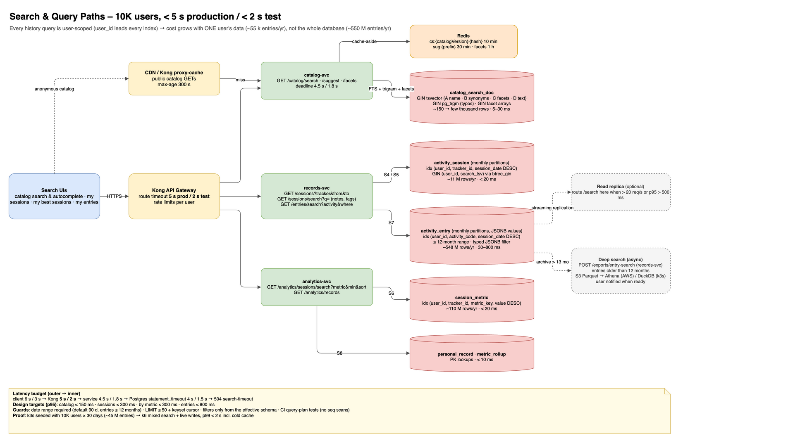

# TrainMe – Search & Query Performance Design

| Item | Value |
|---|---|
| Version | 1.0 · 2026-10-03 |
| Requirement | Search API responses **< 5 s in production** and **< 2 s on the local k3s test instance**, with **10K registered users each recording several sessions per day** (NFR-PERF-09/10) |
| Related | SRS NFR-PERF-09..11, FR-CAT-12..14, FR-REC-16 · HLD ADR-011/012 · LLD §2 · diagram `14_search_query_paths` |

---

## 1. Summary

The 5 s / 2 s limits are **hard ceilings**. The design targets p95 latencies **10–20× lower**, so the ceilings hold through traffic spikes, cold caches and data growth:

| Search type | Design target (p95, server) | Hard ceiling prod / test |
|---|---|---|
| Catalog search & autocomplete | ≤ 150 ms (≤ 20 ms cached) | 5 s / 2 s |
| My sessions (filter, notes text) | ≤ 300 ms | 5 s / 2 s |
| My sessions by metric ("yorker accuracy ≥ 70 %") | ≤ 300 ms | 5 s / 2 s |
| My entries ("balls ≥ 140 km/h", "bench sets ≥ 100 kg") | ≤ 800 ms (1-year range) | 5 s / 2 s |

Four design rules make this hold as users grow:
1. **Every history query is scoped to one user.** `user_id` is the leading column of every index, so query cost depends on **that user's data** (≈ 55 k entries per year), not the whole database (≈ 550 M entries per year at 10K users).
2. **Search the smallest table that can answer.** Session summaries and per-session metrics are precomputed when a session completes. Raw entries are touched only for entry-level questions.
3. **Bound every query.** A date range is required (default 90 days), results are limited (≤ 50, keyset pagination, no `OFFSET`, no full `COUNT(*)`), and timeouts apply at every layer.
4. **Catalog search is global but small.** About 150 activities in Phase 1 and a few thousand later. It is served by PostgreSQL full-text + trigram indexes with Redis and CDN caching.



---

## 2. Workload Model – 10K Users

Worst case: every registered user is active every day.

| Quantity | Assumption | Per day | Per month | Per year |
|---|---|---|---|---|
| Users | 10,000, 100 % daily active | – | – | – |
| Sessions | 3 per user per day (e.g. nets + gym + fielding) | 30,000 | 0.9 M | 11 M |
| Entries | 50 per session (balls, sets, shots, items) | 1.5 M | 45 M | 548 M |
| Parameter values | ~11 per entry | 16.5 M | 495 M | **6 B** |
| Session metrics (precomputed) | ~10 per session | 300 k | 9 M | 110 M |
| Per-user entries | 150 / day | 150 | 4.5 k | **55 k** |

**Storage decision (ADR-011).** At this volume, the v1.1 "one row per parameter value" table (`entry_value`) would reach about 6 B rows per year (~650 GB with indexes). **Entries now store their values as one validated JSONB document per entry**: 548 M rows per year, about 245 GB with indexes and roughly 2.7× smaller. Values are still validated against the tracker's JSON Schema on write, so typing is preserved. Charts never scan raw entries (they use rollups), so nothing is lost.

| Table (records_db / analytics_db) | Rows / year | Approx. size / year (incl. indexes) |
|---|---|---|
| `activity_entry` (JSONB values) | 548 M | ~245 GB |
| `activity_session` | 11 M | ~6 GB |
| `session_metric` | 110 M | ~12 GB |
| `metric_rollup` (DAY/WEEK/MONTH) | ~90 M | ~14 GB |

Search traffic is small compared with writes. If 20 % of users are online at peak and each runs one search every 5 minutes, that is about **7 history searches/s**. Catalog autocomplete may reach **50–100 req/s** while users type, and is mostly served from cache.

---

## 3. What Users Search, and Which Structure Answers It

| # | Question (example) | API | Served by | Index |
|---|---|---|---|---|
| S1 | Find an exercise or drill: "dumbbell chest beginner", "yorker drill", "pushup" (typo/synonym) | `GET /catalog/search` | `catalog_search_doc` | GIN(`search_tsv`), GIN(`name` trigram), GIN(facet arrays) |
| S2 | Autocomplete while typing: "squ…" | `GET /catalog/suggest` | `catalog_search_doc` | GIN trigram + Redis |
| S3 | Browse by facet: sport = cricket, role = fast_bowler; muscle = chest, equipment = dumbbell | `GET /catalog/search?…facets` | `catalog_search_doc` | GIN on `sports`, `roles`, `muscles`, `equipment` arrays |
| S4 | My sessions for a tracker and date range | `GET /sessions?trackerId&from&to` | `activity_session` | B-tree (`user_id, tracker_id, session_date DESC`) + partition pruning |
| S5 | My sessions whose notes or tags contain "new run-up" | `GET /sessions/search?q=` | `activity_session` | GIN (`user_id`, `search_tsv`) via `btree_gin` |
| S6 | Sessions where yorker accuracy ≥ 70 % in the last 6 months; my top 10 fastest sessions | `GET /analytics/sessions/search?metric&min&max&sort` | `session_metric` | B-tree (`user_id, tracker_id, metric_key, value DESC`) |
| S7 | Every ball ≥ 140 km/h in the last 30 days; bench-press sets ≥ 100 kg this year | `GET /entries/search?activity&where` | `activity_entry` | B-tree (`user_id, activity_code, session_date DESC`) + JSONB filter on that user's rows |
| S8 | Personal bests | `GET /analytics/records` | `personal_record` | unique (`user_id, tracker_id, activity_code, metric_key`) |
| S9 | Support: find a user by email/name | `GET /admin/users?q=` | `profile_db.user_profile` | GIN trigram on `email`, `display_name` |

Cross-user free-text search (e.g. a future coach marketplace) is **out of scope** for this design. ADR-012 describes when to add OpenSearch.

---

## 4. Data Structures (DDL)

Required extensions (CloudNativePG and RDS both support them): `pg_trgm`, `unaccent`, `btree_gin`, `pg_partman`, `pg_stat_statements`, `auto_explain`.

### 4.1 Catalog search document (catalog_db)

One denormalised row per searchable item (category, template, activity), rebuilt by the seed importer and on every publish:

```sql
CREATE OR REPLACE FUNCTION f_unaccent(text) RETURNS text
  LANGUAGE sql IMMUTABLE PARALLEL SAFE STRICT AS $$ SELECT public.unaccent('public.unaccent', $1) $$;

CREATE TABLE catalog_search_doc (
  item_type     VARCHAR(12) NOT NULL CHECK (item_type IN ('CATEGORY','TEMPLATE','ACTIVITY')),
  item_code     VARCHAR(120) NOT NULL,
  name          TEXT NOT NULL,
  synonyms      TEXT[] NOT NULL DEFAULT '{}',
  description   TEXT,
  kind          VARCHAR(12),                 -- EXERCISE | DRILL | TEST | MATCH | LOG
  sports        TEXT[] NOT NULL DEFAULT '{}',
  roles         TEXT[] NOT NULL DEFAULT '{}',
  categories    TEXT[] NOT NULL DEFAULT '{}', -- full ancestor path codes, so "gym.legs" finds quads/hamstrings items
  muscles       TEXT[] NOT NULL DEFAULT '{}', -- primary + secondary
  equipment     TEXT[] NOT NULL DEFAULT '{}',
  level         VARCHAR(12),
  locale        VARCHAR(10) NOT NULL DEFAULT 'en',
  popularity    INT NOT NULL DEFAULT 0,       -- trackers using it (updated nightly)
  status        VARCHAR(12) NOT NULL DEFAULT 'PUBLISHED',
  search_tsv    tsvector GENERATED ALWAYS AS (
                  setweight(to_tsvector('simple', f_unaccent(name)), 'A') ||
                  setweight(to_tsvector('simple', f_unaccent(array_to_string(synonyms, ' '))), 'B') ||
                  setweight(to_tsvector('simple', f_unaccent(array_to_string(sports || roles || muscles || equipment, ' '))), 'C') ||
                  setweight(to_tsvector('english', coalesce(description, '')), 'D')) STORED,
  PRIMARY KEY (item_type, item_code, locale)
);
CREATE INDEX csd_tsv      ON catalog_search_doc USING GIN (search_tsv);
CREATE INDEX csd_name_trg ON catalog_search_doc USING GIN (f_unaccent(lower(name)) gin_trgm_ops);
CREATE INDEX csd_syn_trg  ON catalog_search_doc USING GIN (f_unaccent(lower(array_to_string(synonyms, ' '))) gin_trgm_ops);
CREATE INDEX csd_facets   ON catalog_search_doc USING GIN (sports, roles, categories, muscles, equipment);
```

### 4.2 Records (records_db) – changes for search and scale

```sql
-- activity_entry: values as one JSONB document per entry (ADR-011); user_id denormalised for per-user search
CREATE TABLE activity_entry (
  id               UUID NOT NULL,
  user_id          UUID NOT NULL,
  session_id       UUID NOT NULL,
  session_date     DATE NOT NULL,                -- partition key (monthly, pg_partman)
  client_entry_id  UUID NOT NULL,
  activity_code    VARCHAR(80) NOT NULL,
  seq_no           INT NOT NULL,
  group_no         INT,
  recorded_at      TIMESTAMPTZ NOT NULL,
  values           JSONB NOT NULL CHECK (jsonb_typeof(values) = 'object'),
  row_version      INT NOT NULL DEFAULT 1,
  deleted_at       TIMESTAMPTZ,
  PRIMARY KEY (id, session_date),
  UNIQUE (session_id, client_entry_id, session_date)
) PARTITION BY RANGE (session_date);
CREATE INDEX ae_user_activity_date ON activity_entry (user_id, activity_code, session_date DESC) WHERE deleted_at IS NULL;
CREATE INDEX ae_session            ON activity_entry (session_id, seq_no);

-- activity_session: searchable notes and tags
ALTER TABLE activity_session ADD COLUMN tags TEXT[] NOT NULL DEFAULT '{}';
ALTER TABLE activity_session ADD COLUMN search_tsv tsvector GENERATED ALWAYS AS (
  to_tsvector('simple', f_unaccent(coalesce(notes, '') || ' ' || array_to_string(tags, ' ')))) STORED;
CREATE INDEX as_user_search ON activity_session USING GIN (user_id, search_tsv);         -- btree_gin: user first
CREATE INDEX as_user_tracker_date ON activity_session (user_id, tracker_id, session_date DESC) WHERE deleted_at IS NULL;
```

The table `entry_value` from v1.1 is **removed**. Example `values` document for one ball:

```json
{"speed_kmph": 131.4, "line": "off_stump", "length_landed": "good", "yorker_attempted": true, "yorker_accurate": true,
 "seam_attempted": true, "seam_accurate": true, "bouncer_attempted": false, "swing_attempted": false,
 "slower_ball_attempted": false, "no_ball": false}
```

### 4.3 Per-session metrics (analytics_db)

Written once when `record.session.completed` is processed. It is the same computation as the rollups, at session level:

```sql
CREATE TABLE session_metric (
  user_id        UUID NOT NULL,
  tracker_id     UUID NOT NULL,
  session_id     UUID NOT NULL,
  session_date   DATE NOT NULL,
  activity_code  VARCHAR(80) NOT NULL,
  metric_key     VARCHAR(64) NOT NULL,
  num            NUMERIC, den NUMERIC,
  value          NUMERIC,                         -- num/den (or num) – what users filter and sort on
  PRIMARY KEY (user_id, session_id, activity_code, metric_key)
);
CREATE INDEX sm_lookup ON session_metric (user_id, tracker_id, metric_key, value DESC, session_date DESC);
CREATE INDEX sm_by_date ON session_metric (user_id, tracker_id, metric_key, session_date DESC);
```

---

## 5. Query Shapes (what the services execute)

**S1 – catalog search** ("dumbell chest", with a typo):

```sql
WITH q AS (SELECT websearch_to_tsquery('simple', f_unaccent($1)) AS tsq, f_unaccent(lower($1)) AS raw)
SELECT item_type, item_code, name, kind, sports, roles, muscles, equipment,
       ts_rank_cd(search_tsv, q.tsq) * 2 + similarity(f_unaccent(lower(name)), q.raw) + ln(1 + popularity) * 0.05 AS score
FROM catalog_search_doc, q
WHERE status = 'PUBLISHED' AND locale = $2
  AND (search_tsv @@ q.tsq OR f_unaccent(lower(name)) % q.raw OR f_unaccent(lower(array_to_string(synonyms,' '))) % q.raw)
  AND ($3::text[] IS NULL OR sports && $3) AND ($4::text[] IS NULL OR muscles && $4) AND ($5::text[] IS NULL OR equipment && $5)
ORDER BY score DESC, item_code
LIMIT 20;
```

**S6 – sessions by metric** ("yorker accuracy ≥ 70 % in the last 6 months, best first"):

```sql
SELECT session_id, session_date, value, num, den
FROM session_metric
WHERE user_id = $1 AND tracker_id = $2 AND metric_key = 'yorker_accuracy'
  AND value >= 0.70 AND den >= 5                      -- ignore tiny samples
  AND session_date >= current_date - interval '6 months'
ORDER BY value DESC, session_date DESC
LIMIT 20;                                             -- Index Scan on sm_lookup
```

**S7 – entry search** ("balls ≥ 140 km/h in the last 30 days"):

```sql
SELECT id, session_id, session_date, seq_no, group_no, values
FROM activity_entry
WHERE user_id = $1 AND activity_code = 'cricket.fast.delivery'
  AND session_date >= $2 AND session_date < $3        -- partition pruning: 1–2 monthly partitions
  AND deleted_at IS NULL
  AND (values->>'speed_kmph')::numeric >= 140
ORDER BY session_date DESC, seq_no
LIMIT 50;                                             -- reads ≤ ~4.5 k rows of this user, typically < 30 ms warm
```

Entry-search filters are built **only** from the tracker's effective schema: known keys, typed casts, and operators `= ≠ ≥ ≤ in`. They are never free SQL. The date range is capped at **12 months** for entry search. Older raw data is searchable through an asynchronous export ("deep search") instead (§9).

---

## 6. Latency Budget and Timeouts

| Layer | Production | k3s test |
|---|---|---|
| Client request timeout (search screens) | 6 s, then "taking longer than usual" | 3 s |
| Kong route timeout (`/catalog/search*`, `/sessions/search`, `/entries/search`, `/analytics/sessions/search`) | **5 s** | **2 s** |
| Service deadline (AbortSignal propagated to DB/Redis) | 4.5 s | 1.8 s |
| PostgreSQL `statement_timeout` for the search role (`SET LOCAL` per query) | 4 s | 1.5 s |
| Redis command timeout | 50 ms (fall through to DB) | 50 ms |
| On timeout | `504` `application/problem+json`, `type: …/search-timeout`, hint to narrow the date range or filters | same |

Because the database aborts before the service and the service aborts before the gateway, a slow query can never exceed the stated limits.

---

## 7. Caching

| What | Where | Key / TTL | Invalidation |
|---|---|---|---|
| Public catalog search & facets (anonymous) | **CloudFront** (AWS) / Kong proxy-cache (k3s) | URL, `Cache-Control: public, max-age=300` | short TTL; URL contains `catalogVersion` |
| Catalog search (authenticated) | Redis | `cs:{catalogVersion}:{locale}:{hash(q,facets)}`, 10 min | `catalogVersion` bumps on publish/seed, so old keys expire |
| Autocomplete | Redis | `sug:{catalogVersion}:{locale}:{prefix}`, 30 min | same |
| Facet counts | Redis | `facets:{catalogVersion}:{locale}`, 1 h | same |
| History searches | not cached (per-user, rarely repeated); first page warm in the PostgreSQL buffer cache | – | – |

---

## 8. PostgreSQL Configuration

| Setting | k3s test (32 GB VM, CNPG) | AWS beta RDS (db.m7g.xlarge, 16 GB) | Why |
|---|---|---|---|
| `shared_buffers` | 6 GB | RDS default (~25 % RAM) | hot recent partitions + indexes |
| `effective_cache_size` | 16 GB | ~12 GB | planner prefers index scans |
| `work_mem` | 32 MB | 32 MB | sorts for top-N stay in memory |
| `random_page_cost` | 1.1 | 1.1 | SSD / gp3 |
| `jit` | off | off | short OLTP queries; JIT adds latency |
| `max_parallel_workers_per_gather` | 2 | 2 | – |
| `pg_stat_statements.track` | all | all | find slow queries |
| `auto_explain.log_min_duration` | 300 ms | 500 ms | plans of slow queries in logs (Loki) |
| autovacuum (hot partitions) | `autovacuum_vacuum_insert_scale_factor = 0.05` | same | keeps visibility map fresh → index-only scans |
| Pooling | PgBouncer (transaction mode) | RDS Proxy | stable connection counts under HPA |

**Sizing for 10K users (beta):**
- Move `records_db` + `analytics_db` to **db.m7g.xlarge** (4 vCPU / 16 GB) once there are more than 5K daily active users.
- Start at **500 GB gp3** (3,000 IOPS / 125 MB/s baseline) with storage autoscaling.
- Add **one RDS read replica** and route all `/search` traffic to it once search exceeds ~20 req/s or p95 > 500 ms.
- **Retention:** raw entries stay hot for 13 months, then partitions are exported to S3 Parquet and detached. Sessions, `session_metric`, rollups and personal records are kept for the account's lifetime, so charts and most searches never lose history.

---

## 9. Long-range and Heavy Queries

- **Older than 12 months (entry level):** `POST /exports/entry-search` runs asynchronously against S3 Parquet (Athena on AWS, DuckDB job on k3s). The user is notified when results are ready. It is never on the synchronous path.
- **Big exports (CSV/JSON):** asynchronous job (FR-PRF-03).

---

## 10. Verification Plan (how we prove < 2 s / < 5 s)

1. **Synthetic dataset generator** (`tools/seed-load`):
   - **k3s test:** 10K users × 30 days × 3 sessions × 50 entries = **45 M entries** (~20 GB), realistic per-sport value distributions, notes text, all Phase 1 templates.
   - **AWS pre-launch:** 10K users × 13 months (~590 M entries) to prove production behaviour with a full hot window.
2. **Query plan tests in CI:** a seeded Testcontainers PostgreSQL runs `EXPLAIN (FORMAT JSON)` for S1–S9 and fails the build if a plan contains a sequential scan on `activity_entry`, `activity_session` or `session_metric`, or a missing partition prune.
3. **k6 search scenarios** (in `06_Test_Strategy`): mixed S1–S9 at 2× expected peak (catalog 100 req/s, history 15 req/s) **while** the live-session write load runs. Pass: p95 within §1 targets and p99 < 2 s on k3s, < 1 s on AWS (well under the 5 s ceiling).
4. **Cold-cache test:** restart PostgreSQL / flush Redis, then run the k6 suite; p99 must still be < 2 s on k3s.
5. **Production guardrails:** Grafana panel per search endpoint. Alert when p99 > 1.5 s for 10 min (well before the 5 s SLO), and on any `search-timeout` 504s. Use `pg_stat_statements` top-N review weekly.

---

## 11. Growth Path (beyond 10K users)

| Trigger | Action |
|---|---|
| > 20 search req/s or p95 > 500 ms | RDS read replica for search traffic |
| > 100K users / > 5 B entries | Hash sub-partition `activity_entry` by `user_id` within monthly partitions, or move records to **Citus** (shard by `user_id`; all queries are already user-scoped) |
| Cross-user discovery (coach marketplace, public profiles) or multi-language relevance tuning | **OpenSearch** fed from Kafka (`catalog.events`, opt-in public data), with PostgreSQL remaining the source of truth (ADR-012) |
| Heavy analytical questions across all users | Kafka → S3 Parquet → Athena / ClickHouse, never the OLTP database |
