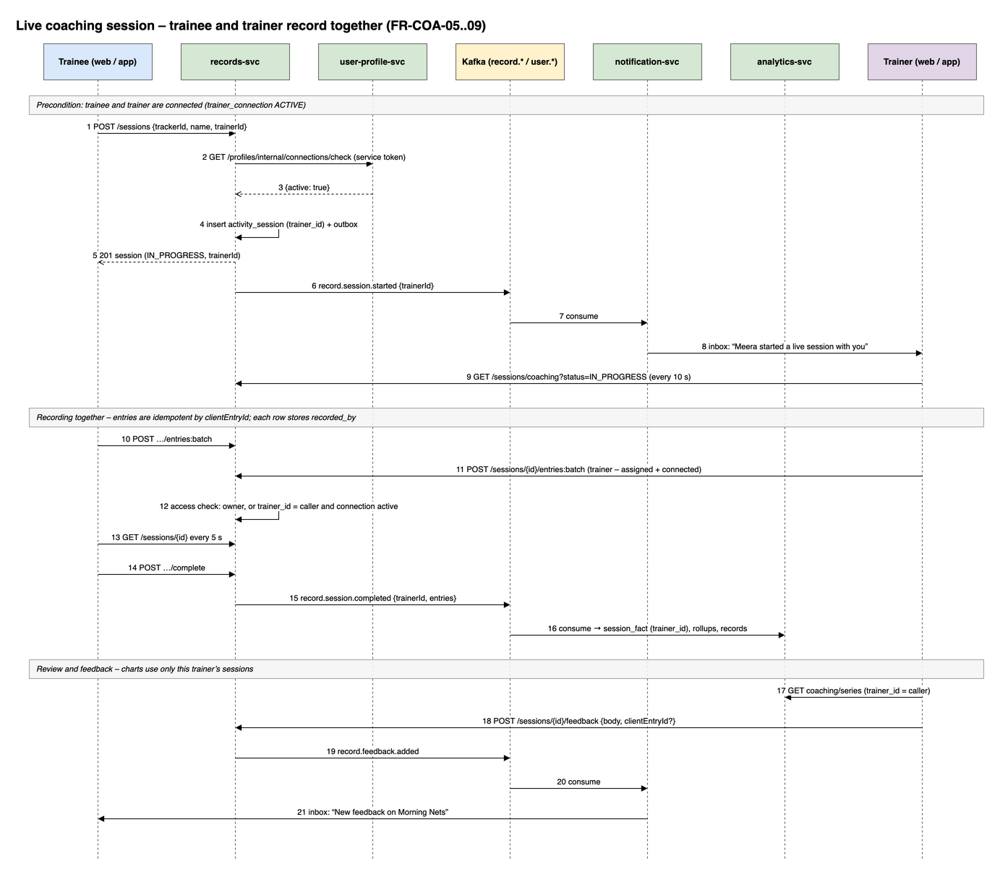
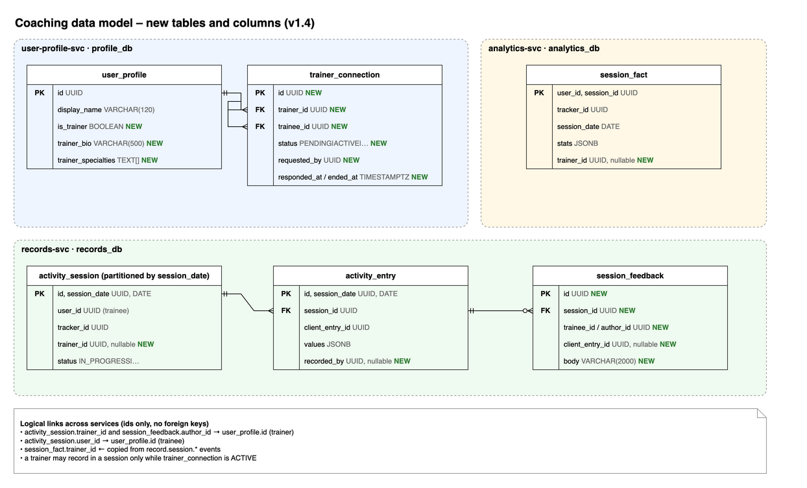

# 12 – Trainers and Coaching (v1.4)

| | |
|---|---|
| Version | 1.4 – adds requirements 10 and 11a (trainers, trainees, live coaching) |
| Status | Approved scope, 2026-10-04 |
| Related | SRS (01), HLD (02 §8 future coach accounts), LLD (03), Runbook (11) |

Coach and team accounts were out of scope in v1.0 (SRS §1.3, open question 2). This version brings in the **trainer** use case:
a trainer works with trainees who have their own accounts. The trainer can follow and record the trainee's live sessions,
review results and give feedback, but only for sessions the trainee assigned to that trainer.

---

## 1. Requirements

| ID | Requirement |
|---|---|
| FR-COA-01 | Any user who is not a trainee can **register as a trainer** from their profile (self-service, no admin approval). A trainer adds a short bio and specialties. A trainer can still record their own sessions. |
| FR-COA-13 | **Coach or trainee, never both (v1.5).** A trainee (anyone with a pending or active trainer) cannot become a coach, and a coach cannot become a trainee of another coach – neither by requesting a trainer nor by accepting an invitation. A coach who still has trainees cannot stop coaching until those connections end. Coaches never see *My trainers*; trainees never see *Coaching* or the trainer switch. |
| FR-COA-02 | A trainee can **find trainers** by name or specialty and **send a connection request**. |
| FR-COA-03 | A trainer can **invite a trainee** by the trainee's e-mail address (the account must exist). |
| FR-COA-04 | The other side **accepts or declines**. Either side can **disconnect** at any time. |
| FR-COA-05 | When starting a session, a trainee can choose an optional **trainer** from their **connected** trainers only. |
| FR-COA-06 | The trainer sees a **coaching dashboard**: live sessions assigned to them (refreshing), their trainees, and pending requests. |
| FR-COA-07 | The trainer can **open a trainee's live session and record entries** in it, alongside the trainee (two devices, one session). |
| FR-COA-08 | The trainer sees a trainee's **sessions and charts only for sessions where the trainer is assigned**. Example: user A had sessions with trainers 1, 2 and 3; trainer 1 sees none of trainer 2's or 3's sessions or their data in charts. |
| FR-COA-09 | The trainer can give **feedback**: one note on the session and comments on single entries (e.g. ball #12). The trainee is notified and sees the feedback on the session page. |
| FR-COA-10 | After a disconnect the trainer **keeps read access** to sessions they were assigned (their own coaching history) but cannot be chosen for new sessions and cannot record. |
| FR-COA-11 | Trainers do **not** create catalog profiles (catalog editing stays with admins). |
| FR-COA-12 | Every coaching action (connections, assigned sessions, entries recorded by the trainer, feedback) is logged and audited (who did it). |

Non-functional: no extra round trip on the trainee's recording path; access checks are row-level and enforced in the owning service
(never only in the web app); a trainer's chart query stays below 2 s for a trainee with 2 years of daily sessions.

## 2. Decisions

| Topic | Decision | Why |
|---|---|---|
| Technical accounts | `admin`, `curator` and `support` accounts never coach and never train with a coach: becoming a trainer, requesting and accepting connections return 403, and the coaching menu is hidden (`canCoach=false` on `GET /profiles/me`). A coach is never given a technical role. | Admins run the application; coaching is for end users only (decision 2026-10-05). |
| Coach or trainee | Exclusive (FR-COA-13). `GET /profiles/me` returns `coachingRole`: `TRAINER` (flag on), `TRAINEE` (has a pending/active trainer), `NONE` (may still choose), `TECHNICAL`. Server checks: trainer flag on → 403 for `POST /connections` as trainee and for invitations to that person, and accept re-checks it under a row lock; open trainer connections → 409 `trainee-cannot-coach` on `PUT /me/trainer`; open trainee connections → 409 `coach-has-trainees` when switching the flag off. | Clear roles (user decision 2026-10-07); enforced in the service, the web app only hides menus. |
| Trainer status | A profile flag (`is_trainer`) in user-profile-svc, not a Keycloak role | Self-service with no token refresh; every permission is relationship-based anyway (connection or assigned session), so a role would add nothing. |
| Where connections live | user-profile-svc (`trainer_connection`) | Connections are user-to-user relationships; no new service is needed for v1.4 (HLD §8 kept `team-svc` for teams/organisations later). |
| Trainer on a session | `activity_session.trainer_id` in records-svc, validated at start through user-profile-svc | One synchronous check when the session starts; recording itself needs no extra call. |
| Who may record | Owner always; the assigned trainer while the session is live **and** the connection is still active | FR-COA-07/10. |
| Trainer charts | Built on demand in analytics-svc from `session_fact` rows of that trainer's sessions (`trainer_id` column), merged per period with the same rules as rollups | Rollups mix all sessions of a tracker; filtering per trainer must use per-session facts. ≤ 730 rows per query. |
| Feedback | `session_feedback` in records-svc (session note or entry comment), event `record.feedback.added` | Feedback belongs to the session; notifications come from the event. |
| Two devices in one session | Entries are idempotent by `clientEntryId`; each records `recorded_by`; the recorder polls the server every 5 s when a trainer is assigned; "complete" checks that the device's entries are on the server instead of an exact count | A trainee and a trainer can log at the same time without losing or duplicating entries. |
| URLs | Under existing prefixes: `/profiles/trainers`, `/profiles/connections`, `/sessions/coaching`, `/sessions/{id}/feedback`, `/analytics/coaching/…` | No gateway (Kong) changes. |

## 3. Main flows



1. **Become a trainer** – Profile → *I coach or train others* → bio, specialties → saved (`user.trainer.updated`).
2. **Connect** – trainee: *My trainers → Find a trainer → Request*; or trainer: *Coaching → Invite trainee (e-mail)*. The other side gets an inbox notification and accepts (`user.connection.requested / accepted / ended`).
3. **Live session** – trainee starts a session and picks the trainer → records-svc checks the active connection → `record.session.started` (with `trainerId`) → the trainer is notified and the session appears under *Live now*.
4. **Record together** – both devices post entry batches to the same session; each entry stores who recorded it; each recorder shows the other's entries within 5 s.
5. **Finish and review** – either side completes; analytics stores the session's facts with `trainer_id`; the trainer opens the trainee's charts (only their sessions) and writes feedback; the trainee is notified.

## 4. Data model



**user-profile-svc (`profile_db`)**

```sql
ALTER TABLE user_profile ADD COLUMN is_trainer BOOLEAN NOT NULL DEFAULT false,
                         ADD COLUMN trainer_bio VARCHAR(500),
                         ADD COLUMN trainer_specialties TEXT[] NOT NULL DEFAULT '{}';
-- Trainer search (FR-COA-02): only trainers, by name or specialty.
CREATE INDEX ix_user_profile__trainer_name ON user_profile USING GIN (lower(display_name) gin_trgm_ops) WHERE is_trainer AND deleted_at IS NULL;

CREATE TABLE trainer_connection (
  id UUID PRIMARY KEY, trainer_id UUID NOT NULL, trainee_id UUID NOT NULL,
  status VARCHAR(12) NOT NULL CHECK (status IN ('PENDING','ACTIVE','DECLINED','ENDED')),
  requested_by UUID NOT NULL, created_at TIMESTAMPTZ NOT NULL DEFAULT now(),
  responded_at TIMESTAMPTZ, ended_at TIMESTAMPTZ, ended_by UUID,
  CHECK (trainer_id <> trainee_id));
-- One open (pending or active) connection per pair; history rows stay.
CREATE UNIQUE INDEX uq_trainer_connection__open_pair ON trainer_connection (trainer_id, trainee_id) WHERE status IN ('PENDING','ACTIVE');
CREATE INDEX ix_trainer_connection__trainee ON trainer_connection (trainee_id, status);
CREATE INDEX ix_trainer_connection__trainer ON trainer_connection (trainer_id, status);
```

**records-svc (`records_db`)**

```sql
ALTER TABLE activity_session ADD COLUMN trainer_id UUID;      -- optional, set at start
ALTER TABLE activity_entry   ADD COLUMN recorded_by UUID;     -- null = the owner (older rows)
-- Trainer dashboard: live sessions and one trainee's sessions with this trainer (partition-pruned by date).
CREATE INDEX ix_activity_session__trainer ON activity_session (trainer_id, status, session_date DESC) WHERE trainer_id IS NOT NULL;
CREATE INDEX ix_activity_session__trainer_trainee ON activity_session (trainer_id, user_id, session_date DESC) WHERE trainer_id IS NOT NULL;

CREATE TABLE session_feedback (
  id UUID PRIMARY KEY, session_id UUID NOT NULL, session_date DATE NOT NULL,
  trainee_id UUID NOT NULL, author_id UUID NOT NULL,
  client_entry_id UUID,              -- null = note on the whole session
  body VARCHAR(2000) NOT NULL, created_at TIMESTAMPTZ NOT NULL DEFAULT now(), updated_at TIMESTAMPTZ NOT NULL DEFAULT now());
CREATE INDEX ix_session_feedback__session ON session_feedback (session_id, created_at);
```

**analytics-svc (`analytics_db`)**

```sql
ALTER TABLE session_fact ADD COLUMN trainer_id UUID;
CREATE INDEX ix_session_fact__trainer ON session_fact (trainer_id, user_id, tracker_id, session_date) WHERE trainer_id IS NOT NULL;
```

## 5. APIs (all under `/api/v1`, JWT required)

| Method | Path | Who | Purpose |
|---|---|---|---|
| PUT | `/profiles/me/trainer` | self | `{isTrainer, bio, specialties}` – become / stop being a trainer |
| GET | `/profiles/trainers?q=` | any user | Trainer search (name, specialty), self excluded |
| GET | `/profiles/connections` | self | `{asTrainee: [...], asTrainer: [...]}` with the other person's name and status |
| POST | `/profiles/connections` | trainee or trainer | `{trainerId}` (request) or `{traineeEmail}` (invite; caller must be a trainer) |
| POST | `/profiles/connections/{id}/accept` · `/decline` | the invited side | Respond |
| DELETE | `/profiles/connections/{id}` | either side | Disconnect (status ENDED) |
| GET | `/profiles/internal/connections/check?trainerId=&traineeId=` | `service` role | `{active}` – used by records-svc |
| POST | `/sessions` | trainee | now also `trainerId?` (must be an active connection, else 422) |
| GET | `/sessions/coaching?status=&traineeId=&from=&to=` | trainer | Sessions where the caller is the trainer |
| GET | `/sessions/{id}` · `/sessions/{id}/schema` | owner or assigned trainer | Session (+entries) and its pinned schema |
| POST | `/sessions/{id}/entries:batch` · `/complete` | owner, or assigned trainer while connected | Record together |
| GET / POST | `/sessions/{id}/feedback` | owner reads; assigned trainer reads and writes | `{body, clientEntryId?}` |
| PATCH / DELETE | `/sessions/{id}/feedback/{fid}` | author | Edit / remove own feedback |
| GET | `/analytics/coaching/trainees/{traineeId}/trackers` | trainer | Trackers and metrics that appear in the trainer's sessions with this trainee |
| GET | `/analytics/coaching/series?traineeId=&trackerId=&activity=&metric=&granularity=` | trainer | Chart series from the trainer's sessions only |

**Access matrix (enforced in the owning service)**

| Action | Owner (trainee) | Assigned trainer (connected) | Assigned trainer (disconnected) | Other trainer / user |
|---|---|---|---|---|
| View session, entries, schema | ✔ | ✔ | ✔ (history) | ✖ 404 |
| Record entries, complete | ✔ | ✔ while live | ✖ 403 | ✖ 404 |
| Rename, notes, discard, delete, reopen | ✔ | ✖ | ✖ | ✖ |
| Read feedback | ✔ | ✔ | ✔ | ✖ |
| Write feedback | ✖ | ✔ | ✖ | ✖ |
| Charts | all sessions | only sessions assigned to them | same (history) | ✖ |

404 (not 403) for strangers so session ids cannot be probed.

## 6. Events

| Event | Producer | Consumers |
|---|---|---|
| `user.connection.requested` · `accepted` · `declined` · `ended` | user-profile-svc | notification-svc (inbox for the other side) |
| `record.session.started` (now with `trainerId`) | records-svc | notification-svc (*“Asha started a live session with you”*) |
| `record.session.completed / updated` (with `trainerId`) | records-svc | analytics-svc (`session_fact.trainer_id`) |
| `record.feedback.added` | records-svc | notification-svc (*“New feedback on Morning Nets”*) |

## 7. Screens (web)

- **Profile → Are you a coach? / Trainer details** (not shown to trainees): switch *I coach or train others*, bio, specialties.
- **My trainers** (everyone except coaches): connected trainers, requests to accept, *Find a trainer* (search + Request), disconnect.
- **Start session**: optional *Trainer* drop-down (connected trainers only).
- **Coaching** (trainers only, in the sidebar): *Live now* (refreshes every 10 s) · *My trainees* (invite by e-mail, pending) · trainee page with sessions (with this trainer) and charts limited to them.
- **Session page**: trainer name badge; for the trainer the same recorder (live) or summary; *Feedback* panel (session note + comment buttons on entries); the trainee sees feedback read-only.

## 8. Test plan

| # | Scenario | Expected |
|---|---|---|
| 1 | coach@ turns on *I coach or train others*; admin@ tries the same | coach@ appears in trainer search; admin@ gets 403 |
| 2 | Meera requests coach@; coach@ accepts | Both see the connection; inbox notifications |
| 3 | Meera starts a session with coach@ | coach@ sees it under *Live now* within 10 s; inbox notice |
| 4 | coach@ and Meera both log balls | Both recorders show all entries; complete succeeds from either |
| 5 | Meera picks a trainer she is not connected to (API) | 422 |
| 6 | Isolation: Meera has sessions with trainers T1, T2, T3 (coach@, coach2@, coach3@) | T1 lists and charts only T1 sessions; T2/T3 session ids → 404 for T1 |
| 7 | Feedback: coach@ comments on ball #3 and the session | Meera notified; sees both; cannot write feedback |
| 8 | Disconnect, then coach@ tries to record | 403; history still readable |

Every item is in the smoke test or the E2E script (`scripts/e2e-coaching.sh`).
